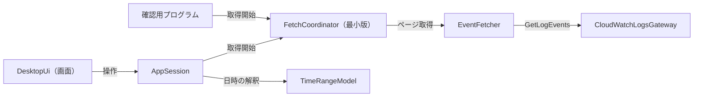
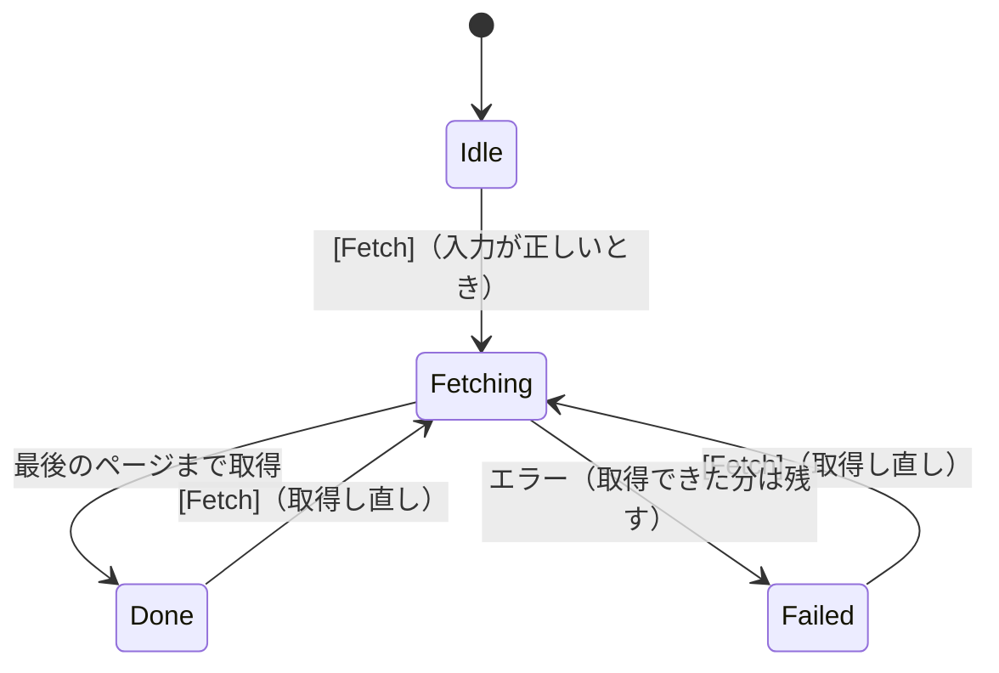
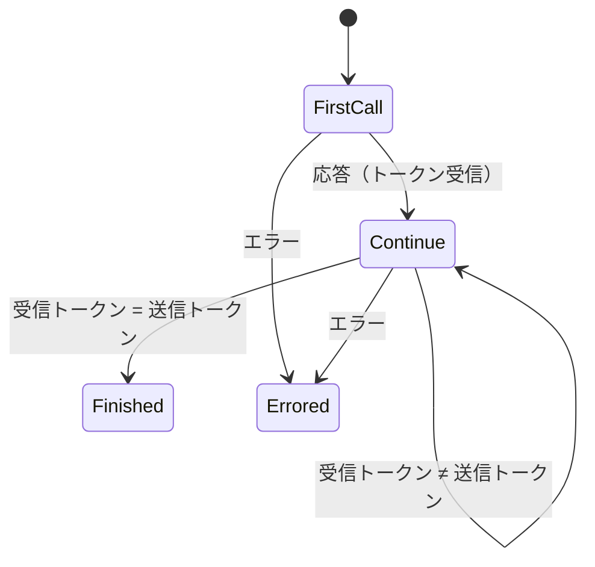
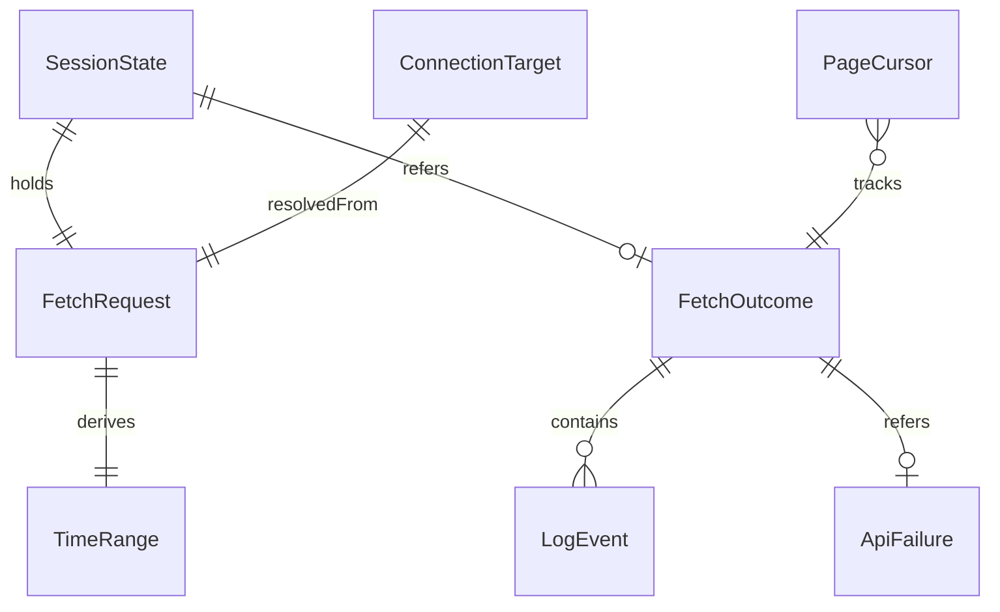

# Functional Spec — U1 薄い一本（u1-walking-skeleton）

上流の成果物：`inception/units-generation/unit-of-work.md`（U1 の範囲）、`inception/domain-design/components.md`、`decisions.md`（ADR-001〜ADR-008）、`inception/requirements-analysis/requirements.md`。データの形は `entities.md`、判断のルールは `rules.md` が正。この文書は、手順（ワークフロー）と状態遷移の正であり、ER 図とルールの要約はそこから写した見やすい版。

## 1. U1 で動くもの

GUI を起動し、プロファイル名（省略可）・ロググループ名・ストリーム名・開始日時・終了日時（UTC）を手入力して [Fetch] を押すと、その 1 つのストリームを GetLogEvents で最後のページまで取得し、時刻とメッセージを一覧に表示する。あわせて、同じライブラリを使う手元用の確認用プログラムを用意する。

部品のつながりは最初から最終形と同じ一方向にする（ADR-001、ADR-004、ADR-007、ADR-008）。

<!-- Text fallback: 画面 → AppSession → FetchCoordinator（最小版）→ EventFetcher → CloudWatchLogsGateway（GetLogEvents）。AppSession は TimeRangeModel で日時を解釈する。確認用プログラムは画面と AppSession を通らず、FetchCoordinator を直接使う。 -->

## 2. ワークフロー

### UC1：画面から 1 つのストリームを取得して表示する

1. 利用者がアプリを起動する。AppSession は phase = Idle で始まる。画面の文言は OS の言語に合わせて英語か日本語で出す（BR6.1）。
2. 利用者がプロファイル名（省略可）・ロググループ名・ストリーム名・開始日時・終了日時を入力する。
3. 入力が変わるたびに AppSession が検証し、[Fetch] を押せるかどうかと、押せない理由を画面に返す（BR1.1、BR1.2、BR1.3）。日時の解釈は TimeRangeModel が行う。
4. 利用者が [Fetch] を押す（Enter キーでも押せる、BR6.2）。
5. AppSession は TimeRangeModel で TimeRange を算出する（開始はその秒の 0 ミリ秒、終了はその秒の 999 ミリ秒、BR2.1、BR2.2）。phase を Fetching にし、入力欄と [Fetch] を無効にして「取得中」を表示する（BR1.4）。
6. AppSession は FetchCoordinator に FetchRequest と TimeRange を渡して取得を始め、進み具合の受け口も渡す（ADR-007）。
7. FetchCoordinator は接続先を決める。プロファイル名が空なら SDK の既定の設定を使い（BR1.5）、リージョンはプロファイルの既定を使う（BR1.6）。リージョンが見つからなければ、ここで RegionMissing として終わる（→ 手順 11）。
8. FetchCoordinator は EventFetcher に 1 ストリームの取得を頼む。EventFetcher は次を繰り返す。
   1. GetLogEvents を startTime・endTime・startFromHead = true 付きで呼ぶ（BR3.1）。2 回目以降は前回受け取ったトークンを渡す。
   2. 返ったイベントを順に LogEvent にし（sequence を振る）、FetchCoordinator に渡す。
   3. 2 回目以降の呼び出しで、受け取ったトークンが渡したトークンと同じなら終わる。空のページや件数の少ないページでは終わらない（BR3.2）。件数で打ち切らない（BR3.3）。
9. エラーが返ったら、CloudWatchLogsGateway が種類に分類し、安全な詳細を付けて返す（BR4.2、BR4.3）。EventFetcher はそこで取得をやめ、それまでの LogEvent は残す（BR4.1）。
10. 最後のページまで取得できたら、FetchCoordinator は status = Completed、件数、ページ数を受け口に届ける。AppSession は phase を Done にする。
11. エラーで終わったら、FetchCoordinator は status = Failed、件数、ページ数、ApiFailure を受け口に届ける。AppSession は phase を Failed にする。
12. 画面は取得した全件を取得順に一覧に並べる（BR5.1）。各行は時刻（UTC、ミリ秒まで、BR5.3）とメッセージ（1 行分、BR5.2）。ステータス行に件数を出し、0 件なら 0 件と示す（BR5.4）。Failed なら種類名と安全な詳細も出す（BR4.4）。
13. 入力欄と [Fetch] を有効に戻す。利用者は条件を変えて取得し直せる（前回の結果は新しい取得の開始時に消える）。

### UC2：確認用プログラムで実際の AWS から取得する

1. 開発者が手元で、引数（--profile は省略可、--log-group、--stream、--start、--end）を付けて実行する（BR7.1）。
2. 引数が足りない・日時の形式が誤っている・開始が終了より後のときは、使い方とエラーを標準エラーに出し、0 以外の終了コードで終わる（BR1.1〜BR1.3 と同じ検証）。
3. UC1 の手順 7〜9 と同じ流れで、FetchCoordinator を使って取得する。
4. 受け取った LogEvent を 1 件ずつ「UTC の時刻（ミリ秒まで）＋メッセージ」の 1 行で標準出力に出す。
5. 最後に件数とページ数を標準エラーに出す。エラーで終わったときは、種類と安全な詳細を標準エラーに出し、0 以外の終了コードで終わる。
6. このプログラムは自動テストと CI からは実行しない（BR7.2）。

## 3. 状態遷移

### SessionState.phase

<!-- Text fallback: Idle → Fetching（[Fetch]）。Fetching → Done（最後のページまで取得）。Fetching → Failed（エラー、取得できた分は残す）。Done・Failed → Fetching（取得し直し）。 -->

| 状態 | 入力欄と [Fetch] | 表示 |
|------|------------------|------|
| Idle | 有効（[Fetch] は検証を通ったときだけ押せる） | 押せない理由 |
| Fetching | 無効 | 「取得中」 |
| Done | 有効 | 一覧と件数（0 件なら 0 件） |
| Failed | 有効 | 取得できた分の一覧、件数、エラーの種類名と安全な詳細 |

### ページング（EventFetcher）

<!-- Text fallback: 最初の呼び出し → 応答を受けたら続行。続行中は受け取ったトークンが渡したトークンと違えば次のページへ、同じなら終わり。どの呼び出しでもエラーなら終わり（Errored）。最初の呼び出しの応答では終わらない。 -->

## 4. 画面（U1 の最小版）

U1 の種類は service のため、frontend-components.md は作らない。画面の最小の構成をここに書く。仕上げは U7。

| 部分 | 内容 |
|------|------|
| 入力欄 | プロファイル名（空欄可）、ロググループ名、ストリーム名、開始日時、終了日時（いずれも 1 行入力、UTC の例をプレースホルダーに出す） |
| [Fetch] | 検証を通ったときだけ押せる。押せないときは理由を出す |
| 一覧 | 時刻（UTC、ミリ秒まで）とメッセージ（1 行分）の 2 列。全件を並べる（U1 は仮想スクロールなし） |
| ステータス行 | 「取得中」、件数（0 件を含む）、エラーの種類名と安全な詳細 |

画面側（TypeScript＋React）と Rust 側（AppSession）は Tauri のコマンドとイベントでつなぐ。画面側は状態を持たず、AppSession の状態を表示し、操作を伝えるだけにする（ADR-001）。

## 5. ER 図（entities.md から写したもの）

<!-- Text fallback: SessionState は FetchRequest を 1 つ持ち、FetchOutcome を 0〜1 つ参照する。FetchRequest から TimeRange を 1 つ算出する。FetchOutcome は LogEvent を 0 件以上持ち、ApiFailure を 0〜1 つ参照する。PageCursor は取得の進み具合を表す。ConnectionTarget は FetchRequest から決まる。 -->

## 6. ルールの要約（rules.md から写したもの）

| 分類 | ルール |
|------|--------|
| 入力の検証 | BR1.1 ロググループ名・ストリーム名は必須／BR1.2 日時の形式（UTC）／BR1.3 開始 < 終了／BR1.4 取得中は変更不可 |
| 接続 | BR1.5 プロファイル空欄は SDK の既定／BR1.6 リージョンはプロファイルの既定、なければエラー／BR1.7 認証は SDK に任せる |
| 範囲 | BR2.1 開始はその秒の 0 ミリ秒／BR2.2 終了はその秒の 999 ミリ秒まで含む |
| 取得 | BR3.1 開始・終了を必ず指定／BR3.2 同じトークンで終わり／BR3.3 上限なし／BR3.4 GetLogEvents だけ |
| エラー | BR4.1 取得できた分は残す／BR4.2 種類の分類／BR4.3 秘密とアクセスキー ID を出さない／BR4.4 暫定表示 |
| 表示 | BR5.1 取得順に全件／BR5.2 1 行分／BR5.3 UTC・ミリ秒まで／BR5.4 件数と 0 件 |
| 土台 | BR6.1 文言はキーから英日／BR6.2 キーボード操作 |
| 確認用プログラム | BR7.1 入出力／BR7.2 テスト・CI で実行しない |

## 7. テストの方針（team.md の Testing Posture に沿って）

- テストを先に書く純粋なロジック：日時の解釈と範囲の算出（BR1.2、BR1.3、BR2.1、BR2.2）、ページの終わりの判定（BR3.2）、エラーの安全な詳細への変換（BR4.3）、文言キーの英日のそろい（BR6.1）。
- 実装してからテストを書くもの：CloudWatchLogsGateway の偽物を使った取得の流れ（空ページ・複数ページ・途中のエラー）、AppSession の状態遷移。
- 自動テストと CI は実際の AWS に接続しない。実際の AWS での確認は確認用プログラムと GUI の目視で行う（team.md の Walking Skeleton）。
