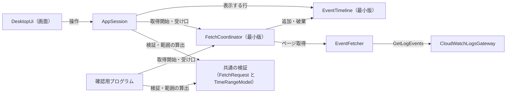
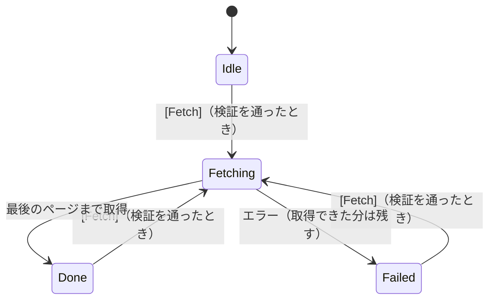
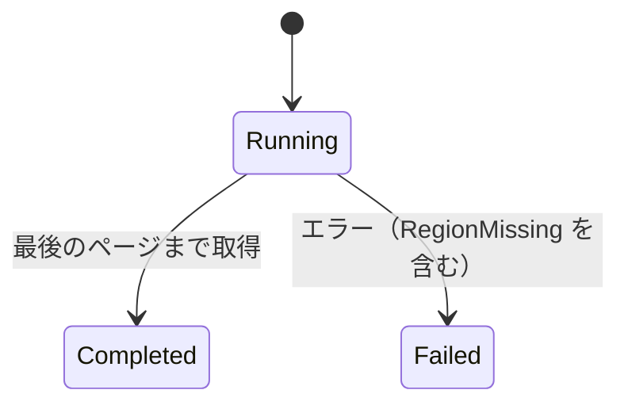
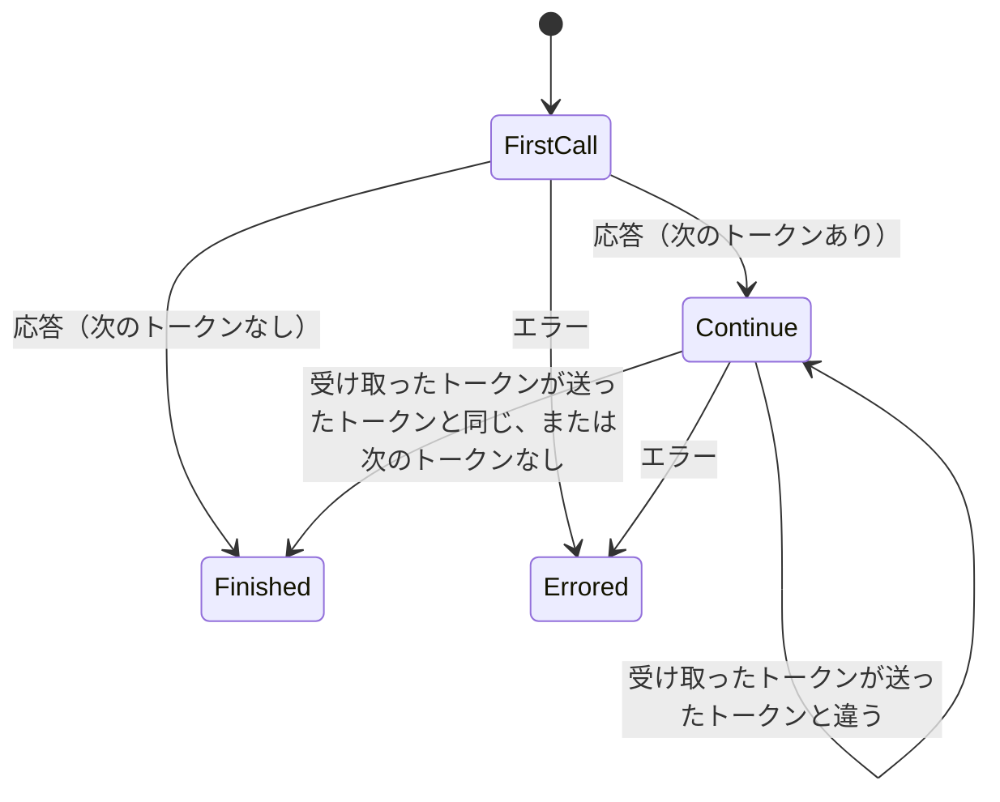
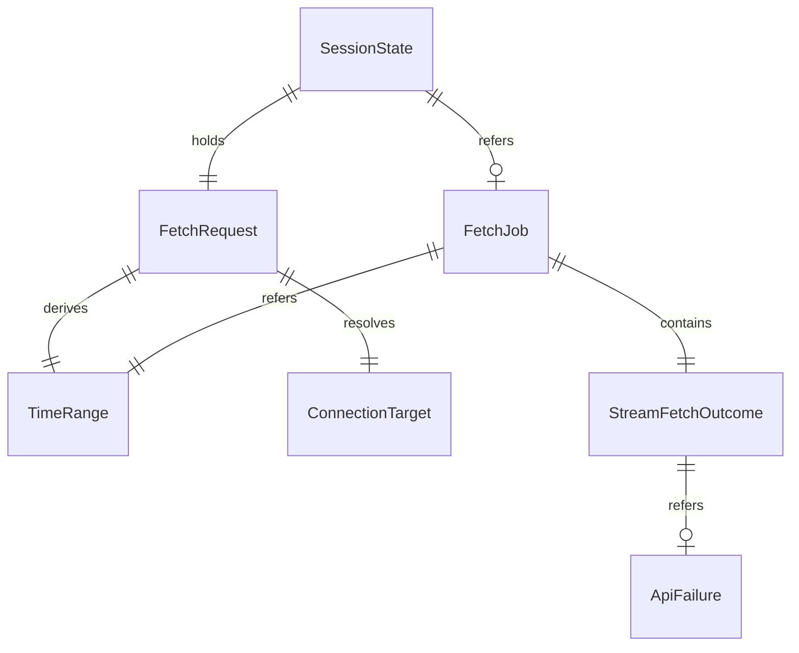

# Functional Spec — U1 薄い一本（u1-walking-skeleton）

上流の成果物：`inception/units-generation/unit-of-work.md`（U1 の範囲）、`inception/domain-design/components.md`、`decisions.md`（ADR-001〜ADR-008）、`inception/requirements-analysis/requirements.md`。データの形は `entities.md`、判断のルールは `rules.md` が正。この文書は手順（ワークフロー）と状態遷移の正であり、ER 図とルールの要約はそこから写した見やすい版。

## 1. U1 で動くもの

画面を起動し、プロファイル名（省略可）・ロググループ名・ストリーム名・開始日時・終了日時（UTC）を手入力して [Fetch] を押すと、その 1 つのストリームを GetLogEvents で最後のページまで取得し、時刻とメッセージを一覧に表示する。あわせて、同じライブラリを使う手元用の確認用プログラムを用意する。

部品のつながりは最初から最終形と同じ一方向にする（ADR-001、ADR-004、ADR-007、ADR-008）。U1 では EventTimeline を最小版（取得順の追加・全件の読み出し・破棄）として置き、LogEvent の持ち主を components.md のとおりに保つ（entities.md）。

<!-- Text fallback: 画面 → AppSession。AppSession は共通の検証（FetchRequest の検証と TimeRangeModel）で条件を確かめ、FetchCoordinator（最小版）に取得を頼み、EventTimeline（最小版）から表示する行を読む。FetchCoordinator は EventFetcher に取得させ、取得したログを EventTimeline に追加する。EventFetcher は CloudWatchLogsGateway を通して GetLogEvents を呼ぶ。確認用プログラムは画面と AppSession を通らず、同じ共通の検証と FetchCoordinator を使う。 -->

## 2. ワークフロー

### UC1：画面から 1 つのストリームを取得して表示する

1. 利用者がアプリを起動する。AppSession は新しい sessionId と phase = Idle で始まる。画面の文言は OS の言語に合わせて英語か日本語で出す（BR6.1）。
2. 利用者がプロファイル名（省略可）・ロググループ名・ストリーム名・開始日時・終了日時を入力する。
3. 入力が変わるたびに、AppSession は共通の検証を呼び、[Fetch] を押せるかどうかと押せない理由を画面に返す（BR1.1、BR1.2、BR1.3、BR1.8）。phase が Done・Failed のときも同じ検証を通ったときだけ押せる。
4. 利用者が [Fetch] を押す（Enter キーでも押せる、BR6.2）。
5. AppSession は共通の検証で TimeRange を算出する（開始はその秒の 0 ミリ秒、終了はその秒の 999 ミリ秒、BR2.1、BR2.2）。phase を Fetching にし、入力欄と [Fetch] を無効にして「取得中」を表示する（BR1.4）。
6. AppSession は FetchCoordinator に、検証済みの FetchRequest・TimeRange と受け口を渡して取得を始める（BR4.5）。
7. FetchCoordinator は新しい FetchJob（status = Running）を作り、EventTimeline の保持ログを破棄し、受け口に「開始」を届ける（BR4.5）。
8. FetchCoordinator は EventFetcher に 1 ストリームの取得を頼む。EventFetcher は CloudWatchLogsGateway を通して呼ぶ。
   1. CloudWatchLogsGateway は最初の呼び出しの前に接続先（ConnectionTarget）を解決する。プロファイル名が空なら SDK の既定の設定を使い（BR1.5）、リージョンはプロファイルの既定を使う（BR1.6）。リージョンが見つからなければ、GetLogEvents を呼ばずに RegionMissing を返す（→ 手順 10）。
   2. GetLogEvents を開始時刻・終了時刻・古い順の指定付きで呼ぶ（BR3.1）。2 回目以降は前回受け取ったトークンを送る。
   3. 応答を受けるたびに pageCount を 1 増やす。返ったイベントに API が返した順で sequence を振って LogEvent にし、FetchCoordinator に渡す。FetchCoordinator はそれを EventTimeline に追加し、受け口に「追加された LogEvent のまとまりと累計件数」を届ける（BR4.5）。
   4. 2 回目以降の応答で、受け取ったトークンが送ったトークンと同じなら終わる。応答に次のトークンがないときも終わる。空のページや件数の少ないページでは終わらない（BR3.2）。件数で打ち切らない（BR3.3）。
9. 最後のページまで取得できたら、EventFetcher は StreamFetchOutcome（status = Completed、件数、ページ数）を返す。FetchCoordinator は FetchJob を Completed にして受け口に届ける。AppSession は phase を Done にする。
10. エラーが返ったら、CloudWatchLogsGateway が種類に分類し、安全な詳細を付けて返す（BR4.2、BR4.3）。EventFetcher はそこで取得をやめ、StreamFetchOutcome（status = Failed、それまでの件数とページ数、ApiFailure）を返す。それまでに EventTimeline に追加した LogEvent は残す（BR4.1）。FetchCoordinator は FetchJob を Failed（failedStreamCount = 1）にして受け口に届ける。AppSession は phase を Failed にする。
11. 画面は EventTimeline の全件を (timestamp, sequence) の昇順で一覧に並べる（BR5.1）。各行は時刻（UTC、ミリ秒まで、BR5.3）とメッセージ（1 行分、BR5.2）。ステータス行に件数を出し、0 件なら 0 件と示す（BR5.4）。Failed なら種類名と安全な詳細も出す（BR4.4）。
12. 入力欄を有効に戻し、[Fetch] は検証を通ったときだけ押せる状態に戻す。取得し直すと、手順 7 で前回のログは破棄される。

### UC2：確認用プログラムで実際の AWS から取得する

1. 開発者が手元で、引数（--profile は省略可、--log-group、--stream、--start、--end）を付けて実行する（BR7.1）。
2. 確認用プログラムは、画面と同じ共通の検証で引数を確かめ、TimeRange を算出する（BR1.1〜BR1.3、BR2.1、BR2.2、BR1.8）。検証を通らなければ、使い方と理由を標準エラーに出し、0 以外の終了コードで終わる。
3. FetchCoordinator に、検証済みの条件・TimeRange と受け口を渡して取得を始める。流れは UC1 の手順 7〜10 と同じ。
4. 受け口に LogEvent のまとまりが届くたびに、1 件ずつ「UTC の時刻（ミリ秒まで）＋メッセージ」の 1 行で標準出力に出す（BR4.5、BR7.1）。
5. 終わったら件数とページ数を標準エラーに出す。Failed のときは、種類と安全な詳細を標準エラーに出し、0 以外の終了コードで終わる。
6. このプログラムは自動テストと CI からは実行しない（BR7.2）。

## 3. 状態遷移

### SessionState.phase

<!-- Text fallback: Idle・Done・Failed から、検証を通ったときだけ [Fetch] で Fetching へ。Fetching → Done（最後のページまで取得）。Fetching → Failed（エラー、取得できた分は残す）。 -->

| 状態 | 入力欄 | [Fetch] | 表示 |
|------|--------|---------|------|
| Idle | 有効 | 検証を通ったときだけ押せる | 押せない理由 |
| Fetching | 無効 | 無効 | 「取得中」 |
| Done | 有効 | 検証を通ったときだけ押せる | 一覧と件数（0 件なら 0 件） |
| Failed | 有効 | 検証を通ったときだけ押せる | 取得できた分の一覧、件数、エラーの種類名と安全な詳細 |

### FetchJob.status

<!-- Text fallback: Running で始まり、最後のページまで取得できたら Completed、エラー（接続先のリージョンが見つからない場合を含む）なら Failed。 -->

### ページング（EventFetcher の内部）

<!-- Text fallback: 最初の呼び出しの応答は、次のトークンがあれば続行、なければ終わり。続行中は、受け取ったトークンが送ったトークンと違えば次のページへ、同じか次のトークンがなければ終わり。どの呼び出しでもエラーなら Errored。応答を受けるたびに pageCount を 1 増やし、最後の同じトークンの応答も数える。 -->

## 4. 画面（U1 の最小版）

U1 の種類は service のため、frontend-components.md は作らない。画面の最小の構成をここに書く。仕上げは U7。

| 部分 | 内容 |
|------|------|
| 入力欄 | プロファイル名（空欄可）、ロググループ名、ストリーム名、開始日時、終了日時（いずれも 1 行入力、UTC の入力例を薄く表示） |
| [Fetch] | 検証を通ったときだけ押せる。押せないときは理由を出す |
| 一覧 | 時刻（UTC、ミリ秒まで）とメッセージ（1 行分）の 2 列。全件を並べる（U1 は表示範囲だけ描く仕組みなし） |
| ステータス行 | 「取得中」、件数（0 件を含む）、エラーの種類名と安全な詳細 |

画面はライブラリ側の AppSession と、画面とライブラリのやり取り（操作の伝達と状態の通知）でつなぐ。画面は自分で状態を持たず、AppSession の状態を表示し、操作を伝えるだけにする（ADR-001）。具体的なつなぎ方は Code Generation で決める。

## 5. ER 図（entities.md から写したもの）

<!-- Text fallback: SessionState は FetchRequest を 1 つ持ち、FetchJob を 0〜1 つ参照する。FetchRequest から TimeRange と ConnectionTarget をそれぞれ 1 つ決める。FetchJob は StreamFetchOutcome を 1 つ持ち（U1 は 1 ストリーム）、TimeRange を 1 つ参照する。StreamFetchOutcome は ApiFailure を 0〜1 つ参照する。LogEvent は EventTimeline が持ち、FetchJob からは参照しない。MessageCatalog は画面の文言で、ほかのエンティティとは関係しない。 -->

## 6. ルールの要約（rules.md から写したもの）

| 分類 | ルール |
|------|--------|
| 入力の検証 | BR1.1 ロググループ名・ストリーム名は必須／BR1.2 日時の形式（UTC）／BR1.3 開始 < 終了／BR1.4 取得中は変更不可／BR1.8 検証と範囲の算出は画面・確認用プログラム共通 |
| 接続 | BR1.5 プロファイル空欄は SDK の既定／BR1.6 リージョンはプロファイルの既定、なければエラー／BR1.7 認証は SDK に任せる |
| 範囲 | BR2.1 開始はその秒の 0 ミリ秒／BR2.2 終了はその秒の 999 ミリ秒まで含む |
| 取得 | BR3.1 開始・終了を必ず指定／BR3.2 同じトークン（または次のトークンなし）で終わり／BR3.3 上限なし／BR3.4 GetLogEvents だけ |
| エラーと進み具合 | BR4.1 取得できた分は残す／BR4.2 種類の分類／BR4.3 秘密とアクセスキー ID を出さない／BR4.4 暫定表示／BR4.5 進み具合とログは受け口へ、ログは EventTimeline が持つ |
| 表示 | BR5.1 (timestamp, sequence) の昇順で全件／BR5.2 1 行分／BR5.3 UTC・ミリ秒まで／BR5.4 件数と 0 件 |
| 土台 | BR6.1 文言はキーから英日／BR6.2 キーボード操作 |
| 確認用プログラム | BR7.1 入出力／BR7.2 テスト・CI で実行しない |

## 7. テストの方針（team.md の Testing Posture に沿って）

- テストを先に書く純粋なロジック：共通の検証と範囲の算出（BR1.1〜BR1.3、BR1.8、BR2.1、BR2.2）、ページの終わりの判定（BR3.2、次のトークンがない場合と pageCount の数え方を含む）、並べ替えのキー（BR5.1）、エラーの安全な詳細への変換（BR4.3）、文言キーの英日のそろい（BR6.1）。
- 実装してからテストを書くもの：AWS への呼び出しの偽物を使った取得の流れ（空ページ・複数ページ・途中のエラー・RegionMissing）、受け口に届く順序（開始 → まとまり → 結果）、AppSession の状態遷移。
- 自動テストと CI は実際の AWS に接続しない。実際の AWS での確認は確認用プログラムと画面の目視で行う（team.md の Walking Skeleton）。
