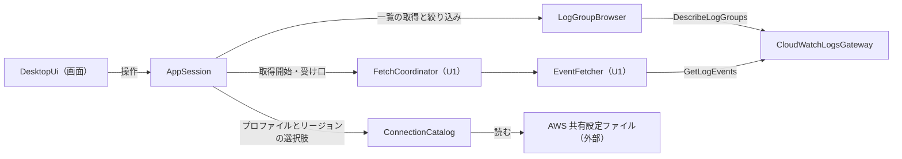
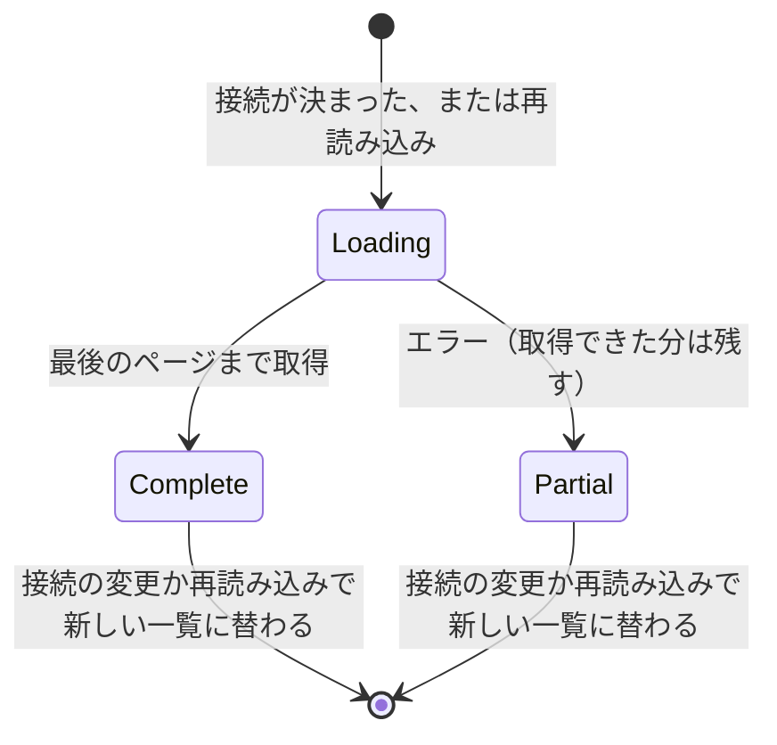
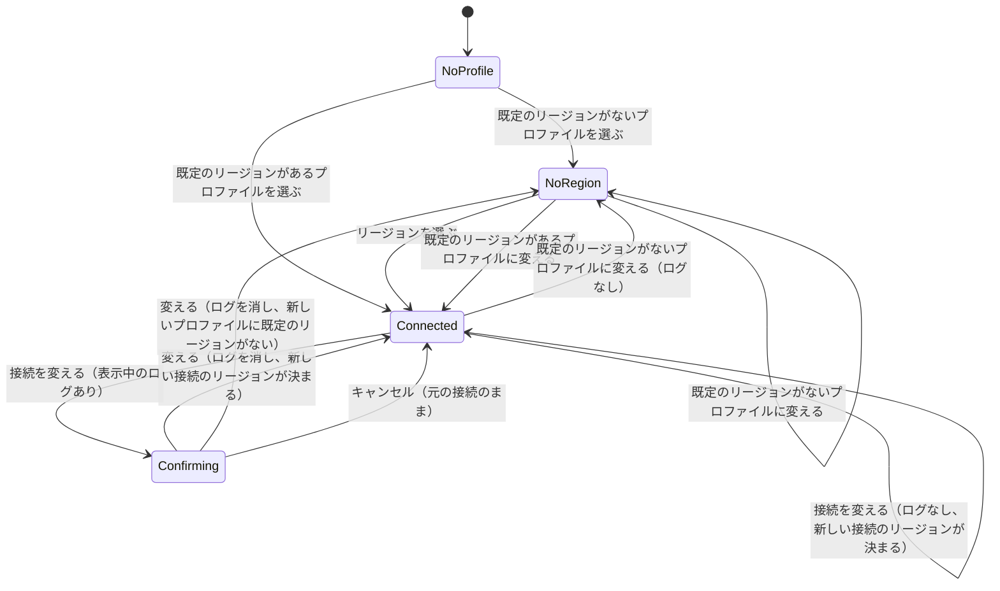
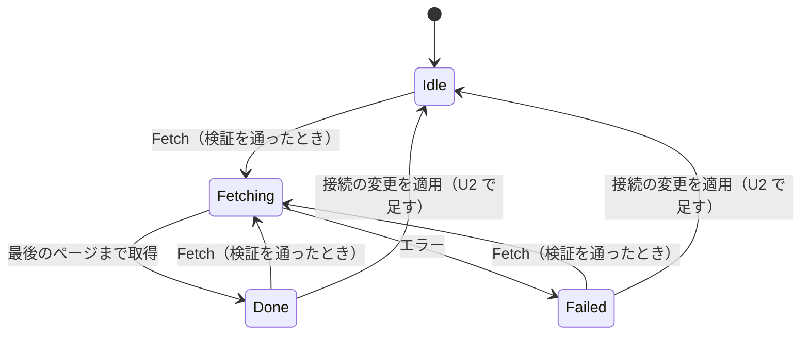
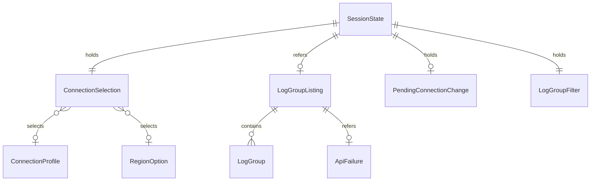

# Functional Spec — U2 接続とロググループの選択（u2-connection-selection）

上流の成果物：`inception/units-generation/unit-of-work.md`（U2 の範囲）、`inception/domain-design/components.md`（ConnectionCatalog・LogGroupBrowser）、`inception/requirements-analysis/requirements.md`（FR1.1、FR1.3、FR1.4、FR2.1〜FR2.3）。データの形は `entities.md`、判断のルールは `rules.md` が正。この文書は手順（ワークフロー）と状態遷移の正であり、ER 図とルールの要約はそこから写した見やすい版。U1 の functional-spec.md の流れ（取得と表示）はそのまま有効で、ここでは U2 で足す流れと変わるところを書く。

## 1. U2 で動くもの

上部バーでプロファイルとリージョンを一覧から選ぶと、左ペインにその接続で取得できるロググループの一覧が出る。一覧は名前で絞り込め、1 つを選んで、U1 と同じくストリーム名と日時を入れて [Fetch] を押すと取得する。U1 のプロファイル名とロググループ名の手入力はなくなる。ストリーム名は U3 まで手入力のまま。

部品のつながり（U2 で足す部分を含む）：

<!-- Text fallback: 画面 → AppSession。AppSession は ConnectionCatalog からプロファイルとリージョンの選択肢を得て、LogGroupBrowser にロググループ一覧の取得と絞り込みを頼み、取得は U1 と同じく FetchCoordinator に頼む。LogGroupBrowser は CloudWatchLogsGateway を通して DescribeLogGroups を呼ぶ。ConnectionCatalog は AWS 共有設定ファイル（外部依存）を読む。 -->

## 2. ワークフロー

### UC1：起動してプロファイルとリージョンを選ぶ

1. アプリを起動する。ConnectionCatalog は設定ファイルからプロファイルの一覧を作り（先頭は「既定の設定（SDK に任せる）」、BR1.1〜BR1.3、BR1.5）、リージョンの選択肢を作る（BR1.4）。設定ファイルを読めなかったときは、上部バーのプロファイルの欄の近くに、読めなかったファイルの種類を知らせる（起動し直すまで出したまま、BR1.3）。
2. AppSession はプロファイルもリージョンも未選択で始め、ロググループ一覧は取らない。一覧の欄には「プロファイルを選んでください」を出す（BR2.1）。
3. 利用者がプロファイルを選ぶ。
   1. そのプロファイルに既定のリージョンがあれば、リージョンにそれが入る（BR2.2）。→ 手順 4。
   2. なければリージョンは未選択のままで、「リージョンを選んでください」を出す（BR2.2）。利用者がリージョンを選ぶ。
4. プロファイルとリージョンの両方が決まったので、UC2 でロググループ一覧を取る（BR2.3）。

### UC2：ロググループ一覧を取る

1. AppSession は LogGroupBrowser に、決まった接続で一覧の取得を頼む。LogGroupBrowser は新しい listingId で LogGroupListing（status = Loading）を始める（BR2.3）。一覧の欄に「読み込み中」を出す。
2. LogGroupBrowser は CloudWatchLogsGateway を通して DescribeLogGroups を呼ぶ（次のトークン以外の条件は渡さない、BR3.9）。
3. ページを受けるたびに、listingId がいまの取得のものか確かめ（違えば捨てて取得をやめる、BR3.6）、ロググループを足して名前の昇順に並べ、画面に届ける（BR3.2、BR3.3）。読み込み中でも、表示されているロググループは選べる（BR3.2）。
4. 次のトークンがなくなったら（または同じトークンが返ったら）status = Complete にし、「読み込み中」を消す（BR3.1）。0 件なら「ロググループがありません」を出す（BR3.10）。
5. エラーが返ったら、それ以上たどらず status = Partial にし、取得できた分を残して「一覧が途中までです」と種類名・安全な詳細を出す（BR3.4、BR4.1）。利用者は [再読み込み]（UC5）か、プロファイル・リージョンの選び直しで取り直せる。

### UC3：絞り込んでロググループを選び、取得する

1. 利用者が絞り込みの欄に文字を入れると、取得済みの一覧を、大文字・小文字を区別しない部分一致で絞り込んで出す（BR3.7）。AWS の API は呼ばない。0 件なら「一致するロググループがありません」を出す（BR3.10）。
2. 利用者がロググループを 1 つ選ぶ（矢印キーと Enter でも選べる、BR5.2）。それまでの選択は外れる（BR3.8）。表示中のログは消さない。選んだロググループ名は、ストリーム名の入力欄の近くに常に表示する（絞り込みで一覧から隠れても分かる、BR3.8）。
3. 利用者がストリーム名と日時を入れる。[Fetch] は、プロファイル・リージョン・ロググループが選ばれ、ストリーム名と日時が U1 の検証を通ったときだけ押せる（BR2.7）。
4. [Fetch] を押すと、選んだプロファイル・リージョン・ロググループで U1 の UC1 の手順 5 以降と同じく取得する（BR2.8）。取得中は、プロファイル・リージョン・ロググループの選択と [再読み込み] も無効になる（BR2.6）。

### UC4：表示中のログがある状態で接続を変える

1. 利用者がプロファイルかリージョンを変えようとする（取得中は変えられない、BR2.6）。
2. 表示中のログ（EventTimeline の保持ログ）が 1 件以上あるか確かめる（BR2.5）。
   1. ないとき：確認なしで手順 4 へ。
   2. あるとき：変更を PendingConnectionChange に入れ、「表示中のログが消えます。変えてよいですか？」の確認ダイアログを出す。フォーカスは [キャンセル] に置く（BR5.2）。確認を待っている間は、ほかの操作を受け付けない（BR2.5、BR2.6）。
3. 利用者の選択：
   1. [変える]：手順 4 へ。
   2. [キャンセル] または Escape キー：変更を捨て、プロファイルとリージョンの欄を元の選択に戻す。ロググループの選択、表示中のログ、一覧はそのまま。
4. 変更を適用する。進行中の一覧の取得を無効にする（BR2.3、BR3.6）。ロググループの選択を外し、表示中のログ・件数・直近の取得の結果（失敗の種類名と安全な詳細を含む）を消し、phase を Idle に戻して [Fetch] を押せない理由を作り直す（BR2.4、BR2.7）。プロファイルを変えた場合は BR2.2 でリージョンの初期値を決める。両方が決まっていれば UC2 で一覧を取り直し、決まっていなければ一覧を空にして、遅れて届いた前の接続の応答は捨てる（BR2.3、BR3.6）。絞り込みの文字列は残す（BR3.7）。

### UC5：一覧を再読み込みする

1. 接続が決まっていて、取得中でも確認待ちでもないときだけ、[再読み込み] を押せる（BR3.5、BR2.6）。
2. 押すと、いまの接続で UC2 を新しい listingId でやり直す。ロググループの選択と表示中のログは変えない（BR3.5）。前の取得の応答が遅れて届いても捨てる（BR3.6）。

### UC6：確認用プログラム（U1 の UC2 の変更点）

確認用プログラムは U1 のとおり、引数でプロファイル・ロググループ・ストリーム・日時を受け取る。リージョンを指定する引数は足さず、U1 と同じくプロファイル（または SDK の既定の設定）の既定のリージョンで接続する（BR2.8）。ロググループ一覧の取得は確認用プログラムには入れない。

## 3. 状態遷移

### LogGroupListing.status

<!-- Text fallback: 接続が決まるか再読み込みで Loading の一覧が始まる。最後のページまで取得したら Complete、エラーなら取得できた分を残して Partial。接続の変更や再読み込みでは、新しい listingId の一覧に替わり、古い一覧の応答は捨てる。 -->

### 接続の選択（ConnectionSelection と PendingConnectionChange）

<!-- Text fallback: 起動時はプロファイル未選択（NoProfile）。既定のリージョンがないプロファイルを選ぶとリージョン未選択（NoRegion）、あるプロファイルを選ぶか、リージョンを選ぶと接続が決まる（Connected）。NoRegion のままプロファイルを変えると、既定のリージョンがあれば Connected、なければ NoRegion のまま。Connected で接続を変えると、表示中のログがあれば確認中（Confirming）になり、変えるなら新しい接続（リージョンが決まれば Connected、新しいプロファイルに既定のリージョンがなければ NoRegion）、キャンセルなら元の接続のまま Connected。表示中のログがなければ確認なしで新しい接続になり、同じくリージョンが決まれば Connected、決まらなければ NoRegion。 -->

| 状態 | プロファイル・リージョンの欄 | ロググループ一覧 | [Fetch] |
|------|------------------------------|------------------|---------|
| NoProfile | 操作できる | 「プロファイルを選んでください」 | 押せない（理由を表示） |
| NoRegion | 操作できる | 「リージョンを選んでください」 | 押せない（理由を表示） |
| Connected | 操作できる（取得中は無効） | 読み込み中・一覧・途中まで・0 件 | ロググループを選び、U1 の検証を通れば押せる |
| Confirming | 無効（ダイアログだけ操作できる） | そのまま | 押せない |

SessionState.phase の遷移（Idle・Fetching・Done・Failed）は U1 のままで、U2 では「接続の変更を適用したら Done または Failed から Idle に戻る」遷移を 1 本足す（BR2.4）。Fetching の間は接続を変えられないため、Fetching からこの遷移はない。Fetching の間は、上の表の操作もすべて無効になる（BR2.6）。

<!-- Text fallback: U1 の phase の遷移（Idle・Done・Failed から検証を通れば Fetch で Fetching、Fetching から Done か Failed）に、U2 で Done・Failed から接続の変更の適用で Idle に戻る遷移を足す。 -->

## 4. 画面（U2 で足すもの）

U2 の種類は service のため、frontend-components.md は作らない。U2 で足す画面の部分をここに書く。見た目は標準部品だけにする（project.md Corrections）。

| 部分 | 内容 |
|------|------|
| 上部バー | プロファイルの選択（先頭は「既定の設定（SDK に任せる）」）、リージョンの選択。未選択の状態を持つ。設定ファイルを読めなかったときの知らせをプロファイルの欄の近くに出す（BR1.3） |
| 左ペイン | 絞り込みの欄、[再読み込み]、ロググループ一覧（1 つだけ選べる）、読み込み中・途中まで（種類名と安全な詳細）・0 件・うながしの文言 |
| 入力欄 | U1 のプロファイル名とロググループ名の手入力欄をなくす。選択中のロググループ名（未選択なら「未選択」）を、ストリーム名の入力欄の近くに常に表示する（BR3.8）。ストリーム名と日時は U1 のまま |
| 確認ダイアログ | 「表示中のログが消えます。変えてよいですか？」と [変える]・[キャンセル]。開いたときのフォーカスは [キャンセル]、Escape で閉じる |

画面は U1 と同じく、AppSession の状態を表示し、操作を伝えるだけにする（ADR-001）。

## 5. ER 図（entities.md から写したもの）

<!-- Text fallback: SessionState は ConnectionSelection を 1 つ持ち、直近の LogGroupListing を 0〜1 つ参照し、確認待ちの PendingConnectionChange を 0〜1 つ持つ。ConnectionSelection は ConnectionProfile と RegionOption をそれぞれ 0〜1 つ選ぶ。LogGroupListing は LogGroup を 0 件以上持ち、ApiFailure を 0〜1 つ参照する。SessionState は絞り込みの条件 LogGroupFilter を 1 つ持ち、LogGroupListing の表示を絞る。 -->

## 6. ルールの要約（rules.md から写したもの）

| 分類 | ルール |
|------|--------|
| プロファイルとリージョンの選択肢 | BR1.1 プロファイル一覧／BR1.2 セクション名と region だけ読む／BR1.3 読めなくても止めない／BR1.4 公開リージョンの一覧／BR1.5 既定のリージョンの決め方 |
| 接続の選択 | BR2.1 起動時は未選択／BR2.2 リージョンの初期値とうながし／BR2.3 接続が決まったら一覧を取る／BR2.4 接続を変えたら選択とログを消す／BR2.5 ログがあれば確認ダイアログ／BR2.6 取得中・確認中は変えられない／BR2.7 [Fetch] の条件／BR2.8 選んだ接続で取得 |
| ロググループ一覧 | BR3.1 全ページ／BR3.2 ページごとに更新／BR3.3 名前の昇順／BR3.4 途中のエラー／BR3.5 再読み込み／BR3.6 古い応答は捨てる／BR3.7 絞り込み／BR3.8 1 つだけ選ぶ／BR3.9 DescribeLogGroups を足す／BR3.10 0 件の表示 |
| エラー | BR4.1 認証失敗・権限不足でも止めない |
| 土台 | BR5.1 文言はキーから英日／BR5.2 キーボード操作 |

## 7. テストの方針（team.md の Testing Posture に沿って）

- テストを先に書く純粋なロジック：設定ファイルの中身からプロファイル一覧と既定のリージョンを作る処理（BR1.1、BR1.2、BR1.5。ファイルの読み込みとは分け、文字列を受け取る形でテストする）、リージョンの選択肢（BR1.4）、一覧のページの終わりの判定と並べ替え（BR3.1、BR3.3）、絞り込み（BR3.7）、接続の選択の状態遷移と確認の要否（BR2.1〜BR2.5）。
- 実装してからテストを書くもの：設定ファイルの読み込み（一時ファイル、BR1.3）、DescribeLogGroups の偽物を使った一覧の取得（複数ページ・途中のエラー・古い応答を捨てる）、AppSession の選択と取得中の無効化（BR2.6〜BR2.8）、画面（選択欄・一覧・絞り込み・確認ダイアログ・キーボード操作）。
- 自動テストと CI は実際の AWS に接続しない。設定ファイルのテストは一時ファイルだけを使う。
