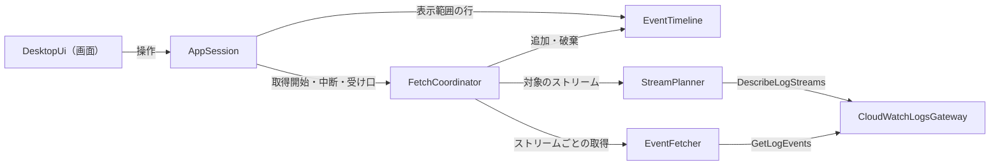
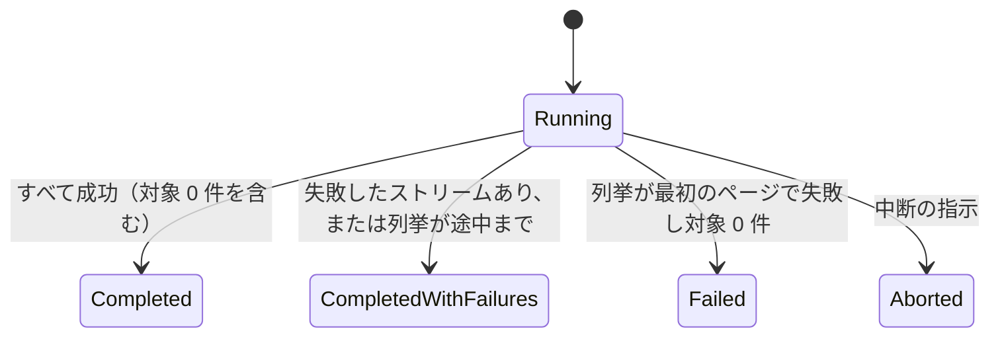
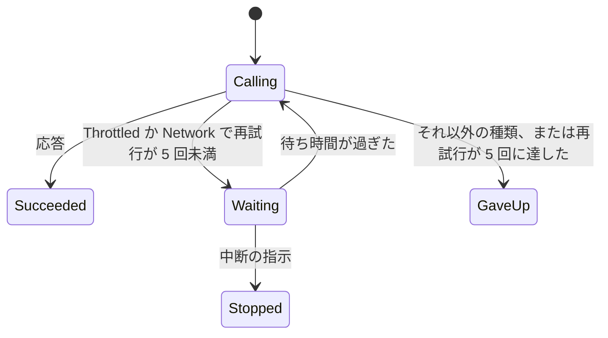
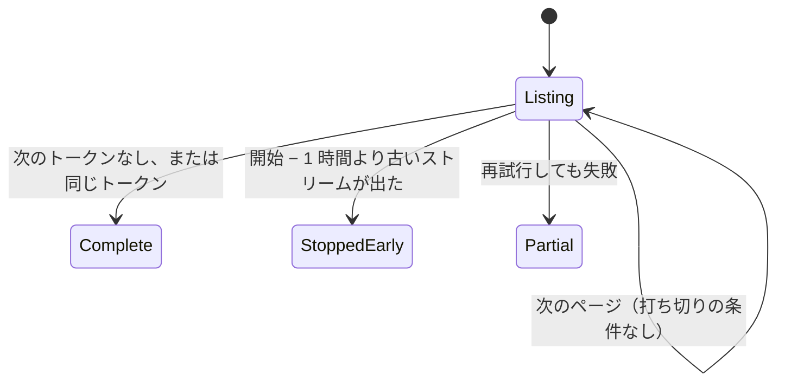
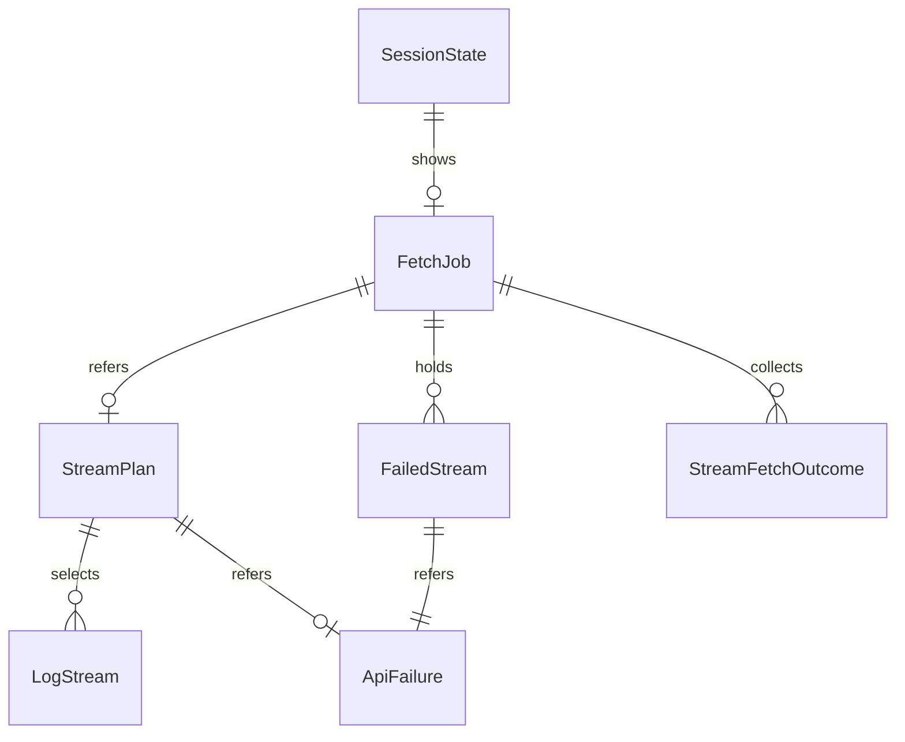

# Functional Spec — U3 取得の作り込み（u3-fetch-robustness）

上流の成果物：`inception/units-generation/unit-of-work.md`（U3 の範囲）、`inception/domain-design/components.md`（StreamPlanner・EventFetcher・EventTimeline・FetchCoordinator）、`inception/requirements-analysis/requirements.md`（FR4.1、FR4.2、FR4.5、FR4.7、FR4.8、FR4.10、FR4.11、NFR2〜NFR4）。データの形は `entities.md`、判断のルールは `rules.md` が正。この文書は手順（ワークフロー）と状態遷移の正であり、ER 図とルールの要約はそこから写した見やすい版。U1・U2 の流れは、ここで変えると書いたもの以外はそのまま有効。

## 1. U3 で動くもの

ストリーム名の手入力をなくし、[Fetch] を押すと、選んだロググループの中で時間範囲に関係するストリームをすべて取得する。取得したログは、取得したものから逐次、ストリームを跨いだ時刻順で「時刻 / ストリーム名 / メッセージ」の一覧に加わる。一覧は 100 万件でも表示範囲の行だけを描く。スロットリングと通信のエラーは待って再試行し、それでも失敗したストリームは失敗としてまとめ、取得できた分は表示する。

部品のつながり（U3 で足す部分を含む）：

<!-- Text fallback: 画面 → AppSession。AppSession は FetchCoordinator に取得の開始・中断を頼み、受け口で進み具合を受け、EventTimeline から表示範囲の行を読む。FetchCoordinator は StreamPlanner で対象のストリームを選び、EventFetcher でストリームごとに取得し、取得したログを EventTimeline に足す。StreamPlanner は DescribeLogStreams、EventFetcher は GetLogEvents を CloudWatchLogsGateway 経由で呼ぶ。 -->

## 2. ワークフロー

### UC1：ロググループ全体を取得する

1. 利用者がプロファイル・リージョン・ロググループを選び（U2）、日時を入れる。[Fetch] は、選択がそろい日時が検証を通ったときだけ押せる（BR6.1）。
2. 利用者が [Fetch] を押す。AppSession は phase を Fetching にし、取得条件の操作を無効にする（BR6.6）。
3. FetchCoordinator は新しい FetchJob（status = Running）を作り、最初の API を呼ぶ前に、保持ログと画面の前回の行・件数・失敗の一覧・直近の結果を消す（BR5.6、BR4.5）。受け口に「開始」を届ける（BR5.4）。画面には「取得中」と 0 件が出る。
4. StreamPlanner がストリームを列挙する（UC2）。列挙のページを受けるたびに、それまでに見たストリーム数と対象にしたストリーム数を受け口に届け、画面は「ストリームを列挙中」と対象にした数を出す（BR5.4、BR6.2）。終わったら、計画したストリーム数を受け口に届ける（BR5.4）。
5. EventFetcher が対象のストリームを 1 つずつ順に取得する（BR3.1）。各ストリームは U1 のページングのルールで最後のページまで取得する（BR3.2）。
   1. エラーが返ったら、UC3 の再試行を行う。
   2. ページを受けるたびに、ストリームごとに sequence を振り、FetchCoordinator が EventTimeline に時刻順の位置で足し（BR4.1、BR4.2）、受け口に追加件数と累計件数を届ける（BR5.4）。画面はステータス行の進み具合を更新し（BR6.2）、一覧の行数を増やす。一番上に見えている行は動かさない（UC5）。
   3. 再試行しても失敗したら、そのストリームを失敗としてまとめ（BR3.3、BR5.3）、次のストリームに進む。再試行を使い切って失敗したストリームが続けて 3 つになったら、残りのストリームは呼ばずに失敗とする（BR2.1）。
   4. ストリームの取得を終えるたびに、受け口に終了（成功・失敗）を届ける（BR5.4）。
6. すべてのストリームを終えたら、FetchJob の状態を決め（BR5.2）、受け口に届ける。AppSession は phase を Done（Completed・CompletedWithFailures）か Failed にする。
7. ステータス行に件数（0 件なら 0 件）を出し、失敗があれば「N ストリームで失敗」、列挙が途中までならその知らせを出す（BR6.2）。取得条件の操作を有効に戻す。

### UC2：ストリームを列挙して取得対象を決める

1. StreamPlanner は DescribeLogStreams を、最後のイベント時刻の新しい順で呼ぶ（BR1.1、BR1.4）。
2. ページを受けるたびに、先頭から順にストリームを見る。
   1. 最後のイベント時刻が「範囲の開始 − 1 時間」より古いストリームが出たら、それと、同じページでそれより後ろにある時刻を持つストリームを対象にせず、次のページを呼ばずに列挙をやめる（StoppedEarly、BR1.2）。そのページの中の時刻を持たないストリームは、位置にかかわらず対象に残す（BR1.2、BR1.3）。時刻なしのストリームの並びの仮定は rules.md の「前提と手元の確認の項目」のとおり手元で確かめる。
   2. それ以外のストリームは、範囲と重なるか、最初・最後のイベント時刻のどちらかを持たないときだけ対象にする（BR1.3）。
3. 次のトークンがない、または送ったトークンと同じトークンが返ったら、列挙を終える（Complete、BR1.1）。
4. エラーが返ったら UC3 の再試行を行い、それでも失敗したら列挙をやめ、それまでに選んだストリームだけを対象にして、列挙の失敗を残す（Partial、BR1.5）。

### UC3：待って再試行する

1. DescribeLogStreams か GetLogEvents がエラーを返す。
2. 種類が Throttled か Network なら、1・2・4・8・16 秒（それぞれ ±20% ばらつかせる）の順に待ってから、同じ要求を送り直す（BR2.1）。成功したら、次の要求の回数は 0 から数え直す（BR2.2）。
3. 5 回再試行しても失敗したら、その要求を失敗とする。それ以外の種類は再試行せずにすぐ失敗とする（BR2.1）。
4. 待っている間に中断を指示されたら、待たずにやめる（BR2.3）。
5. 取得全体の上限：再試行を使い切って失敗したストリームが続けて 3 つになったら、残りのストリームは呼ばずに失敗とする。途中で成功するか、使い切らずに失敗したら、続けての数は 0 に戻す（BR2.1）。

受け入れ条件（FR4.10、BR2.1、BR3.3）：

- Given 対象のストリームが 2 つあり、1 つ目の GetLogEvents が 2 回続けて Throttled を返し、3 回目に成功する
  When 利用者が [Fetch] を押す
  Then 1 つ目のストリームは 1 秒・2 秒（±20%）待った後に続きを取得し、2 つ目のストリームも取得し、結果は Completed で、失敗の数は出ない
- Given 1 つ目のストリームの GetLogEvents が 6 回続けて Throttled を返し、2 つ目は成功する
  When 利用者が [Fetch] を押す
  Then 1 つ目は再試行を使い切って失敗としてまとめられ、取得できたページは残り、2 つ目は取得され、結果は CompletedWithFailures で「1 ストリームで失敗」が出る
- Given 対象のストリームが 5 つあり、最初の 3 つがどれも再試行を使い切って失敗する
  When 利用者が [Fetch] を押す
  Then 4 つ目と 5 つ目は GetLogEvents を呼ばずに失敗とされ、結果は CompletedWithFailures で「5 ストリームで失敗」が出る

### UC4：失敗したストリームの一覧を見る

1. 取得後のステータス行の「N ストリームで失敗」を押すか、Tab で選んで Enter かスペースを押す（BR6.3、BR6.8）。
2. 失敗したストリームの名前と、エラーの種類名・安全な詳細の一覧が出る。列挙の失敗があれば一覧の先頭に出る（BR6.3）。フォーカスは [閉じる] にある。
3. Escape か [閉じる] で閉じる。取得し直すと一覧は閉じて中身も消える（BR5.6）。

### UC5：大量のログをスクロールして見る

1. 画面は保持ログを持たず、表示範囲の行だけを位置と件数で取り寄せて描く（BR4.3、BR6.4）。スクロールの範囲は保持件数から決める。
2. 取得中に保持ログが増えたら（timelineVersion が変わったら）：
   1. 一番上までスクロールしているときは、一番上のままにする（BR6.5）。
   2. そうでなければ、変わる前に一番上に見えていた行の新しい位置を求め、その行が同じ高さに見えるようにスクロールの位置を合わせる（BR4.4、BR6.5）。
3. 保持ログが破棄されたとき（取得の開始・中断・接続先の変更）は、timelineVersion が増え、一番上に戻る（BR4.5）。
4. 列の幅は固定で、メッセージは折り返さず 1 行に収まらない分を省略する（BR6.4）。
5. 上下の矢印キー・Page Up・Page Down・Home・End でもスクロールできる（BR6.8）。

### UC8：接続先の変更と、ほかの操作の順序

1. AppSession は接続先の世代番号を持ち、接続先の変更を確定するたびに 1 増やす（BR6.7）。
2. ロググループ一覧の読み込み・ロググループの選択・取得の開始は、受け取った時点の世代番号を覚えておく。
3. 結果を画面の状態に書く前に、いまの世代番号と比べ、違えばその結果を捨て、画面にも返さない（BR6.7）。
4. これにより、接続先の変更より前に出したロググループの選択が、変更の確定より後に終わっても、変更後の接続先の選択と一覧を上書きしない。

### UC6：取得を中断する（ウィンドウを閉じるときの内部処理）

1. 呼び出し元（U7 の確認ダイアログで [Close] が選ばれたとき）が中断を指示する。
2. FetchCoordinator は進行中の待ちを打ち切り、次の API を呼ばず、FetchJob を Aborted にし、保持ログを破棄する（BR5.5、BR2.3、BR4.5）。利用者向けの中断の操作は作らない。

### UC7：確認用プログラム（U1 の UC2 の変更点）

引数から --stream をなくし、この単位の流れ（UC1〜UC3）でロググループ全体を取得する。1 件 1 行で「UTC の時刻＋タブ＋ストリーム名＋タブ＋メッセージ」を時刻順に標準出力に出し、最後に件数・ストリーム数・失敗の数を標準エラーに出す。失敗したストリームがあれば、名前と種類・安全な詳細を標準エラーに出し、終了コード 1 で終わる（BR6.9）。

## 3. 状態遷移

### FetchJob.status

<!-- Text fallback: Running で始まり、すべて成功なら Completed（対象 0 件でも）、失敗したストリームがあるか列挙が途中までなら CompletedWithFailures、列挙が最初のページで失敗して対象が 0 件なら Failed、中断の指示なら Aborted。 -->

### 1 つの要求の再試行（UC3）

<!-- Text fallback: 呼び出し（Calling）で応答があれば成功（Succeeded）。Throttled か Network で再試行が 5 回未満なら待ち（Waiting）、待ち時間が過ぎたら呼び直す。それ以外の種類か再試行が 5 回に達したら失敗（GaveUp）。待っている間に中断の指示があれば止まる（Stopped）。 -->

### StreamPlan.listingStatus（UC2）

<!-- Text fallback: 列挙中（Listing）は、打ち切りの条件がなければ次のページへ。次のトークンがないか同じトークンが返れば Complete、開始 − 1 時間より古いストリームが出れば StoppedEarly、再試行しても失敗すれば Partial。 -->

SessionState.phase の遷移は U1・U2 のまま（Done は Completed と CompletedWithFailures の両方を含む。Aborted はウィンドウを閉じるときだけ起きるため、画面の状態としては扱わない）。

## 4. 画面（U3 で足す・変えるもの）

U3 の種類は service のため、frontend-components.md は作らない。見た目は標準部品だけにする（project.md Corrections）。

| 部分 | 内容 |
|------|------|
| 入力欄 | ストリーム名の欄をなくす（BR6.1） |
| ログ一覧 | 「時刻 / ストリーム名 / メッセージ」の 3 列。表示範囲の行だけを描く。1 行の高さと列の幅は固定。メッセージは折り返さず省略。矢印キー・Page Up・Page Down・Home・End でスクロール（BR6.4、BR6.8） |
| ステータス行 | 列挙中：「ストリームを列挙中」と対象にしたストリーム数。取得中：「取得中」、終えたストリーム数／計画したストリーム数、累計件数。取得後：件数（0 件を含む）、「N ストリームで失敗」（押せる）、列挙が途中までの知らせ（BR6.2） |
| 失敗の一覧 | 失敗したストリームの名前と種類名・安全な詳細。[閉じる]、Escape で閉じる（BR6.3） |

## 5. ER 図（entities.md から写したもの）

<!-- Text fallback: FetchJob は StreamPlan を 0〜1 つ参照し（列挙を終える前に中断したときは持たない）、StreamPlan は LogStream を 0 件以上選び、列挙の失敗の ApiFailure を 0〜1 つ参照する。FetchJob は FailedStream を 0 件以上持ち、各 FailedStream は ApiFailure を 1 つ参照する。FetchJob はストリームごとの StreamFetchOutcome を集める。SessionState は進み具合として FetchJob を 0〜1 つ表示する。LogEvent は EventTimeline が持ち、RowWindow で表示範囲を取り出す。RetryPolicy は再試行の決まり、ViewportAnchor は画面の位置を保つ補助で、ほかのエンティティとは関係しない。 -->

## 6. ルールの要約（rules.md から写したもの）

| 分類 | ルール |
|------|--------|
| ストリームの列挙と選定 | BR1.1 新しい順に列挙／BR1.2 古いストリームで打ち切り／BR1.3 範囲と重なるか時刻なしを対象／BR1.4 DescribeLogStreams を足す／BR1.5 列挙の途中のエラー |
| 再試行 | BR2.1 倍々に待って最大 5 回、使い切りが 3 ストリーム続いたら残りは失敗／BR2.2 要求ごとに数える／BR2.3 待ちの間の中断 |
| ストリームの取得 | BR3.1 1 つずつ順に／BR3.2 U1 のページングのルール／BR3.3 失敗したストリームは取得分を残して次へ |
| 保持と表示範囲 | BR4.1 時刻 → ストリーム名 → ストリームの中の順／BR4.2 逐次追加／BR4.3 表示範囲の取り出し／BR4.4 1 件の位置／BR4.5 開始と中断で破棄 |
| 取得の流れ | BR5.1 流れの順／BR5.2 結果の状態／BR5.3 失敗のまとめ／BR5.4 進み具合／BR5.5 中断／BR5.6 開始時に前回の行と件数を消す |
| 画面と確認用プログラム | BR6.1 ストリーム名の欄をなくす／BR6.2 ステータス行／BR6.3 失敗の一覧／BR6.4 3 列で表示範囲だけ描く／BR6.5 位置を保つ／BR6.6 取得中の操作の制限／BR6.7 操作を受け取った順に処理、古い世代の結果は捨てる／BR6.8 文言とキーボード／BR6.9 確認用プログラム |

## 7. テストの方針（team.md の Testing Posture に沿って）

- テストを先に書く純粋なロジック：ストリームの選定と打ち切り（BR1.2、BR1.3。余裕 1 時間の境界、時刻なし）、再試行の判断と待ち時間の計算（BR2.1、BR2.2。乱数は差し替えられる形にする。使い切りが続けて 3 つの上限と数え直し）、接続先の世代番号による古い結果の破棄（BR6.7）、時刻順の並べ替えと逐次の挿入（BR4.1、BR4.2）、表示範囲の取り出しと 1 件の位置（BR4.3、BR4.4）、結果の状態の決め方（BR5.2）、位置を保つ計算（BR6.5）。
- 実装してからテストを書くもの：DescribeLogStreams・GetLogEvents の偽物を使った取得の流れ（複数ストリーム、空ページ、スロットリングからの回復、再試行の上限、列挙の打ち切り・途中のエラー、ストリーム単位の失敗、中断、受け口に届く順序）、AppSession と画面（進み具合、失敗の一覧、表示範囲の取り寄せ、キーボード操作）。待ち時間はテストで実時間を待たない形にする。
- 100 万件の保持と表示範囲の取り出しの速さは、ライブラリ側で 100 万件を足して取り出す時間と、1 件の位置の問い合わせが 10 ミリ秒以内であることを確かめるテストを置く（NFR2、BR4.4）。
- 時刻を持たないストリームの並び（BR1.2 の仮定）は、開発者本人の手元で実際の AWS に対して確かめる（rules.md の「前提と手元の確認の項目」）。画面のスクロールの体感は手元の目視で確かめる。
- 自動テストと CI は実際の AWS に接続しない。
