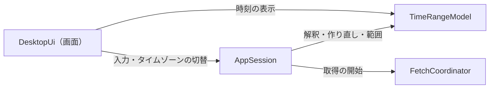
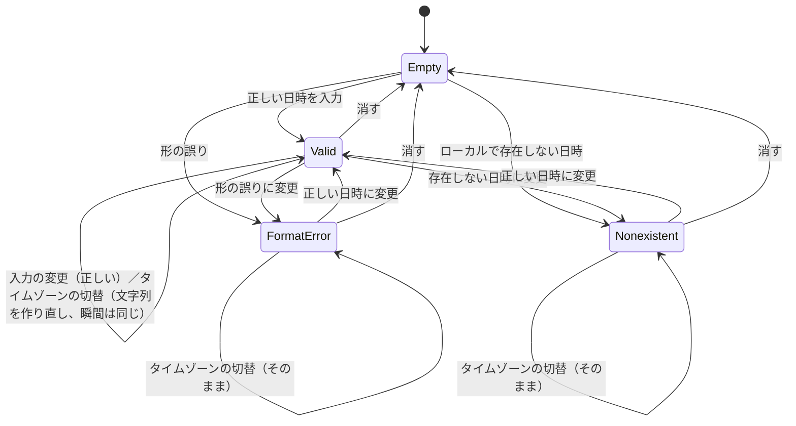
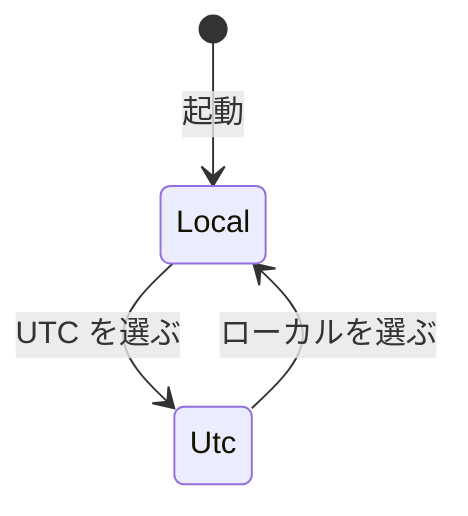
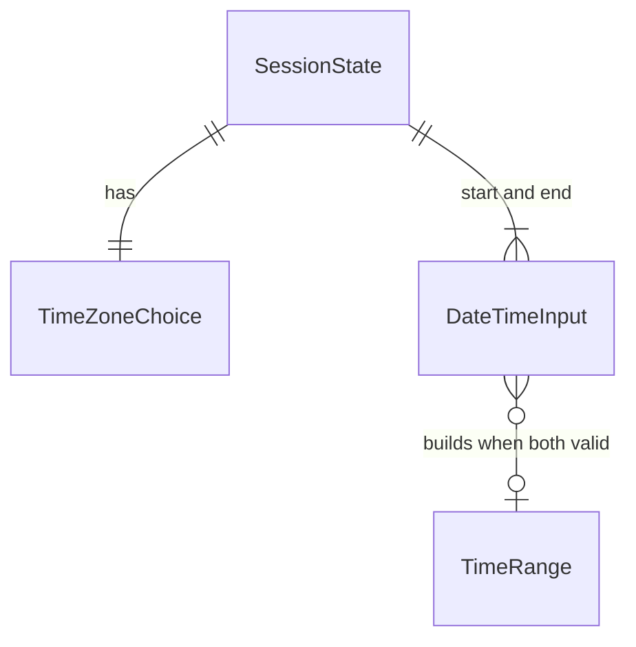

# Functional Spec — U4 時間範囲とタイムゾーン（u4-time-range）

上流の成果物：`inception/units-generation/unit-of-work.md`（U4 の範囲）、`inception/domain-design/components.md`（TimeRangeModel・AppSession・DesktopUi）、`inception/requirements-analysis/requirements.md`（FR3.2〜FR3.4、FR3.6）。データの形は `entities.md`、判断のルールは `rules.md` が正。この文書は手順（ワークフロー）と状態遷移の正であり、ER 図とルールの要約はそこから写した見やすい版。U1〜U3 の流れは、ここで変えると書いたもの以外はそのまま有効。

## 1. U4 で動くもの

上部バーで、日時の入力とログ一覧の時刻表示のタイムゾーンを、ローカルと UTC から選べるようにする。起動のたびにローカルから始まる。切り替えても入力済みの開始・終了日時は同じ瞬間を指したまま表示だけが変わり、ログ一覧の時刻も取得し直さずに表示が変わる。ローカルの夏時間で存在しない日時は入力の誤り（形式の誤りとは別の理由）、2 回現れる日時は早い方の瞬間として扱う。[Fetch] を押せない理由は、条件の並びの順にすべて文字で示す。

部品のつながり（U4 で足す部分を含む）：

<!-- Text fallback: 画面は入力とタイムゾーンの切替を AppSession に伝える。AppSession は TimeRangeModel で入力を解釈し、切り替え時は入力を瞬間から作り直し、取得の範囲を作って FetchCoordinator に渡す。画面のログ一覧の時刻表示も、TimeRangeModel と同じタイムゾーンの決まりを使う。 -->

## 2. ワークフロー

### UC1：タイムゾーンを切り替える

1. 起動直後はローカルが選ばれている（BR1.1）。
2. 利用者が上部バーでローカルか UTC を選ぶ（マウス、または Tab と矢印キー・スペース。BR3.3）。取得中・確認待ちでも選べる（BR1.4）。
3. 開始・終了の入力欄のうち、瞬間を持つものは、その瞬間を新しいタイムゾーンで表した文字列に作り直す。瞬間は変わらない（BR1.4）。
4. 瞬間を持たない入力欄（空・形式の誤り・存在しない日時）は、文字列と誤りの表示をそのまま残す（BR1.4、Q1）。
5. [Fetch] を押せる条件を確かめ直し、理由の表示を更新する（BR2.1）。
6. ログ一覧の時刻の列の見出しを「時刻（ローカル）」か「時刻（UTC）」に変え、表示中の行の時刻を新しいタイムゾーンで描き直す。取得し直さず、並び順も変わらない（BR3.1、BR3.2）。

受け入れ条件：

- Given ローカル（UTC+9）で開始 `2024-03-01 10:00:00` を入力した When タイムゾーンを UTC に切り替える Then 入力欄は `2024-03-01 01:00:00` と表示され、取得範囲は変わらない
- Given 開始に `2024-13-01 00:00:00` と入力している When タイムゾーンを切り替える Then 入力欄は `2024-13-01 00:00:00` のまま、形式の誤りの理由も残る
- Given 取得済みのログが表示されている When タイムゾーンを切り替える Then 取得の API は呼ばれず、各行の時刻と列の見出しだけが変わる
- Given 夏時間の終わりで 2 回現れるローカルの時刻の遅い方に当たる瞬間を UTC で入力した When ローカルに切り替え、さらに UTC に戻す Then 入力欄は最初の UTC の文字列に戻る（瞬間が保たれる）

### UC2：日時を入力する

1. 利用者が開始・終了の入力欄に `yyyy-mm-dd hh:mm:ss` を入れる（取得中は入力できない。U1:BR1.4）。
2. 入力が変わるたびに、いまのタイムゾーンで解釈し直す（BR1.5）。
   1. 空なら、誤りも瞬間も持たない（[Fetch] の条件の「空でない」を満たさない）。
   2. 形や日付・時刻が正しくなければ、形式の誤り（BR1.2）。
   3. UTC なら、その時刻をそのまま UTC の瞬間にする。
   4. ローカルで、その時刻に当たる瞬間が 1 つならそれ、2 つなら早い方、0 個なら「夏時間の切り替えで存在しない日時」の誤り（BR1.2、BR2.2）。
3. 開始・終了の両方が瞬間を持てば、瞬間で順序を確かめる（BR1.6）。
4. [Fetch] を押せる条件を確かめ直し、理由の表示を更新する（BR2.1）。

受け入れ条件：

- Given ローカルが夏時間のある地域（例：America/New_York）で、2024-03-10 に 02:00 から 03:00 に進む When 開始に `2024-03-10 02:30:00` を入れる Then [Fetch] は押せず、「開始日時は夏時間の切り替えで存在しない日時です」が表示される
- Given 同じ地域で、2024-11-03 に 01:00〜02:00 が 2 回現れる When 開始に `2024-11-03 01:30:00` を入れる Then 早い方（夏時間の側、UTC の 05:30:00）の瞬間として扱われる
- Given 開始日時が終了日時より後 When 入力する Then [Fetch] は押せず、順序の理由が表示される

### UC3：[Fetch] を押せるかと、押せない理由を見る

1. 選択・入力・タイムゾーン・phase が変わるたびに、AppSession が FR3.4 の条件をすべて確かめる（BR2.1）。
2. 満たさない理由を、プロファイルとリージョン → ロググループ → 開始・終了の入力 → 順序 → 取得中の順にすべて並べて示す。開始か終了が誤りのときは、順序の理由は出さない（BR2.1）。
3. すべて満たせば [Fetch] を押せる。押したときの範囲は瞬間から作る（BR1.6）。

### UC4：確認用プログラム（変更なし）

確認用プログラムの日時の引数と出力の時刻は UTC のまま（BR3.5）。

## 3. 状態遷移

### DateTimeInput

<!-- Text fallback: 入力欄は空（Empty）から始まる。正しい日時なら Valid、形の誤りなら FormatError、ローカルで存在しない日時なら Nonexistent。Valid はタイムゾーンを切り替えると文字列を作り直すが瞬間は同じまま Valid にとどまる。FormatError と Nonexistent はタイムゾーンを切り替えても文字列も誤りもそのまま。どの状態からも入力を変えれば解釈し直し、消せば Empty に戻る。なお Nonexistent の文字列は、UTC に切り替えてもそのまま残る（Q1）。利用者が書き換えたときに、いまのタイムゾーンで解釈し直される。 -->

### TimeZoneChoice

<!-- Text fallback: 起動のたびにローカルから始まり、利用者の選択でローカルと UTC を行き来する。選択は保存しない。 -->

SessionState.phase の遷移は U1〜U3 のまま。タイムゾーンの切替は phase を変えない。

## 4. 画面（U4 で足す・変えるもの）

U4 の種類は service のため、frontend-components.md は作らない。見た目は標準部品だけにする（project.md Corrections）。

| 部分 | 内容 |
|------|------|
| 上部バー | タイムゾーンの切替（ローカル / UTC）。標準部品。取得中も使える（BR3.3） |
| 入力欄 | 開始・終了日時。いまのタイムゾーンの壁時計の時刻で表示し、入力も同じタイムゾーンで解釈する（BR1.2、BR1.4） |
| [Fetch] を押せない理由 | 条件の並びの順にすべて。夏時間で存在しない日時は形式の誤りとは別の文言（BR2.1、BR2.2） |
| ログ一覧 | 時刻の列の見出しに「（ローカル）」「（UTC）」。各行は選んだタイムゾーンの yyyy-mm-dd hh:mm:ss.mmm（BR3.1、BR3.2） |

## 5. ER 図（entities.md から写したもの）

<!-- Text fallback: SessionState はタイムゾーンを 1 つと、開始・終了の入力欄を 2 つ持つ。開始と終了の両方が瞬間を持つとき、その 2 つから TimeRange を作る。ValidationError は [Fetch] を押せない理由で、入力欄の誤りから作る。 -->

## 6. ルールの要約（rules.md から写したもの）

| 分類 | ルール |
|------|--------|
| タイムゾーンと入力 | BR1.1 ローカルと UTC、起動のたびにローカル／BR1.2 選んだタイムゾーンで解釈／BR1.3 文字列と瞬間／BR1.4 切り替えても同じ瞬間／BR1.5 書き換えたら解釈し直す／BR1.6 範囲と順序は瞬間から |
| [Fetch] の条件 | BR2.1 条件と理由／BR2.2 存在しない日時は別の理由 |
| 表示 | BR3.1 一覧の時刻／BR3.2 見出しのタイムゾーン／BR3.3 上部バーの切替／BR3.4 画面とライブラリは同じローカル／BR3.5 確認用プログラムは UTC |

## 7. テストの方針（team.md の Testing Posture に沿って）

- テストを先に書く純粋なロジック：選んだタイムゾーンでの解釈（UTC、夏時間のない地域、夏時間のある地域で存在しない日時・2 回現れる日時、境界の秒）、切り替えでの作り直し（瞬間が保たれる、2 回現れる時刻の遅い方でも往復で元に戻る、変換できない入力はそのまま）、瞬間からの範囲と順序、[Fetch] の理由の並び、ログの時刻の表示（夏時間をまたぐ行でオフセットが変わる）。タイムゾーンは決めた値に差し替えられる形にし、OS の設定に依存させない（BR3.4）。
- 実装してからテストを書くもの：AppSession のつなぎ（切替が取得中も受け付けられ phase を変えない、入力の書き換えは取得中に拒まれる）、画面（上部バーの切替、見出しの切替、取得し直さずに時刻が変わる、理由の文言の英日、キーボードの操作）。
- 自動テストと CI は実際の AWS に接続しない。
