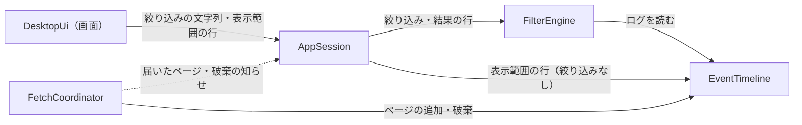
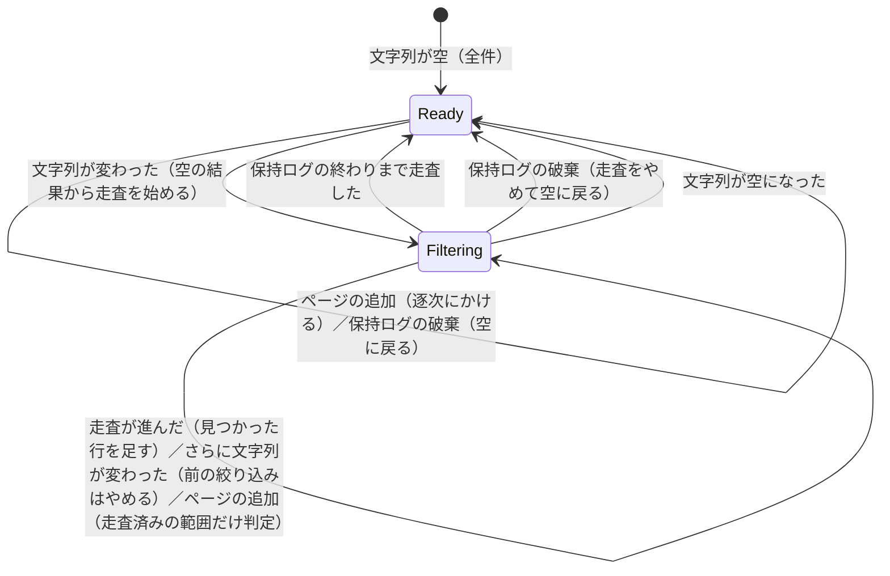
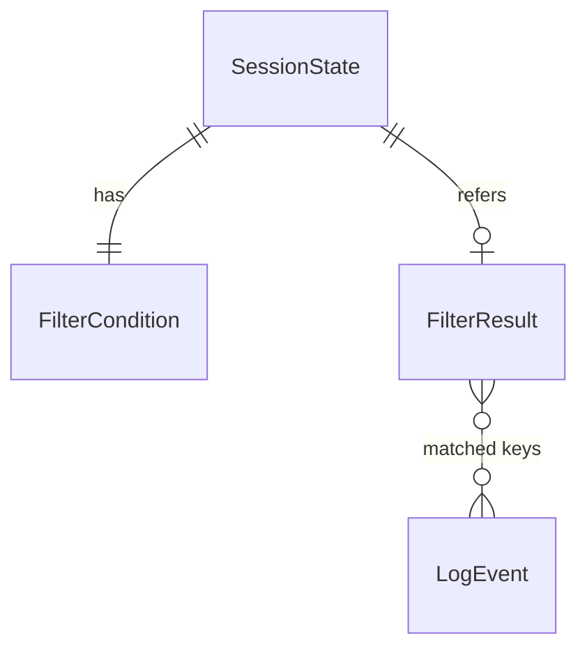

# Functional Spec — U5 絞り込み（u5-filter）

上流の成果物：`inception/units-generation/unit-of-work.md`（U5 の範囲）、`inception/domain-design/components.md`（FilterEngine・AppSession・DesktopUi）、`inception/requirements-analysis/requirements.md`（FR6.1〜FR6.5、NFR1、NFR2）。データの形は `entities.md`、判断のルールは `rules.md` が正。この文書は手順（ワークフロー）と状態遷移の正であり、ER 図とルールの要約はそこから写した見やすい版。U1〜U4 の流れは、ここで変えると書いたもの以外はそのまま有効。

## 1. U5 で動くもの

条件エリアの絞り込みの欄に文字列を入れると、取得済みのログのうち、メッセージにその文字列を含む行だけを一覧に出す（大文字・小文字は区別しない）。入力が止まってから約 0.3 秒後にかけ、AWS の API は呼ばない。ステータス行には「絞り込み後 / 全件」を出し、絞り込みに時間がかかっている間は絞り込み中と出す。取得中も届いたログに逐次同じ絞り込みをかけ、取り直しても絞り込みの文字列は残る。

部品のつながり（U5 で足す部分を含む）：

<!-- Text fallback: 画面は絞り込みの文字列と表示範囲の行の求めを AppSession に渡す。AppSession は FilterEngine に絞り込みを頼み、絞り込み中は FilterEngine から結果の行を得る。FilterEngine は EventTimeline のログを読む。絞り込みがないときは AppSession が EventTimeline から直接行を得る。FetchCoordinator がページを追加・破棄すると、その知らせを受けた AppSession が FilterEngine に逐次の絞り込みや結果の破棄を頼む。 -->

## 2. ワークフロー

### UC1：絞り込む

1. 利用者が条件エリアの絞り込みの欄に文字列を入れる（取得中も入れられる。BR3.4）。
2. 最後の入力から約 0.3 秒、新しい入力がなければ、その文字列をライブラリに渡す（BR1.3）。
3. 前後の空白を除く。空なら絞り込みをやめて全件を出し、「絞り込み後 / 全件」を消す（BR1.1）。
4. 文字列が前と変わっていれば、filterId を 1 増やし、進行中の絞り込みをやめる（BR1.4）。
5. 新しい filterId の空の結果に入れ替え、一覧の一番上に戻る（BR1.5、BR3.2）。
6. 保持ログをキーの小さい順に小分けに走査し、メッセージの部分一致（大文字・小文字を区別しない）をかける（BR1.2、BR1.5）。1 回分ごとにロックを取って放し、見つかった行を結果に足して結果の版を増やし、画面に知らせる（BR2.5、BR3.6）。終わりまで走査するまで：
   1. ステータス行に「絞り込み中」と、ここまでの「絞り込み後 N 件 / 全 M 件」を出す（BR3.3）。
   2. 一覧には、ここまでに見つかった行を出し、見つかるたびに増えていく（一番上に見えている行は動かさない）。スクロールも入力もできる（BR1.5、BR3.2）。
   3. その間に新しい文字列が来たら、4 からやり直す。古い走査の結果は捨てる（BR1.4、BR2.4）。
7. 終わりまで走査したら Ready にし、「絞り込み中」を消す（0 件なら 0 件と文字で出す）（BR3.3）。
8. 一覧は、結果の版が変わるたびに、絞り込み結果の行だけを表示範囲の分だけ取り寄せ直して描く（BR3.1、BR3.6）。

受け入れ条件：

- Given 取得済み 10 万件 When 絞り込み文字列を入れる Then 10 秒以内に結果が表示される（NFR1）
- Given 取得済み 100 万件 When 絞り込み文字列を入れる Then 100 秒以内に結果が表示され、その間も一覧のスクロールに 1 秒以内に反応する（NFR2）
- Given メッセージが `Error: timeout` の行 When `error` で絞り込む Then その行が表示される（Q1）
- Given どの行にも含まれない文字列 When 絞り込む Then 0 件であることが文字で表示される

### UC2：取得中に絞り込む・取り直す

1. 絞り込みの文字列が入っている状態で [Fetch] を押す。保持ログが破棄され、保持ログの世代が進み、結果は空になる。文字列は残る（BR2.2）。
2. ページが届くたびに、AppSession が届いたページの行を絞り込みにも渡し、保持ログへの追加と同じロックの中で、その行だけに同じ条件をかけ、合う行のキーを結果に入れる。「絞り込み後 / 全件」が増え、結果の版が進む（BR2.1、BR2.5、BR3.3、BR3.6）。
3. 一番上に見えている行は動かさない（BR3.2、U3:BR6.5）。
4. 取得中に文字列を変えたら、UC1 の 4〜7 のとおりかけ直す。走査の途中に届いたページの行は、走査済みの範囲（キーが走査の位置以下）のものだけをその場で判定し、それより後ろのものはその後の走査で見る。取りこぼしも重複もしない（BR2.1）。

受け入れ条件：

- Given 絞り込み文字列 `ERROR` を入れている When 条件を変えて取得し直す Then 新しい結果も `ERROR` で絞り込まれる（FR6.4）
- Given 絞り込み中に取得している When ページが届く Then 合う行だけが一覧に加わり、「絞り込み後 / 全件」の両方が増える（Q3）

### UC3：保持ログが破棄されたとき

取得の開始・中断・接続先の変更で保持ログが破棄されたら、保持ログの世代を進めて結果を空にし、文字列は残す。進行中の走査はやめ、古い世代に対する結果は捨てる（BR2.2、BR2.4）。

## 3. 状態遷移

### FilterResult.status

<!-- Text fallback: 文字列が空のときは Ready（全件）。文字列が変わると空の結果から走査を始めて Filtering になる。走査が進むたびに見つかった行が足され、ページが追加されたら走査済みの範囲だけを判定する。さらに文字列が変われば前の絞り込みをやめて Filtering のままやり直す。保持ログの終わりまで走査すると Ready。Filtering の途中で保持ログが破棄されれば、走査をやめて空の Ready に戻る。Ready のままページが追加されれば逐次にかけ、保持ログが破棄されれば空に戻る。Filtering の途中で文字列が空になれば絞り込みをやめて Ready（全件）。 -->

SessionState.phase の遷移は U1〜U4 のまま。絞り込みは phase を変えない。

## 4. 画面（U5 で足す・変えるもの）

U5 の種類は service のため、frontend-components.md は作らない。見た目は標準部品だけにする（project.md Corrections）。

| 部分 | 内容 |
|------|------|
| 条件エリア | 絞り込みの入力欄（ラベル・プレースホルダーは英日）。取得中も使える（BR3.4） |
| ステータス行 | 「絞り込み後 N 件 / 全 M 件」、0 件の文字、「絞り込み中」。取得中の進み具合と並べる（BR3.3） |
| ログ一覧 | 絞り込み中は合う行だけ（走査中はここまでに見つかった行）。結果の版が変わるたびに取り寄せ直す。文字列を変えた・解いたときは一番上に戻る（BR3.1、BR3.2、BR3.6） |

## 5. ER 図（entities.md から写したもの）

<!-- Text fallback: SessionState は絞り込みの条件を 1 つ持ち（文字列が空なら条件なしと同じ）、直近の絞り込み結果を 0〜1 つ参照する。絞り込み結果は、合う LogEvent を並べ替えのキーで参照する。RowWindow は、絞り込み中は結果の中の行を返す補助。 -->

## 6. ルールの要約（rules.md から写したもの）

| 分類 | ルール |
|------|--------|
| 条件とかけ方 | BR1.1 空なら絞り込まない／BR1.2 メッセージ全体、大文字・小文字を区別しない／BR1.3 約 0.3 秒後／BR1.4 かけ直し／BR1.5 手元で画面を止めずに |
| 結果の保ち方 | BR2.1 取得中は逐次（走査済みの範囲だけ）／BR2.2 破棄で世代を進めて空、文字列は残す／BR2.3 キーの順／BR2.4 古い結果は捨てる／BR2.5 ロックの順 |
| 画面 | BR3.1 結果の行の取り寄せ／BR3.2 位置（条件が変われば一番上）／BR3.3 ステータス行／BR3.4 入力欄／BR3.5 確認用プログラムは変えない／BR3.6 結果の版の知らせと取り寄せ直し |

## 7. テストの方針（team.md の Testing Posture に沿って）

- テストを先に書く純粋なロジック：条件の正規化（前後の空白、空）、一致の判定（大文字・小文字、改行を含むメッセージ、ストリーム名は比べない、日本語などの Unicode）、小分けの走査と結果の並び（キーの順）、走査中のページの追加（走査済みの範囲は判定・未走査の範囲は走査に任せる。取りこぼしも重複もない）、破棄で世代が進み空、filterId・世代による古い結果の破棄、結果の版の増え方、結果の中の行の取り出しと位置の問い合わせ。
- 実装してからテストを書くもの：AppSession のつなぎ（取得中の逐次、取り直しで文字列が残る、絞り込み中も操作できる、ロックの順、session-changed と fetch-progress に絞り込みの状態が入る）、画面（0.3 秒待ち、結果の版が変わると件数が同じでも取り寄せ直す、古い版の行は捨てる、ステータス行の表示、0 件の文字、入力欄のキーボード操作、英日）。0.3 秒の待ちは、テストで実時間を待たない形にする。
- 10 万件・100 万件の速さは、ライブラリ側でリリースビルドの `#[ignore]` のテストで確かめる（NFR1、NFR2）。画面の体感は手元の目視で確かめる。
- 自動テストと CI は実際の AWS に接続しない。
