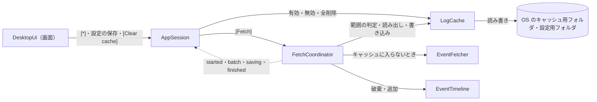
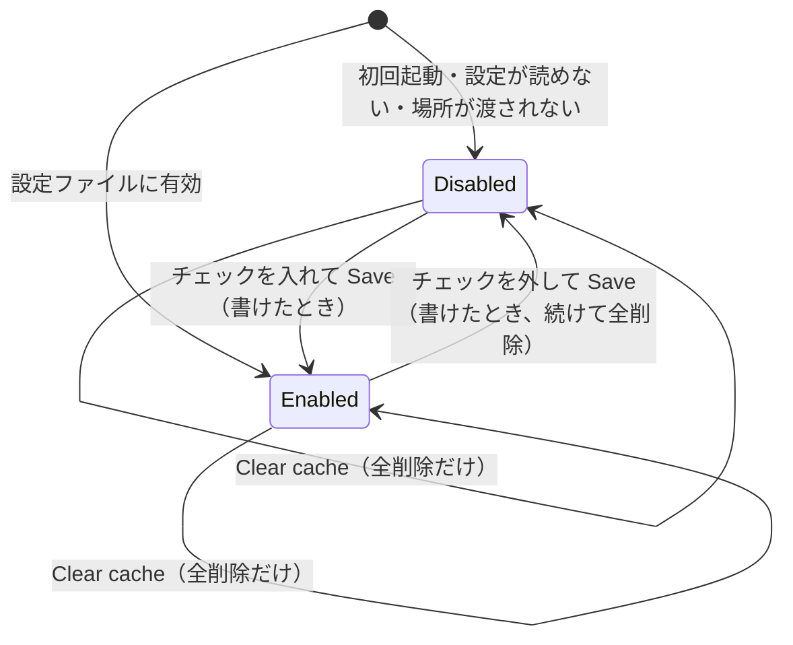
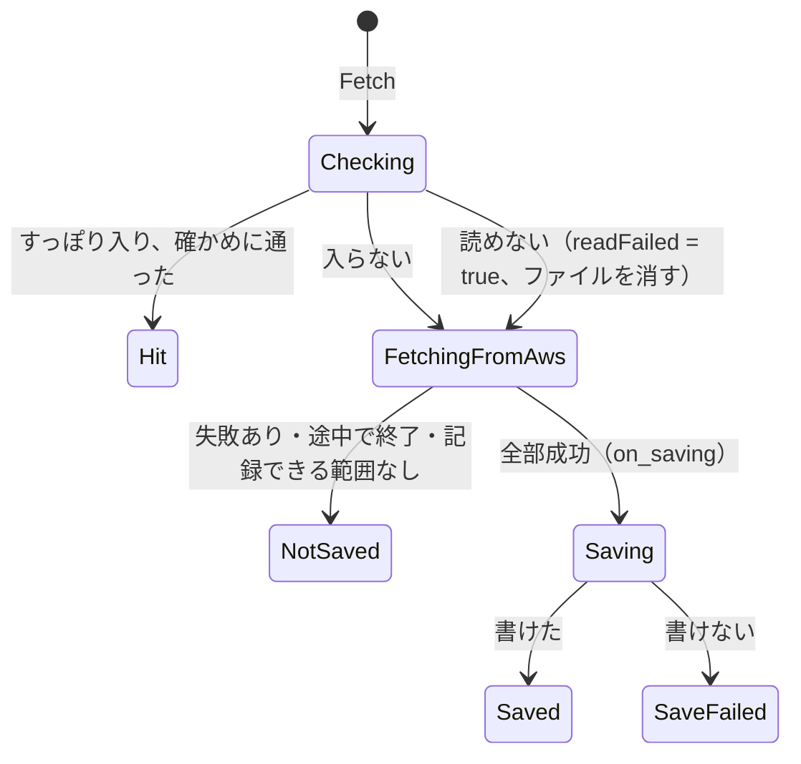
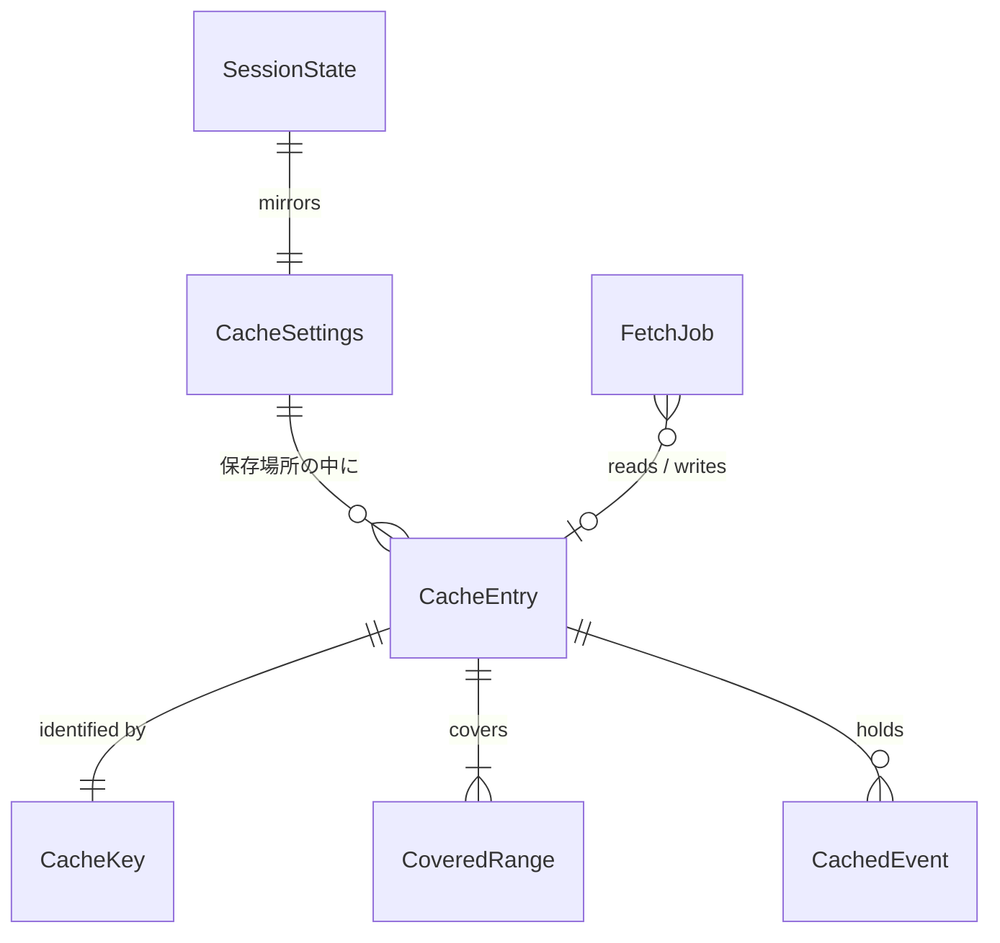

# Functional Spec — U6 ディスクキャッシュ（u6-disk-cache）

上流の成果物：`inception/units-generation/unit-of-work.md`（U6 の範囲）、`inception/domain-design/components.md`（LogCache・FetchCoordinator・AppSession・DesktopUi）、`inception/requirements-analysis/requirements.md`（FR7.1〜FR7.9、NFR5、NFR8、NFR15）、`ideation/rough-mockups/wireframes.md`（画面 6）、`ideation/rough-mockups/user-flow.md`（補助フロー 3）。データの形は `entities.md`、判断のルールは `rules.md` が正。ステータス行の文言の正本は rules.md の BR5.3。この文書は手順（ワークフロー）と状態遷移の正であり、ER 図とルールの要約はそこから写した見やすい版。U1〜U5 の流れは、ここで変えると書いたもの以外はそのまま有効。

## 1. U6 で動くもの

上部バーの [*] で設定ダイアログを開き、ディスクキャッシュを有効にできる（既定は無効）。有効にすると、すべてのストリームの取得が成功して最後まで終わった取得の結果を、取得を始めた時刻の 5 分前までの部分だけ、OS のキャッシュ用フォルダに保存する。同じプロファイル・リージョン・ロググループで、指定した時間範囲がキャッシュ済みの範囲にすっぽり入るときは、AWS の API を呼ばずにキャッシュから表示する。有効・無効の設定はアプリを閉じても覚えておく。無効にして保存するか [Clear cache] を押すと、保存済みのキャッシュをすべて消す。キャッシュが壊れていて読めないときは、それを捨てて AWS から取り直す。

U5 から持ち越した振る舞いの変更として、絞り込みの欄で Enter を押すと 0.3 秒待たずにすぐ絞り込む（BR5.4）。

部品のつながり（U6 で足す部分を含む）：

<!-- Text fallback: 画面は [*]・設定の保存・[Clear cache] を AppSession に伝える。AppSession は LogCache に有効・無効の保存と全削除を頼み、[Fetch] では FetchCoordinator に取得を頼む。FetchCoordinator は LogCache に範囲がキャッシュ済みかを尋ね、入っていればキャッシュから読み出して確かめ、EventTimeline を破棄して追加する。入っていなければ U3 のとおり EventFetcher で AWS から取得し、全部成功したら LogCache に書き込む。進み具合（開始・追加・保存中・終了）は AppSession に届ける。LogCache は OS のキャッシュ用フォルダと設定用フォルダのファイルを読み書きする。 -->

## 2. ワークフロー

### UC1：キャッシュを有効にする（補助フロー 3）

1. 利用者が上部バーの [*] を押す（取得中・接続変更の確認中は押せない。BR5.1）。
2. 設定ダイアログ（画面 6）が開き、入力位置はチェックボックスに移る（BR5.2）。保存場所と「ログに機密情報が含まれうる」の注意が常に出ている（FR7.2、FR7.3）。開いているあいだ、ほかの操作はできない（ライブラリ側でも拒む。BR5.1）。
3. 利用者がチェックを入れて [Save] を押す。
4. 有効・無効の 1 項目を設定ファイルに書く（BR1.1、権限は BR3.6）。書けたらダイアログを閉じ、入力位置を [*] に戻す。書けなければダイアログを開いたまま誤りを出し、設定は前のまま（BR1.3）。
5. [Cancel] か Escape なら、保存せずに閉じる（BR5.2）。

### UC2：取得する（キャッシュが有効なとき）

1. 利用者が [Fetch] を押す。U1〜U4 の検証のあと、範囲 [startMs, endMs] とキー（プロファイルの kind と名前・リージョン・ロググループ）が決まる（BR2.1）。
2. キャッシュが無効なら、U3 のとおり AWS から取得し、何も書かない（BR1.5）。ここで終わり。
3. キーのキャッシュのキーと範囲だけを、ブロッキング用のスレッドで読む（中身のイベントはまだ読まない。BR4.2）。
4. 指定範囲が 1 つのキャッシュ済み範囲にすっぽり入るとき（BR2.3）：
   1. 範囲内のイベントをすべて読み、BR4.1 の確かめ（並び・範囲・形）をすべて終える。この間、保持ログには触れない。確かめに失敗したら UC3 へ。
   2. sequence を振り直し（BR4.3）、保持ログを破棄して on_started を出し、1 回でまとめて追加して、件数が 1 以上なら on_batch を 1 回出す（BR3.7）。U5 の絞り込みもそのままかかる。
   3. AWS の API は 1 回も呼ばない。ジョブは Completed、失敗 0、servedFromCache = true、cacheOutcome = Hit で on_finished を出す。
   4. ステータス行に BR5.3 の cache.hit と件数を出す。
5. 入らないとき（一部だけ・2 つにまたがる・キャッシュがない）：U3 のとおり、指定範囲をすべて AWS から取得する（BR2.4）。知らせは U3 の順（started → listing → planned → batches・streams）。
6. AWS からの取得が終わったら、on_finished を出す前に（BR3.2、BR3.7）：
   1. 失敗したストリームがある・途中で終わった・ジョブ全体が失敗した、のどれかなら書き込まない。既存のキャッシュも変えない（NotSaved）。
   2. 記録する範囲の終わりを min(終了, 取得を始めた時刻 − 5 分) にする。開始より前になるなら書き込まない（BR3.1、NotSaved）。
   3. 書き込むときは on_saving を出す。AppSession は cacheSaving を true にし、ステータス行に BR5.3 の cache.saving を添える。フェーズは取得中のまま（BR3.5）。
   4. 保持ログから記録する範囲のイベントを、短い区切りごとにロックを取って放しながら写し取る。既存のキャッシュの読み出し・合わせ込み・書き込みはブロッキング用のスレッドで行う（BR3.5）。既存から記録する範囲のイベントを捨てて新しいイベントを足し、範囲をつなげる。既存が読めなければ今回の範囲だけで作り直す（BR3.3）。一時ファイルに全部書いてから入れ替える（BR3.4）。
   5. 書けたら Saved、書けなかったら SaveFailed とする（BR3.5）。取得結果は表示したまま。
7. cacheOutcome と readFailed を入れたジョブで on_finished を出す。AppSession は cacheSaving を false に戻し、cacheNotices を作り、U3 のとおり取得中のロックを解く（BR3.7、BR5.3）。

### UC3：キャッシュが読めないとき（Q5）

1. UC2 の 3 か 4 で、ファイルが読めない・途中で切れている・書式の版を知らない・中のキーが違う・範囲の形がおかしい・イベントが範囲の外にある・並びが違う、のどれかに当たる（BR2.2、BR4.1）。保持ログにはまだ何も足していない。
2. そのキーのキャッシュファイルを消す。消せなくても先に進む（BR4.1）。
3. readFailed = true とし、UC2 の 5 と同じく AWS から取得する。U3 の取得の始めで保持ログは破棄されるため、空から始まる。条件を満たせば 6 のとおり書き込む（入れ替えで古いファイルを置き換える）。
4. ステータス行に BR5.3 の cache.readFailed を出す。書き込みに失敗していれば cache.saveFailed も並べて出す（BR5.3）。

### UC4：キャッシュを消す・無効にする

1. 設定ダイアログで [Clear cache] を押すと、その場でキャッシュ用フォルダの直下の、名前の型が合う通常のファイル（キャッシュと書きかけの一時ファイル）だけを消す。シンボリックリンクはたどらない。消したこと・消せなかったことをダイアログに出す。有効・無効は変えず、[Cancel] で取り消せない（BR1.4）。
2. チェックを外して [Save] を押すと、無効を設定ファイルに書いたあと、保存済みのキャッシュをすべて消す（BR1.3）。消せなかったときは、設定は無効のまま、ダイアログにその旨を出す。

### UC5：起動する

1. アプリの起動時に、OS のフォルダから設定ファイルとキャッシュ用フォルダの場所を決め、AppSession に渡す（BR1.6）。
2. 設定ファイルを読み、有効・無効を決める。ない・読めない・解釈できないときは無効として起動する（BR1.1、BR1.2）。
3. プロファイル・リージョン・ロググループは U2 のとおり覚えていない（BR1.1）。

## 3. 状態遷移

### CacheSettings.cacheEnabled

<!-- Text fallback: 起動時、設定ファイルに有効と書かれていれば Enabled、それ以外（初回・読めない・場所が渡されない）は Disabled。チェックを入れて Save して設定を書けたら Enabled に、外して Save して書けたら Disabled になり、続けて保存済みのキャッシュを全部消す。Clear cache は状態を変えず、キャッシュを全部消すだけ。設定が書けなかったときは状態は変わらない。 -->

### FetchJob のキャッシュの扱い（キャッシュが有効なとき）

<!-- Text fallback: Fetch でキャッシュを確かめる。すっぽり入り、中身の確かめに通れば Hit（AWS を呼ばない）。入らなければ AWS から取得する。読めなければ readFailed を true にしてファイルを消し、AWS から取得する。AWS からの取得に失敗したストリームがある・途中で終わった・記録できる範囲がないときは NotSaved。全部成功したら on_saving を出して書き込み、書けたら Saved、書けなければ SaveFailed。readFailed は cacheOutcome とは別に残るため、取り直したあとの SaveFailed も一緒に知らせる。キャッシュが無効なら NotUsed のまま。 -->

## 4. 取得の知らせの順（BR3.7、U3:BR5.4 の例外）

| 場合 | 順 |
|------|----|
| Hit | （確かめを全部終える）→ 破棄 → on_started → 1 回の追加 → on_batch（1 件以上のときだけ 1 回）→ on_finished |
| AWS から取得し書き込む | U3 の順（on_started → on_listing_progress → on_planned → on_batch・on_stream_finished）→ on_saving → 書き込み → on_finished |
| AWS から取得し書き込まない | U3 の順 → on_finished |
| 途中で終わった | U3:BR5.5 のまま → on_finished |

on_finished で渡すジョブには servedFromCache・cacheOutcome・readFailed が入る。AppSession は on_saving で cacheSaving を true に、on_finished で false にし、cacheNotices を作る。

## 5. 画面（U6 で足す・変えるもの）

U6 の種類は service のため、frontend-components.md は作らない。見た目は標準部品だけにする（project.md Corrections）。

| 部分 | 内容 |
|------|------|
| 上部バー | [*]（設定）のボタン。取得中・接続変更の確認中は押せない（BR5.1） |
| 設定ダイアログ（画面 6） | キャッシュの有効・無効のチェックボックス、保存場所、機密情報の注意、[Clear cache]、[Cancel]、[Save]。消した・消せなかった・設定を書けなかったの文字。キーボード操作と Escape（BR5.1、BR5.2、BR1.3、BR1.4） |
| ステータス行 | BR5.3 の cache.saving・cache.hit・cache.readFailed・cache.saveFailed（文言は BR5.3 が正本） |
| 絞り込みの欄 | Enter ですぐ絞り込む（BR5.4、U5 から持ち越し） |

文言はすべて英日をそろえる。

## 6. ER 図（entities.md から写したもの）

<!-- Text fallback: CacheSettings は有効・無効と保存場所を持ち、保存場所の中に CacheEntry が 0 個以上ある。CacheEntry は CacheKey（プロファイルの kind と名前・リージョン・ロググループ）で決まり、1 つ以上の CoveredRange と 0 件以上の CachedEvent を持つ。FetchJob は CacheEntry を 0〜1 つ読み書きする。SessionState は CacheSettings の有効・無効を写して持つ。 -->

## 7. ルールの要約（rules.md から写したもの）

| 分類 | ルール |
|------|--------|
| 設定 | BR1.1 1 項目だけ覚える／BR1.2 読めなければ無効／BR1.3 無効にして保存したら全削除／BR1.4 名前の型が合うファイルだけ消す／BR1.5 無効なら読みも書きもしない／BR1.6 場所は外から渡す |
| 引き方 | BR2.1 kind 付きの 3 つの組み合わせ／BR2.2 ファイル名は SHA-256／BR2.3 すっぽり入れば確かめてから 1 回で追加／BR2.4 入らなければ全部 AWS から |
| 書き込み | BR3.1 開始の 5 分前まで／BR3.2 全部成功したときだけ／BR3.3 入れ替えてつなげる、読めなければ作り直す／BR3.4 全部書けたら入れ替え／BR3.5 ロックを握らず別のスレッドで／BR3.6 決めたものだけ、本人だけが読める／BR3.7 知らせの順 |
| 読み出し | BR4.1 読めなければ捨てて空から取り直す／BR4.2 範囲の判定は中身を読まずに／BR4.3 sequence の振り直し |
| 画面 | BR5.1 [*]・開いているあいだは拒む／BR5.2 キーボード／BR5.3 文言の正本／BR5.4 絞り込みの Enter／BR5.5 確認用プログラムは使わない |

## 8. 前提と割り切り

- キャッシュのキーに AWS のアカウントは入らない（BR2.1）。SDK の既定のプロファイルで、環境変数などにより別のアカウントにつないでも同じキーになる。アカウントを調べるには読み取り 3 API 以外を呼ぶ必要があるため、MVP では割り切る。必要なら利用者が [Clear cache] で消す。
- キャッシュの大きさに上限は設けない（FR7.5 は有効期限を設けないとだけ定める）。大きくなったら [Clear cache] で消す。
- 書き込みのあいだは取得中のロックを保つため、取得の終わりが書き込みの分だけ遅れる（BR3.5）。100 万件でどれだけ遅れるかは測っていない。手元の確認で測る。同時に書き込みと読み出しが起きない単純さを取った。
- 取得を始めた時刻の 5 分前より新しい部分は記録しないため、終了が現在に近い範囲は、同じ条件で取り直しても AWS から取得する（BR3.1）。
- 書き込みのときに既存のキャッシュが読めなければ、前の範囲を失って今回の範囲だけで作り直す（BR3.3）。壊れたキャッシュが残り続けないことを優先した。
- ログの本文に機密情報が含まれていれば、そのままキャッシュに残る（BR3.6）。設定ダイアログの注意と [Clear cache] で利用者に委ねる。

## 9. テストの方針（team.md の Testing Posture に沿って）

- テストを先に書く純粋なロジック：記録する範囲の算出（5 分前、開始より前なら記録なし。BR3.1）、範囲の包含の判定（境界のミリ秒、2 つにまたがる。BR2.3、BR2.4）、範囲のつなげ方（重なり・隣り合い・離れている。BR3.3）、記録する範囲のイベントの入れ替え（範囲外は残る、二重に持たない）、書き込む条件の判定（失敗あり・途中で終了・Hit は書かない。BR3.2）、sequence の振り直し（BR4.3）、キーの作り方とハッシュ（kind が違えば別のキー。BR2.1、BR2.2）、壊れた中身の見分け（範囲の形・範囲外のイベント・並び。BR4.1）、知らせの組み立て（ReadFailed と SaveFailed が両方出る。BR5.3）。
- 実装してからテストを書くもの：LogCache のファイルの読み書き（一時フォルダを使う。一時ファイルからの入れ替え、権限 0600・0700、緩いフォルダを直す、全削除は名前の型が合う通常のファイルだけでシンボリックリンクをたどらない、壊れたファイル、書き込み時に既存が壊れていたら作り直す）、設定ファイルの読み書き（ない・壊れている・知らない版は無効）、FetchCoordinator のキャッシュの分岐（U3 の偽物の gateway で、Hit のとき API が 1 回も呼ばれないことと知らせの順、入らないとき全部取得すること、読めないとき保持ログに何も足さずに取り直してファイルが消えること、消せなくても取得を続けること、失敗ありで書かないこと、on_saving のあとに on_finished が来ること）、AppSession（場所を渡さない既定の作り方はディスクに触れない、取得中は設定ダイアログを開けない、ダイアログ中は取得の開始などを拒む、無効にして保存で全削除、cacheSaving と cacheNotices）、画面（設定ダイアログのキーボード操作と Escape、入力位置の移動と戻り、ステータス行の文字、絞り込みの Enter、英日）。
- 認証情報がキャッシュと設定ファイルに書かれないことは、資格情報の型や値を LogCache に渡す経路がないこと（書く型が CacheKey・CoveredRange・CachedEvent・設定の 1 項目だけであること）で確かめる。
- ファイルを使うテストは、テストごとの一時フォルダを渡して行い、利用者の `~/Library/Caches/` と設定用フォルダには触れない（BR1.6）。
- 自動テストと CI は実際の AWS に接続しない。
