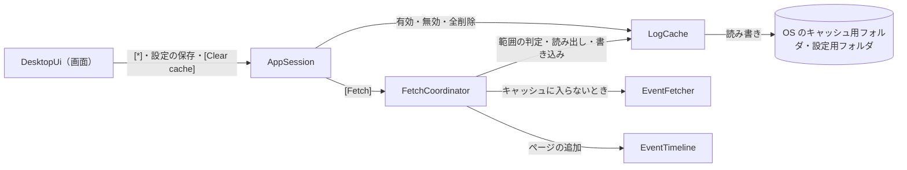
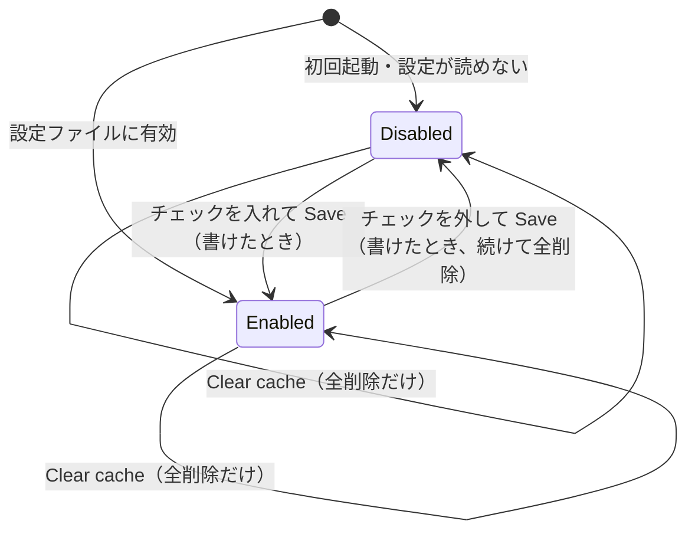
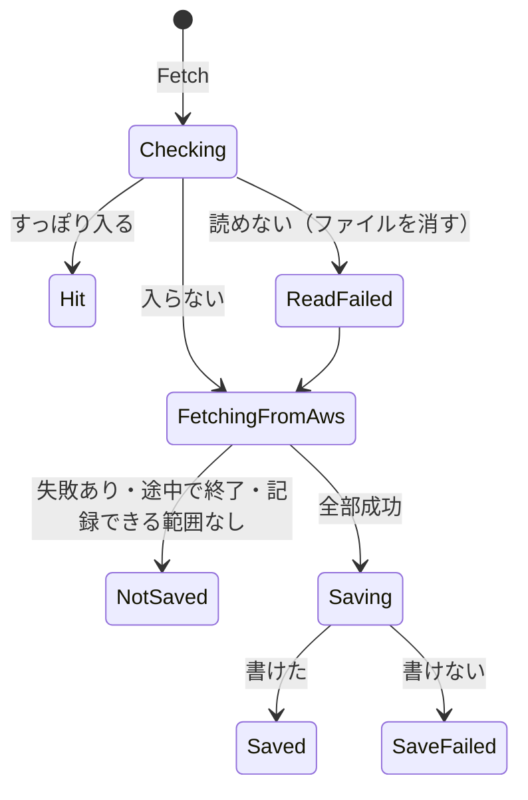
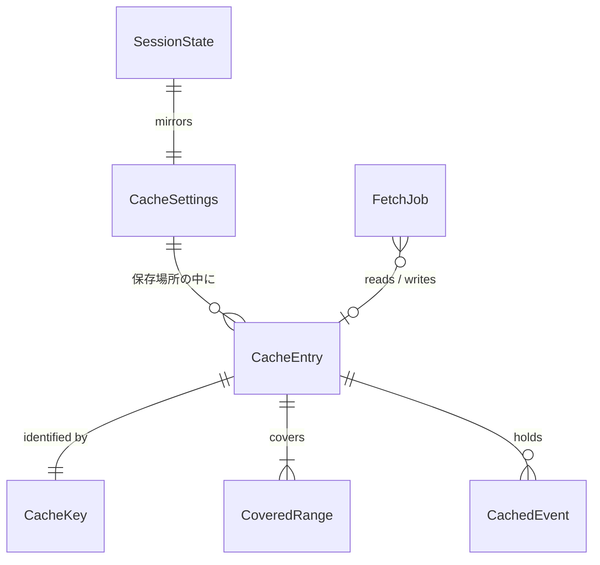

# Functional Spec — U6 ディスクキャッシュ（u6-disk-cache）

上流の成果物：`inception/units-generation/unit-of-work.md`（U6 の範囲）、`inception/domain-design/components.md`（LogCache・FetchCoordinator・AppSession・DesktopUi）、`inception/requirements-analysis/requirements.md`（FR7.1〜FR7.9、NFR5、NFR8、NFR15）、`ideation/rough-mockups/wireframes.md`（画面 6）、`ideation/rough-mockups/user-flow.md`（補助フロー 3）。データの形は `entities.md`、判断のルールは `rules.md` が正。この文書は手順（ワークフロー）と状態遷移の正であり、ER 図とルールの要約はそこから写した見やすい版。U1〜U5 の流れは、ここで変えると書いたもの以外はそのまま有効。

## 1. U6 で動くもの

上部バーの [*] で設定ダイアログを開き、ディスクキャッシュを有効にできる（既定は無効）。有効にすると、すべてのストリームの取得が成功して最後まで終わった取得の結果を、取得を始めた時刻の 5 分前までの部分だけ、OS のキャッシュ用フォルダに保存する。同じプロファイル・リージョン・ロググループで、指定した時間範囲がキャッシュ済みの範囲にすっぽり入るときは、AWS の API を呼ばずにキャッシュから表示する。有効・無効の設定はアプリを閉じても覚えておく。無効にして保存するか [Clear cache] を押すと、保存済みのキャッシュをすべて消す。キャッシュが壊れていて読めないときは、それを捨てて AWS から取り直す。

U5 から持ち越した振る舞いの変更として、絞り込みの欄で Enter を押すと 0.3 秒待たずにすぐ絞り込む（BR5.4）。

部品のつながり（U6 で足す部分を含む）：

<!-- Text fallback: 画面は [*]・設定の保存・[Clear cache] を AppSession に伝える。AppSession は LogCache に有効・無効の保存と全削除を頼み、[Fetch] では FetchCoordinator に取得を頼む。FetchCoordinator は LogCache に範囲がキャッシュ済みかを尋ね、入っていればキャッシュから読み出して EventTimeline に追加する。入っていなければ U3 のとおり EventFetcher で AWS から取得し、全部成功したら LogCache に書き込む。LogCache は OS のキャッシュ用フォルダと設定用フォルダのファイルを読み書きする。 -->

## 2. ワークフロー

### UC1：キャッシュを有効にする（補助フロー 3）

1. 利用者が上部バーの [*] を押す（取得中・接続変更の確認中は押せない。BR5.1）。
2. 設定ダイアログ（画面 6）が開き、入力位置はチェックボックスに移る（BR5.2）。保存場所と「ログに機密情報が含まれうる」の注意が常に出ている（FR7.2、FR7.3）。
3. 利用者がチェックを入れて [Save] を押す。
4. 有効・無効の 1 項目を設定ファイルに書く（BR1.1）。書けたらダイアログを閉じ、入力位置を [*] に戻す。書けなければダイアログを開いたまま誤りを出し、設定は前のまま（BR1.3）。
5. [Cancel] か Escape なら、保存せずに閉じる（BR5.2）。

### UC2：取得する（キャッシュが有効なとき）

1. 利用者が [Fetch] を押す。U1〜U4 の検証のあと、範囲 [startMs, endMs] とキー（プロファイル・リージョン・ロググループ）が決まる（BR2.1）。
2. キャッシュが無効なら、U3 のとおり AWS から取得し、何も書かない（BR1.5）。ここで終わり。
3. キーのキャッシュのキーと範囲だけを読む（中身のイベントはまだ読まない。BR4.2）。
4. 指定範囲が 1 つのキャッシュ済み範囲にすっぽり入るとき（BR2.3）：
   1. キャッシュから timestamp が範囲内のイベントを読み、sequence を振り直して（BR4.3）、U3 と同じ受け口で保持ログに追加する。U5 の絞り込みもそのままかかる。
   2. AWS の API は 1 回も呼ばない。ジョブは Completed、失敗 0、servedFromCache = true。
   3. ステータス行に「キャッシュから表示」と件数を出す（BR5.3）。
5. 入らないとき（一部だけ・2 つにまたがる・キャッシュがない）：U3 のとおり、指定範囲をすべて AWS から取得する（BR2.4）。
6. AWS からの取得が終わったら（BR3.2）：
   1. 失敗したストリームがある・途中で終わった・ジョブ全体が失敗した、のどれかなら書き込まない。既存のキャッシュも変えない。
   2. 記録する範囲の終わりを min(終了, 取得を始めた時刻 − 5 分) にする。開始より前になるなら書き込まない（BR3.1）。
   3. 書き込むときは、ステータス行に「キャッシュに保存中」を添え、取得中のロックを保ったまま書く（BR3.5）。既存のキャッシュから記録する範囲のイベントを捨てて新しいイベントを足し、範囲をつなげる（BR3.3）。一時ファイルに全部書いてから入れ替える（BR3.4）。ファイルは本人だけが読める権限で作る（BR3.6）。
   4. 書けなかったら、取得結果は表示したまま「キャッシュに保存できなかった」と出す（BR3.5）。
7. ジョブを終え、U3 のとおり取得中のロックを解く。

### UC3：キャッシュが読めないとき（Q5）

1. UC2 の 3 か 4 で、ファイルが読めない・解釈できない・書式の版を知らない・中のキーが違う・範囲の形がおかしい、のどれかに当たる（BR2.2、BR4.1）。
2. そのキーのキャッシュファイルを消す。
3. UC2 の 5 と同じく AWS から取得し、条件を満たせば 6 のとおり書き込む。
4. ステータス行に「キャッシュが読めなかったので AWS から取り直した」と出す（BR4.1、BR5.3）。

### UC4：キャッシュを消す・無効にする

1. 設定ダイアログで [Clear cache] を押すと、その場でアプリのキャッシュファイルをすべて消し（書きかけの一時ファイルも含む）、消したこと・消せなかったことをダイアログに出す。有効・無効は変えず、[Cancel] で取り消せない（BR1.4）。
2. チェックを外して [Save] を押すと、無効を設定ファイルに書いたあと、保存済みのキャッシュをすべて消す（BR1.3）。消せなかったときは、設定は無効のまま、ダイアログにその旨を出す。

### UC5：起動する

1. 設定ファイルを読み、有効・無効を決める。ない・読めない・解釈できないときは無効として起動する（BR1.1、BR1.2）。
2. プロファイル・リージョン・ロググループは U2 のとおり覚えていない（BR1.1）。

## 3. 状態遷移

### CacheSettings.cacheEnabled

<!-- Text fallback: 起動時、設定ファイルに有効と書かれていれば Enabled、それ以外（初回・読めない）は Disabled。チェックを入れて Save して設定を書けたら Enabled に、外して Save して書けたら Disabled になり、続けて保存済みのキャッシュを全部消す。Clear cache は状態を変えず、キャッシュを全部消すだけ。設定が書けなかったときは状態は変わらない。 -->

### FetchJob.cacheOutcome（キャッシュが有効なとき）

<!-- Text fallback: Fetch でキャッシュを確かめる。すっぽり入れば Hit（AWS を呼ばない）。入らなければ AWS から取得する。読めなければファイルを消して ReadFailed とし、AWS から取得する。AWS からの取得に失敗したストリームがある・途中で終わった・記録できる範囲がないときは NotSaved。全部成功したら書き込み、書けたら Saved、書けなければ SaveFailed。ReadFailed のあとに書き込んだときも、知らせは ReadFailed を出す。キャッシュが無効なら NotUsed のまま。 -->

## 4. 画面（U6 で足す・変えるもの）

U6 の種類は service のため、frontend-components.md は作らない。見た目は標準部品だけにする（project.md Corrections）。

| 部分 | 内容 |
|------|------|
| 上部バー | [*]（設定）のボタン。取得中・接続変更の確認中は押せない（BR5.1） |
| 設定ダイアログ（画面 6） | キャッシュの有効・無効のチェックボックス、保存場所、機密情報の注意、[Clear cache]、[Cancel]、[Save]。消した・消せなかった・設定を書けなかったの文字。キーボード操作と Escape（BR5.1、BR5.2、BR1.3、BR1.4） |
| ステータス行 | 「キャッシュに保存中」（取得中に添える）、「キャッシュから表示」「キャッシュが読めなかったので AWS から取り直した」「キャッシュに保存できなかった」（BR3.5、BR5.3） |
| 絞り込みの欄 | Enter ですぐ絞り込む（BR5.4、U5 から持ち越し） |

文言はすべて英日をそろえる。

## 5. ER 図（entities.md から写したもの）

<!-- Text fallback: CacheSettings は有効・無効と保存場所を持ち、保存場所の中に CacheEntry が 0 個以上ある。CacheEntry は CacheKey（プロファイル・リージョン・ロググループ）で決まり、1 つ以上の CoveredRange と 0 件以上の CachedEvent を持つ。FetchJob は CacheEntry を 0〜1 つ読み書きする。SessionState は CacheSettings の有効・無効を写して持つ。 -->

## 6. ルールの要約（rules.md から写したもの）

| 分類 | ルール |
|------|--------|
| 設定 | BR1.1 1 項目だけ覚える／BR1.2 読めなければ無効／BR1.3 無効にして保存したら全削除／BR1.4 [Clear cache] はその場で全削除／BR1.5 無効なら読みも書きもしない |
| 引き方 | BR2.1 3 つの組み合わせ／BR2.2 ファイル名はハッシュ／BR2.3 すっぽり入れば AWS を呼ばない／BR2.4 入らなければ全部 AWS から |
| 書き込み | BR3.1 開始の 5 分前まで／BR3.2 全部成功したときだけ／BR3.3 範囲で入れ替えてつなげる／BR3.4 全部書けたら入れ替え／BR3.5 取得の終わりの一部／BR3.6 本人だけが読める |
| 読み出し | BR4.1 読めなければ捨てて取り直す／BR4.2 範囲の判定は中身を読まずに／BR4.3 sequence の振り直し |
| 画面 | BR5.1 [*]／BR5.2 キーボード／BR5.3 ステータス行／BR5.4 絞り込みの Enter／BR5.5 確認用プログラムは使わない |

## 7. 前提と割り切り

- キャッシュのキーに AWS のアカウントは入らない（BR2.1）。SDK の既定のプロファイルで、環境変数などにより別のアカウントにつないでも同じキーになる。アカウントを調べるには読み取り 3 API 以外を呼ぶ必要があるため、MVP では割り切る。必要なら利用者が [Clear cache] で消す。
- キャッシュの大きさに上限は設けない（FR7.5 は有効期限を設けないとだけ定める）。大きくなったら [Clear cache] で消す。
- 書き込みのあいだは取得中のロックを保つため、100 万件近い取得では終わるまでが数秒長くなりうる（BR3.5）。同時に書き込みと読み出しが起きない単純さを取った。
- 取得を始めた時刻の 5 分前より新しい部分は記録しないため、終了が現在に近い範囲は、同じ条件で取り直しても AWS から取得する（BR3.1）。

## 8. テストの方針（team.md の Testing Posture に沿って）

- テストを先に書く純粋なロジック：記録する範囲の算出（5 分前、開始より前なら記録なし。BR3.1）、範囲の包含の判定（境界のミリ秒、2 つにまたがる。BR2.3、BR2.4）、範囲のつなげ方（重なり・隣り合い・離れている。BR3.3）、記録する範囲のイベントの入れ替え（範囲外は残る、二重に持たない）、書き込む条件の判定（失敗あり・途中で終了・Hit は書かない。BR3.2）、sequence の振り直し（BR4.3）、キーのハッシュとキーの突き合わせ（BR2.2）、壊れた中身の見分け（BR4.1）。
- 実装してからテストを書くもの：LogCache のファイルの読み書き（一時フォルダを使う。一時ファイルからの入れ替え、権限 0600・0700、全削除で一時ファイルも消える、壊れたファイル）、設定ファイルの読み書き（ない・壊れている・知らない版は無効）、FetchCoordinator のキャッシュの分岐（U3 の偽物の gateway で、Hit のとき API が 1 回も呼ばれないこと、入らないとき全部取得すること、読めないとき取り直してファイルが消えること、失敗ありで書かないこと）、AppSession（取得中は設定ダイアログを開けない、無効にして保存で全削除、知らせ）、画面（設定ダイアログのキーボード操作と Escape、入力位置の移動と戻り、ステータス行の文字、絞り込みの Enter、英日）。
- ファイルを使うテストは、テストごとの一時フォルダで行い、利用者の `~/Library/Caches/` と設定用フォルダには触れない。
- 自動テストと CI は実際の AWS に接続しない。
