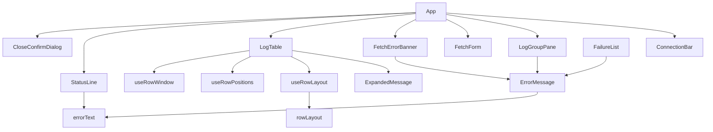

# Frontend Components — U7 画面の仕上げ（u7-ui-polish）

上流の成果物：`functional-spec.md`（ルールは §6 の BR1.1〜BR4.5）、`ideation/rough-mockups/wireframes.md`（画面 3・5・7）、`inception/domain-design/components.md`（DesktopUi）。U1〜U6 で作った画面の部品（`src/components/`、`src/hooks/`、`src/virtualScroll.ts`）に足す・変えるものだけを書く。見た目は標準部品だけにする（NFR10）。

## 1. 部品の一覧

| 部品 | 種類 | U7 での変更 | 主なルール |
|------|------|-------------|------------|
| `LogTable` | 既存を変える | グリッドの役割、行の展開、選んでいる行（キーと位置）、↑↓・PageUp・PageDown・Home・End・Enter・Space（U3 のスクロールのキーを置き換え）、アンカーの保ち方を `rowLayout` に合わせる | BR1.1、BR1.5、BR1.6、BR1.8、BR1.10 |
| `ExpandedMessage` | 新規 | 展開部分。全文をテキストノードで出し、折り返し、372 px まで、中でスクロール、選択とコピー、中を押しても開閉しない、スクロールするときは入力位置を受ける | BR1.2、BR1.3、BR1.10 |
| `rowLayout.ts` | 新規（純粋な関数） | 行の位置・逆向き・全体の高さ・縮小・アンカーからのスクロールの位置・高さの見積もり。U3 の `virtualScroll.ts` の行の高さが一定の計算を置き換える（展開がないときは同じ答えになる） | BR1.4、BR1.8、BR1.9 |
| `useRowLayout` | 新規（フック） | 展開の集合・位置・高さ（測った値と見積もり）を持ち、`rowLayout.ts` を呼ぶ。`ResizeObserver` で測り、一覧の幅が変わったら測った値を捨てる | BR1.4、BR1.9 |
| `useRowPositions` | 新規（フック） | 展開している行・選んでいる行・アンカーのキーをまとめて `row_positions` に問い合わせ、版の古い答えを捨てる。呼び出しは同時に 1 つ | BR1.7 |
| `useRowWindow` | 既存を変える | 取り寄せる行の範囲を `useRowLayout` から受け取る | BR1.4 |
| `ErrorMessage` | 新規 | 「何が起きたか」「次の行動」「詳細」の 3 行。`compact` のときは 1 行目だけ | BR2.2〜BR2.5 |
| `errorText.ts` | 新規（純粋な関数） | 種類・場面・詳細から文言のキーと差し込む値（{retry}・{detail}）を返す。起きない組み合わせは Other の文 | BR2.2、BR2.3 |
| `FetchErrorBanner` | 新規 | ログ一覧の上のエラー欄。取得全体の失敗のときだけ出す。読み上げで知らせる領域 | BR2.4 |
| `StatusLine` | 既存を変える | 失敗のとき「何が起きたか」の文だけ（詳細の行を外す） | BR2.4 |
| `LogGroupPane` | 既存を変える | 一覧の失敗・途中までの理由を `ErrorMessage`（場面 Listing）で出す | BR2.4 |
| `FailureList` | 既存を変える | ストリームごとの失敗を `ErrorMessage`（場面 Stream）で出す | BR2.4 |
| `CloseConfirmDialog` | 新規 | 画面 7。U2 の `ConfirmDialog` の形を使い、SessionView の closeConfirmation が Pending のあいだ出す。入力位置は [Keep fetching]、Escape は [Keep fetching] | BR3.1〜BR3.4 |
| `App` | 既存を変える | CloseConfirmDialog の表示、Tab の順の確認、discardGeneration の受け渡し | BR1.6、BR3.3、BR4.4 |
| `api.ts` | 既存を変える | `rowPositions(keys)`、`confirmClose()`、`cancelClose()`、SessionView の discardGeneration・closeConfirmation | BR1.7、BR3.2 |
| `messages.ts` | 既存を変える | BR2.2・BR3.3 の文言キーを英日で足す。使わなくなった暫定のキーを除く | BR2.2、BR3.3、BR4.3 |
| `styles.css` | 既存を変える | システムカラーだけを使う。展開部分の等幅の文字・行の高さ・余白・折り返し | BR1.2、BR4.2 |

## 2. 状態と純粋な計算の型

| 状態 | 置き場所 | 中身 | 変わるとき |
|------|----------|------|------------|
| 展開の集合 | `useRowLayout` | `Map<RowKey, { position: number \| null; height: number; measured: boolean }>` | 開閉で足す・除く。discardGeneration が変わったら空。位置は `useRowPositions` の答えで更新 |
| 測った高さの幅 | `useRowLayout` | 一覧の展開部分の幅（px） | 幅が変わったら、すべての `measured` を捨てて見積もりに戻す |
| 選んでいる行 | `LogTable` | `{ key: RowKey \| null; position: number }` | キー操作・行を押す。位置は `useRowPositions` でキーから引き直す。キーが消えたら同じ位置の行、破棄で一番上 |
| アンカー | `LogTable` | `{ key: RowKey; offsetPx: number }` | スクロール・描画のたび。位置の引き直し・高さの変化のあとにスクロールの位置を合わせる |
| 終了の確認 | SessionView の closeConfirmation を写したもの | `"None" \| "Pending"` | `session-changed` と get_session |

`RowKey` は `${logStreamName}\u0000${sequence}`。

`rowLayout.ts` の入出力（BR1.4、BR1.8、BR1.9）：

```ts
const ROW_HEIGHT = 22;
const EXPANDED_LINE_HEIGHT = 18;
const EXPANDED_PADDING = 12;            // 上下 6 px ずつ
const EXPANDED_MAX = 18 * 20 + 12;      // 372 px
const MAX_SCROLL_HEIGHT = 10_000_000;   // U3

interface Expansion { position: number; height: number } // 位置の昇順、位置のあるものだけ
interface Layout {
  rowCount: number;
  expansions: Expansion[];
  cumulative: number[];   // cumulative[k] = expansions[0..k) の高さの合計
}

function buildLayout(rowCount: number, expansions: Expansion[]): Layout;
function virtualHeight(l: Layout): number;                    // rowCount*22 + 合計
function scale(l: Layout): number;                            // min(1, MAX/virtualHeight)
function rowOffset(l: Layout, position: number): number;      // 仮想の上端
function rowAt(l: Layout, virtualY: number): { position: number; offsetPx: number };
function visibleRange(l: Layout, scrollTop: number, viewport: number): { first: number; last: number };
function scrollTopForAnchor(l: Layout, anchorPosition: number, offsetPx: number): number; // 縮小をかけた値
function estimateExpandedHeight(message: string, charWidth: number, contentWidth: number): number; // ≤ 372
```

展開がないとき、これらは U3 の `virtualScroll.ts` と同じ答えを返す（U3 のテストをそのまま通す）。

## 3. 部品のつながり



<!-- Text fallback: App は上部バー（ConnectionBar）、左ペイン（LogGroupPane）、条件エリア（FetchForm）、エラー欄（FetchErrorBanner）、ログ一覧（LogTable）、ステータス行（StatusLine）、終了の確認（CloseConfirmDialog）を持つ。LogTable は展開部分（ExpandedMessage）と、位置の計算（useRowLayout → rowLayout）、位置の問い合わせ（useRowPositions）、行の取り寄せ（useRowWindow）を使う。エラー欄・左ペイン・失敗の一覧は ErrorMessage で文を出し、ErrorMessage とステータス行は errorText で文言のキーを決める。 -->

## 4. 操作と結果

| 操作 | 部品 | 結果 |
|------|------|------|
| 行（時刻・ストリーム名・1 行のメッセージ）を押す | `LogTable` | その行を開閉し、選んでいる行にする（BR1.1） |
| 展開部分の中を押す・ドラッグする | `ExpandedMessage` | 文字を選ぶだけ。開閉しない（BR1.3） |
| 一覧で ↑ / ↓ / PageUp / PageDown / Home / End | `LogTable` | 選んでいる行を 1 行・見えている行数ぶん・先頭・末尾へ動かし、見える位置までスクロールする（BR1.5） |
| 一覧で Enter / Space | `LogTable` | 選んでいる行を開閉する。まだ届いていなければ何もしない（BR1.5） |
| 一覧で Tab（選んでいる行の展開部分がスクロールするとき） | `LogTable` → `ExpandedMessage` | 展開部分に入り、↑↓ と Space は展開部分のスクロールと文字の操作に使う（BR1.10） |
| 展開部分で Escape / Shift+Tab | `ExpandedMessage` | 一覧に戻る（BR1.10） |
| 取得中にウィンドウを閉じる・Cmd+Q | ライブラリ → `App` → `CloseConfirmDialog` | closeConfirmation が Pending になり、確認ダイアログを出す。入力位置は [Keep fetching]（BR3.1、BR3.3） |
| [Keep fetching] / Escape | `CloseConfirmDialog` | `cancel_close`。ダイアログを閉じ、取得を続ける（BR3.2） |
| [Close] | `CloseConfirmDialog` | `confirm_close`。取得をやめて終える（BR3.2） |

## 5. アクセシビリティ

- ログ一覧は role=grid（BR1.10）。aria-rowcount に行数＋1、見出しの行は aria-rowindex=1、各行は aria-rowindex=位置＋2。一覧が入力位置を受け、選んでいる行を aria-activedescendant で示す（描かれていないときは付けない）。選んでいる行は標準の選択の見た目でも示す（色だけにしない）。
- 展開した行は aria-expanded=true。展開部分はその行の中の全幅のセル（aria-colspan=3）に置き、行の構造（row > gridcell）を崩さない。
- 展開部分が 20 行ぶんを超えてスクロールするときは tabIndex=0 で入力位置を受ける。一覧のキー処理は event.target が展開部分の中なら行わない。
- エラーは文で示し（BR2.5）、取得全体の失敗のエラー欄は読み上げで知らせる領域（role=alert）にする。
- 確認ダイアログは入力位置をダイアログの中に閉じ込め、閉じたら元に戻す（U2・U6 のダイアログと同じ）。
- 操作できる要素には `data-testid` を付ける。

## 6. テストの方針（画面）

| 部品 | テストのファイル | 観点 |
|------|------------------|------|
| `rowLayout.ts` | `rowLayout.test.ts`（純粋、先に書く） | 展開の累積、offset と rowAt の往復、展開部分の中の y、縮小との組み合わせ、操作した行より上は動かない、アンカーからのスクロールの位置、見積もりの上限 372 px、展開がないときは U3 と同じ |
| `errorText.ts` | `errorText.test.ts`（純粋、先に書く） | 8 種類 × 3 場面、{retry} の差し込み、起きない組み合わせは Other、詳細の有無 |
| `LogTable`・`ExpandedMessage` | `LogTable.test.tsx` | 開閉、複数、テキストノードだけ（HTML を解釈しない）、372 px、中を押しても閉じない、キー操作、展開部分の中ではキーを処理しない、Tab と Escape、グリッドの属性、絞り込み・追加で保ち破棄の世代で閉じる |
| `useRowPositions` | `useRowPositions.test.tsx` | まとめて 1 回呼ぶ、古い版の答えを捨てる、呼び出しは同時に 1 つ |
| `ErrorMessage`・`FetchErrorBanner`・`StatusLine`・`LogGroupPane`・`FailureList` | 各 `*.test.tsx` | 3 行の文、詳細はすべてに、ステータス行に詳細が出ない、暫定の「種類名」が出ない |
| `CloseConfirmDialog`・`App` | `CloseConfirmDialog.test.tsx`、`App.test.tsx` | closeConfirmation で出る、入力位置、Escape、答えのコマンド、確認中に取得が終わっても出たまま |
| `messages.ts` | `messages.test.ts` | すべてのキーの英日、BR2.2・BR3.3 の文言が正本どおり |
