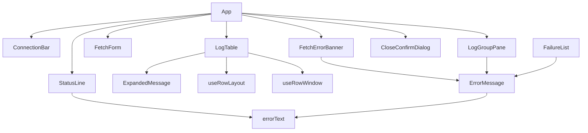

# Frontend Components — U7 画面の仕上げ（u7-ui-polish）

上流の成果物：`functional-spec.md`（ルールは §6 の BR1.1〜BR4.5）、`ideation/rough-mockups/wireframes.md`（画面 3・5・7）、`inception/domain-design/components.md`（DesktopUi）。U1〜U6 で作った画面の部品（`src/components/`、`src/hooks/`）に足す・変えるものだけを書く。見た目は標準部品だけにする（NFR10）。

## 1. 部品の一覧

| 部品 | 種類 | U7 での変更 | 主なルール |
|------|------|-------------|------------|
| `LogTable` | 既存を変える | 行の展開、展開部分、↑↓ と Enter・Space、選んでいる行の表示、行の高さが変わる位置の計算を使う | BR1.1〜BR1.6 |
| `ExpandedMessage` | 新規 | 展開部分。全文を折り返し、20 行ぶんまで、中でスクロール、選択とコピー、中を押しても開閉しない | BR1.2、BR1.3 |
| `useRowLayout` | 新規（フック） | 展開の集合と展開部分の実際の高さから、行の位置・全体の高さ・見えている範囲の行を求める。純粋な計算は `rowLayout.ts` に分ける | BR1.4、BR1.6 |
| `useRowWindow` | 既存を変える | 取り寄せる行の範囲を `useRowLayout` から受け取る | BR1.4 |
| `ErrorMessage` | 新規 | 「何が起きたか」「次の行動」「詳細」の 3 行。場所ごとの見出しの大きさだけを変えられる | BR2.2〜BR2.5 |
| `errorText.ts` | 新規（純粋な関数） | 種類・場面・詳細から文言のキーと差し込む値を返す | BR2.2、BR2.3 |
| `FetchErrorBanner` | 新規 | ログ一覧の上のエラー欄。取得全体の失敗のときだけ出す | BR2.4 |
| `StatusLine` | 既存を変える | 失敗のとき「何が起きたか」の文だけを出す | BR2.4 |
| `LogGroupPane` | 既存を変える | 一覧の失敗・途中までの理由を `ErrorMessage` で出す | BR2.4 |
| `FailureList` | 既存を変える | ストリームごとの失敗を `ErrorMessage` で出す | BR2.4 |
| `CloseConfirmDialog` | 新規 | 画面 7。U2 の `ConfirmDialog` の形を使い、入力位置は [Keep fetching]、Escape は [Keep fetching] | BR3.1〜BR3.4 |
| `App` | 既存を変える | 終了の確認の知らせを受けてダイアログを出す。Tab の順の確認 | BR3.1、BR4.4 |
| `messages.ts` | 既存を変える | BR2.2・BR3.3 の文言キーを英日で足す。使わなくなった暫定のキーを除く | BR2.2、BR3.3、BR4.3 |
| `styles.css` | 既存を変える | システムカラーだけを使う（決め打ちの色を除く） | BR4.2 |

## 2. 状態

| 状態 | 置き場所 | 中身 | 変わるとき |
|------|----------|------|------------|
| 展開の集合 | `LogTable`（`useRowLayout`） | `Set<"stream\u0000sequence">` と timelineVersion | 行を押す・Enter・Space で開閉。timelineVersion が変わったら空。絞り込み・TZ では変えない |
| 展開部分の高さ | `useRowLayout` | 行のキー → 実際の高さ（`ResizeObserver` で測る） | 展開・閉じる・ウィンドウの幅が変わったとき |
| 選んでいる行 | `LogTable` | 一覧の中の位置（絞り込み中は結果の中の位置） | ↑↓・Home・End、行を押したとき。行の数が減ってはみ出したら最後の行、取り直しで一番上 |
| 終了の確認 | ライブラリ（AppSession の closeConfirmation）を写したもの | None / Pending | `close-requested` の知らせで Pending、[Close]・[Keep fetching] の答えで None |

展開の集合のキーには (logStreamName, sequence) を使う。絞り込み中の位置は変わるが、キーは同じ行を指し続ける（U3:BR4.4、U5 の結果の行）。

## 3. 部品のつながり

<!-- Text fallback: App は上部バー（ConnectionBar）、左ペイン（LogGroupPane）、条件エリア（FetchForm）、エラー欄（FetchErrorBanner）、ログ一覧（LogTable）、ステータス行（StatusLine）、終了の確認（CloseConfirmDialog）を持つ。LogTable は展開部分（ExpandedMessage）と、行の位置の計算（useRowLayout）、行の取り寄せ（useRowWindow）を使う。エラー欄・左ペイン・失敗の一覧は ErrorMessage で文を出し、ErrorMessage とステータス行は errorText で文言のキーを決める。 -->

## 4. 操作と結果

| 操作 | 部品 | 結果 |
|------|------|------|
| 行（時刻・ストリーム名・1 行のメッセージ）を押す | `LogTable` | その行を開閉し、選んでいる行にする（BR1.1） |
| 展開部分の中を押す・ドラッグする | `ExpandedMessage` | 文字を選ぶだけ。開閉しない（BR1.3） |
| 一覧で ↑ / ↓ / Home / End | `LogTable` | 選んでいる行を動かし、見える位置までスクロールする（BR1.5） |
| 一覧で Enter / Space | `LogTable` | 選んでいる行を開閉する（BR1.5） |
| 取得中にウィンドウを閉じる | `App` → `CloseConfirmDialog` | 確認ダイアログを出す。入力位置は [Keep fetching]（BR3.1、BR3.3） |
| [Keep fetching] / Escape | `CloseConfirmDialog` | ダイアログを閉じ、取得を続ける（BR3.2） |
| [Close] | `CloseConfirmDialog` | 取得をやめて終了する（BR3.2） |

## 5. アクセシビリティ

- ログ一覧は表の役割と列見出しを保つ（画面 3）。展開した行には「展開している」ことを伝える属性（`aria-expanded`）を付け、展開部分を行と結び付ける。
- 選んでいる行は、標準の選択の見た目と、読み上げ用の「選んでいる」属性で示す（色だけにしない）。
- エラーは文で示し（BR2.5）、取得全体の失敗のエラー欄は読み上げで知らせる領域にする。
- 確認ダイアログは入力位置をダイアログの中に閉じ込め、閉じたら元に戻す（U2・U6 のダイアログと同じ）。
- 操作できる要素には `data-testid` を付ける。

## 6. テストの方針（画面）

| 部品 | テストのファイル | 観点 |
|------|------------------|------|
| `rowLayout.ts` | `rowLayout.test.ts`（純粋、先に書く） | 展開の高さの合計、操作した行より上は動かない、見えている範囲の行、スクロールの上限との組み合わせ |
| `errorText.ts` | `errorText.test.ts`（純粋、先に書く） | 8 種類 × 3 場面、詳細の有無、もう一度試すの指す先 |
| `LogTable` | `LogTable.test.tsx` | 開閉、複数、20 行ぶん、中を押しても閉じない、↑↓・Enter・Space、絞り込みで保ち timelineVersion で閉じる |
| `ErrorMessage`・`FetchErrorBanner`・`StatusLine`・`LogGroupPane`・`FailureList` | 各 `*.test.tsx` | 3 行の文、詳細はすべてに、暫定の「種類名」が出ない |
| `CloseConfirmDialog`・`App` | `CloseConfirmDialog.test.tsx`、`App.test.tsx` | 入力位置、Escape、答えのコマンド、確認中に取得が終わっても出たまま |
| `messages.ts` | `messages.test.ts` | すべてのキーの英日、BR2.2・BR3.3 の文言が正本どおり |
