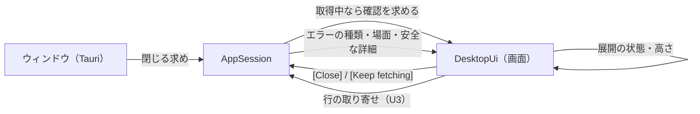
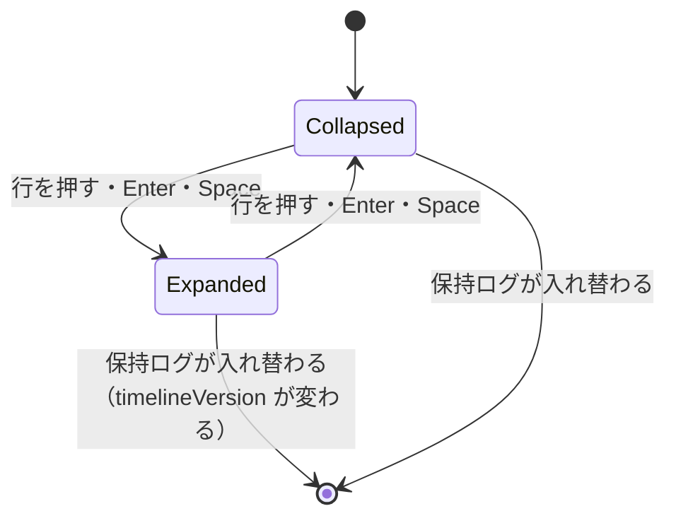
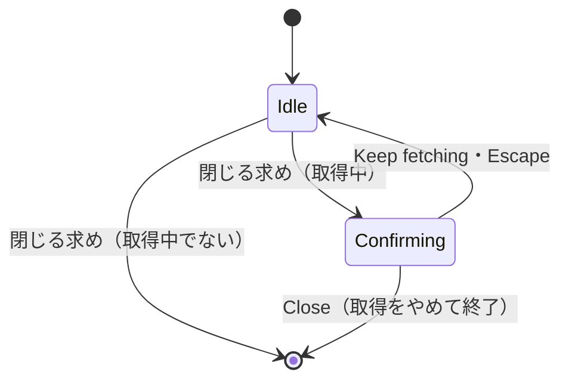

# Functional Spec — U7 画面の仕上げ（u7-ui-polish）

上流の成果物：`inception/units-generation/unit-of-work.md`（U7 の範囲）、`inception/domain-design/components.md`（DesktopUi・AppSession）、`inception/requirements-analysis/requirements.md`（FR1.5、FR4.9、FR5.1〜FR5.4、FR8.1〜FR8.3、NFR10〜NFR13、NFR16）、`ideation/rough-mockups/wireframes.md`（画面 3・5・7）。質問票の回答は `functional-design-questions.md` の Q1〜Q4。画面の部品の分け方は `frontend-components.md` が正。U1〜U6 のルールは、ここで置き換えると書いたもの以外はそのまま有効。前の単位のルールは `U3:BR6.5` のように作業単位名を前に付け、前に何も付けない `BRx.y` はこの文書（U7）のルールを指す。

U7 の種類は ui のため、entities.md と rules.md は作らず、ルールはこの文書の §6 に置く。U7 で新しく持つデータは画面の状態だけで、ライブラリ側のエンティティは AppSession の終了確認の状態だけを足す（§5）。

## 1. U7 で動くもの

- 一覧の行を押すと、その行のすぐ下にメッセージの全文を展開する。もう一度押すと閉じる。複数の行を同時に展開でき、全文は選択してコピーできる。JSON は整形しない。全文は折り返し、20 行ぶんを超える分は展開部分の中でスクロールする（Q1）。絞り込みを変えても展開は開いたまま（Q2）。一覧の中では ↑↓ で行を移り、Enter か Space で展開・閉じる（Q3）。
- エラーを、種類ごとの「何が起きたか」と「次の行動」の文で示し、それまでの「失敗：種類名」の暫定の表示を置き換える。安全な詳細があれば、どのエラーにも短く添える（Q4）。色やアイコンだけで示さない。
- 取得中（キャッシュへの書き込み中を含む）にウィンドウを閉じようとしたときだけ確認する（[Keep fetching] / [Close]）。
- 最小ウィンドウは 1024×640。ダークモードは OS の設定に合わせる。英日の文言とキーボード操作を通しで確かめる。アプリの診断ログは標準エラー出力だけに出す。

部品のつながり（U7 で足す・変える部分）：



<!-- Text fallback: ウィンドウを閉じる求めは AppSession に渡る。取得中なら AppSession は画面に確認を求め、画面は [Close] か [Keep fetching] の答えを AppSession に返す。行の取り寄せは U3 のまま。展開の状態と行の高さは画面の中だけで持つ。エラーは AppSession が種類・場面・安全な詳細を渡し、画面が文に組み立てる。 -->

## 2. ワークフロー

### UC1：行を展開する・閉じる

1. 利用者が一覧の行を押す（または ↑↓ で行を選び、Enter か Space を押す。BR1.5）。
2. その行がまだ展開されていなければ、行のすぐ下にメッセージの全文を出す。全文は折り返し、高さは 20 行ぶんまで。超える分は展開部分の中でスクロールする（BR1.1、BR1.2）。
3. 展開されていれば閉じる（BR1.1）。
4. 展開部分の中の文字は選択してコピーできる。展開部分の中を押しても行は閉じない（BR1.3）。
5. ほかの行を展開しても、前に展開した行は開いたまま（BR1.1）。
6. 展開している行より下の行は、展開部分の高さのぶん下にずれる。スクロールの位置は、見えている行がずれないように保つ（BR1.4）。

### UC2：絞り込み・タイムゾーン・取り直しと展開

1. 絞り込みの文字列を変えても、展開は開いたまま。絞り込みで隠れた行も、絞り込みを解けば展開したまま出る（BR1.6、Q2）。
2. タイムゾーンを切り替えても、展開は開いたまま（時刻の文字だけが変わる。BR1.6）。
3. 取り直し・接続の変更で保持ログが入れ替わったら（timelineVersion が変わったら）、展開をすべて閉じる（BR1.6）。

### UC3：エラーを読む

1. 取得・ロググループの一覧・ストリームごとの取得で失敗すると、AppSession がエラーの種類（U1 の FailureKind）、場面（取得・一覧・ストリーム）、安全な詳細を画面に渡す（BR2.1）。
2. 画面は、種類と場面から「何が起きたか」と「次の行動」の 2 つの文を組み立てる（BR2.2）。文言は §6 の BR2.2 の表が正本。
3. 安全な詳細があれば、3 行目に「詳細：…」として添える（BR2.3、Q4）。
4. 取得全体の失敗はログ一覧の上のエラー欄に、ロググループの一覧の失敗は左ペインに、ストリームごとの失敗は失敗の一覧（U3）に出す。ステータス行には「何が起きたか」の文だけを短く出す（BR2.4）。
5. 文字で示し、色やアイコンだけにしない（BR2.5）。

### UC4：取得中にウィンドウを閉じる（画面 7）

1. 利用者がウィンドウを閉じようとする。
2. 取得中でなければ、確認なしで閉じる（BR3.1）。
3. 取得中（キャッシュへの書き込み中を含む）なら、閉じるのを止めて確認ダイアログを出す。入力位置は [Keep fetching] に置く（BR3.1、BR3.3）。
4. [Keep fetching] か Escape なら、ダイアログを閉じて取得を続ける（BR3.2）。
5. [Close] なら、取得をやめ（U3:BR5.5 の中断。キャッシュには書かない）、取得途中の結果を捨てて終了する（BR3.2）。
6. ダイアログを出しているあいだに取得が終わっても、ダイアログはそのまま。[Close] ならそのまま終了し、[Keep fetching] ならダイアログを閉じるだけ（BR3.4）。

## 3. 状態遷移

### 展開の状態（行ごと）



<!-- Text fallback: 行は閉じた状態から始まる。行を押すか Enter・Space で展開し、もう一度で閉じる。絞り込みやタイムゾーンの切替では状態は変わらない。保持ログが入れ替わると（timelineVersion が変わると）、展開の状態はすべて消える。 -->

### 終了の確認



<!-- Text fallback: 取得中でなければ閉じる求めでそのまま終了する。取得中なら確認中に移り、Keep fetching か Escape で元に戻って取得を続け、Close で取得をやめて終了する。確認中に取得が終わっても確認中のまま。 -->

## 4. 画面（U7 で足す・変えるもの）

画面の部品の分け方と状態は `frontend-components.md` が正。見た目は標準部品だけにする（NFR10、project.md Corrections）。

| 部分 | 内容 |
|------|------|
| ログ一覧 | 行の展開（全文・折り返し・20 行ぶんまで・中でスクロール・選択とコピー）、↑↓ と Enter・Space、行の高さが変わる仮想スクロール（BR1.1〜BR1.6） |
| エラー欄 | 取得全体の失敗の「何が起きたか」「次の行動」「詳細」（BR2.2〜BR2.4） |
| 左ペイン・失敗の一覧・ステータス行 | 暫定の「種類名」を、BR2.2 の文に置き換える（BR2.4） |
| 終了の確認ダイアログ（画面 7） | [Keep fetching]・[Close]、入力位置は [Keep fetching]、Escape は [Keep fetching]（BR3.1〜BR3.4） |
| ウィンドウ | 最小 1024×640、ダークモードは OS に合わせる（BR4.1、BR4.2） |

## 5. 画面とライブラリの状態

| 状態 | 持ち主 | 内容 |
|------|--------|------|
| 展開している行 | 画面（ログ一覧） | (logStreamName, sequence) の集合と、それを取ったときの timelineVersion。timelineVersion が変わったら空にする。components.md は SessionState の expandedRows としていたが、表示だけの状態で行の高さの測り方と一緒に扱う必要があるため、画面の中に置く（ライブラリには渡さない） |
| 選んでいる行（キーボード） | 画面（ログ一覧） | 一覧の中の位置。絞り込みや取り直しで行がなくなったら一番上に戻す |
| 終了の確認 | AppSession | closeConfirmation（None / Pending）。取得中に閉じる求めが来たら Pending にし、画面に知らせる。[Close]・[Keep fetching] で None に戻す |
| エラーの組み立て | 画面 | 種類・場面・安全な詳細から BR2.2 の文を引く。ライブラリは文を作らない（U1〜U6 と同じく文言のキーだけを渡す） |

## 6. ルール（機械可読）

```yaml
rules:
  - id: BR1.1
    statement: 行を押すとその行のすぐ下に全文を展開し、もう一度押すと閉じる。複数の行を同時に展開できる
    category: policy
    applies_to: DesktopUi
    trigger: 一覧の行を押したとき
    logic: 行の (logStreamName, sequence) が展開の集合になければ足し、あれば除く。展開した行の直下にメッセージの全文を出す。ほかの行の展開は変えない
    violation: なし
    source: FR5.2
  - id: BR1.2
    statement: 全文は折り返し、20 行ぶんを超える分は展開部分の中でスクロールする
    category: policy
    applies_to: DesktopUi
    trigger: 行を展開したとき
    logic: メッセージを API が返したまま（改行を含む、JSON を整形しない）折り返して出す。展開部分の高さは min(内容の高さ, 20 行ぶん)。超える分は展開部分の中だけでスクロールする
    violation: なし
    source: FR5.4、Q1
  - id: BR1.3
    statement: 展開した全文は選択してコピーでき、展開部分の中を押しても閉じない
    category: policy
    applies_to: DesktopUi
    trigger: 展開部分を操作したとき
    logic: 展開部分の文字は選択できる形で出し、OS の標準のコピー（Cmd+C）で写せる。展開部分の中の押下・選択は行の開閉にしない。開閉するのは行そのもの（時刻・ストリーム名・1 行のメッセージの部分）を押したときだけ
    violation: なし
    source: FR5.3
  - id: BR1.4
    statement: 展開した行より下の行は展開部分の高さのぶん下にずれ、見えている行の位置は保つ
    category: calculation
    applies_to: DesktopUi
    trigger: 展開・閉じる・展開部分の高さが変わったとき
    logic: 行の位置 = 位置の番号 × 行の高さ（U3 の 22 px）＋ それより前にある展開部分の高さの合計。展開部分の高さは実際の大きさを測って使う。展開・閉じるで、操作した行より上の行の位置は変えない。U3 の仮想スクロールのスクロールの高さの上限（1,000 万 px を超えると比例で縮める）と、U3:BR6.5 の見えている行を動かさない決まりはそのまま守る。取り寄せる行は、見えている範囲に入る行を、この位置から求める
    violation: なし
    source: FR5.2、U3:BR6.5、NFR2
  - id: BR1.5
    statement: 一覧の中では ↑↓ で行を移り、Enter か Space で展開・閉じる
    category: policy
    applies_to: DesktopUi
    trigger: 一覧に入力位置があるときにキーを押したとき
    logic: 一覧は Tab で入れる 1 つの部品とし、その中で選んでいる行を ↑↓ で 1 行ずつ移す（Home・End で先頭・末尾）。選んでいる行は見える位置までスクロールし、文字以外でも分かる形（標準の選択の見た目）で示す。Enter か Space で BR1.1 と同じく開閉する。展開部分の中の文字を選んでいるあいだは、Space を文字の操作に使わせる
    violation: なし
    source: Q3、NFR13
  - id: BR1.6
    statement: 絞り込みとタイムゾーンの切替では展開を保ち、保持ログが入れ替わったら閉じる
    category: policy
    applies_to: DesktopUi
    trigger: 絞り込み・タイムゾーン・timelineVersion が変わったとき
    logic: 絞り込みの文字列が変わっても、タイムゾーンが変わっても、展開の集合はそのまま（隠れた行は、また出たときに展開したまま）。timelineVersion が変わったら（取り直し・接続の変更・中断で保持ログが入れ替わったら）、展開の集合を空にする（(logStreamName, sequence) は次の取得で別の行を指すため。U3:BR4.4）
    violation: なし
    source: Q2、U3:BR4.4

  - id: BR2.1
    statement: エラーは種類・場面・安全な詳細の組として画面に渡す
    category: constraint
    applies_to: AppSession
    trigger: 取得・一覧・ストリームの取得で失敗したとき
    logic: AppSession は FailureKind（AuthRequired・AccessDenied・Throttled・Network・NotFound・InvalidInput・RegionMissing・Other）、場面（Fetch・Listing・Stream）、安全な詳細（U1:BR4.3 のとおり許可した項目だけで作った文、なければ空）を渡す。秘密の認証情報とアクセスキー ID は渡さない
    violation: なし
    source: FR8.1、FR8.3
  - id: BR2.2
    statement: 種類ごとに「何が起きたか」と「次の行動」の文で示す（文言の正本）
    category: policy
    applies_to: DesktopUi
    trigger: エラーを出すとき
    logic: "文言の正本はこの表だけとする。次の行動の「もう一度試す」は、場面が Fetch・Stream なら [Fetch]、Listing なら左ペインの [再読み込み]（U2）を指す。AuthRequired＝ja「認証情報を使えませんでした（SSO のログイン切れなど）。」「SSO を使っているときは aws sso login を実行してから、もう一度試してください。それ以外はプロファイルの設定を確認するか、別のプロファイルを選んでください。」／en「Credentials could not be used (for example, the SSO session expired).」「If you use SSO, run aws sso login and try again. Otherwise, check the profile settings or choose another profile.」。AccessDenied＝ja「権限がないため拒否されました。」「IAM の権限を確認するか、別のプロファイルを選んでください。」／en「Access was denied.」「Check the IAM permissions or choose another profile.」。Throttled＝ja「AWS の呼び出しが多すぎるため、制限されました。」「しばらく待ってから、もう一度試してください。」／en「AWS throttled the requests.」「Wait a while, then try again.」。Network＝ja「AWS に接続できませんでした。」「接続を確認してから、もう一度試してください。」／en「Could not connect to AWS.」「Check your connection, then try again.」。NotFound＝ja「ロググループかストリームが見つかりませんでした。」「ロググループの一覧を読み込み直して、選び直してください。」／en「The log group or stream was not found.」「Reload the log group list and choose again.」。InvalidInput＝ja「AWS が条件を受け付けませんでした。」「時間範囲を見直してから、もう一度試してください。」／en「AWS rejected the request.」「Check the time range, then try again.」。RegionMissing＝ja「このプロファイルには既定のリージョンがありません。」「上部バーでリージョンを選んでください。」／en「This profile has no default region.」「Choose a region in the top bar.」。Other＝ja「AWS の呼び出しで問題が起きました。」「もう一度試してください。続くときは詳細を確かめてください。」／en「Something went wrong while calling AWS.」「Try again. If it keeps happening, check the details.」"
    violation: なし
    source: FR1.5、FR8.1、wireframes 画面 5
  - id: BR2.3
    statement: 安全な詳細があれば、どのエラーにも短く添える
    category: policy
    applies_to: DesktopUi
    trigger: エラーを出すとき
    logic: "安全な詳細が空でなければ、3 行目に ja「詳細：{detail}」／en「Details: {detail}」として添える（U1 の status.detail の文言を使う）。空なら何も添えない"
    violation: なし
    source: Q4、FR8.1、FR8.3
  - id: BR2.4
    statement: エラーは場面ごとの場所に出し、暫定の「種類名だけ」の表示を置き換える
    category: policy
    applies_to: DesktopUi
    trigger: エラーを出すとき
    logic: 取得全体の失敗（U3 の Failed）はログ一覧の上のエラー欄に BR2.2・BR2.3 の 3 行を出し、取得できた行があれば下に残す。ステータス行には「何が起きたか」の文だけを出す。ロググループの一覧の失敗・途中までの一覧は左ペインに、ストリームごとの失敗は失敗の一覧に、同じ文で出す。U1:BR4.4 の暫定の表示（U1〜U6 の「失敗：種類名」「一覧は途中までです：種類名」）を置き換える（途中までであることの文は残し、理由を BR2.2 の文にする）
    violation: なし
    source: FR8.1、wireframes 画面 5、unit-of-work.md の「エラー表示の暫定扱い」
  - id: BR2.5
    statement: エラーを色やアイコンだけで示さない
    category: constraint
    applies_to: DesktopUi
    trigger: エラーを出すとき
    logic: エラー欄・左ペイン・失敗の一覧・ステータス行のエラーは、必ず BR2.2 の文を含める。色や記号を足すときも、文を省かない
    violation: なし
    source: FR8.2

  - id: BR3.1
    statement: 取得中にウィンドウを閉じようとしたときだけ確認し、取得中でなければそのまま閉じる
    category: policy
    applies_to: AppSession
    trigger: ウィンドウを閉じる求めが来たとき
    logic: IF フェーズが取得中（U6 のキャッシュへの書き込み中を含む）THEN 閉じるのを止め、closeConfirmation を Pending にして画面に確認を求める。ELSE そのまま閉じる（設定ダイアログ・接続変更の確認が開いていても閉じる）。Pending のときにもう一度閉じる求めが来ても、ダイアログを出したまま何もしない
    violation: なし
    source: FR4.9、wireframes 画面 7
  - id: BR3.2
    statement: "[Keep fetching] で取得を続け、[Close] で取得をやめて終了する"
    category: policy
    applies_to: AppSession
    trigger: 確認ダイアログの答え
    logic: "[Keep fetching] か Escape なら closeConfirmation を None に戻し、取得を続ける。[Close] なら取得を中断し（U3:BR5.5。U6:BR3.2 によりキャッシュには書かない）、取得途中の結果を捨ててウィンドウを閉じ、アプリを終える。書き込みの途中で終えたときは一時ファイルが残りうるが、U6:BR3.4 によりキャッシュは前のまま"
    violation: なし
    source: FR4.9
  - id: BR3.3
    statement: 確認ダイアログは文で何が失われるかを示し、入力位置は [Keep fetching] に置く
    category: policy
    applies_to: DesktopUi
    trigger: 確認ダイアログを出したとき
    logic: "文言は ja「取得中です。」「ウィンドウを閉じると、ここまで取得したログは失われます。」ボタン「取得を続ける」「閉じる」／en「Fetching is in progress.」「If you close the window, the logs fetched so far will be lost.」ボタン「Keep fetching」「Close」。開いたら入力位置を [Keep fetching] に置く（誤って Enter を押しても失わないように）。Escape は [Keep fetching]。閉じたら入力位置を元に戻す"
    violation: なし
    source: wireframes 画面 7、NFR13
  - id: BR3.4
    statement: 確認中に取得が終わっても、確認ダイアログはそのまま
    category: policy
    applies_to: AppSession
    trigger: 確認中に取得が終わったとき
    logic: 取得が終わっても closeConfirmation は Pending のまま。[Close] なら（もう取得していないので中断せずに）そのまま閉じ、[Keep fetching] ならダイアログを閉じるだけ
    violation: なし
    source: FR4.9

  - id: BR4.1
    statement: ウィンドウの最小の大きさは 1024×640
    category: constraint
    applies_to: DesktopUi
    trigger: 起動時、ウィンドウの大きさを変えるとき
    logic: ウィンドウの最小の幅を 1024、最小の高さを 640 にする。起動時の大きさもそれ以上にする
    violation: なし
    source: NFR11
  - id: BR4.2
    statement: ダークモードは OS の設定に合わせる
    category: policy
    applies_to: DesktopUi
    trigger: 起動時、OS の設定が変わったとき
    logic: 画面の色は OS の明暗に合わせて変わる標準の色（システムカラー）だけを使い、決め打ちの色を使わない。OS の設定を変えたら、アプリを開き直さずに追従する。独自のテーマは作らない
    violation: なし
    source: NFR11、NFR10
  - id: BR4.3
    statement: 画面のすべての文言を英日でそろえ、OS の言語に合わせる
    category: constraint
    applies_to: DesktopUi
    trigger: 画面に文字を出すとき
    logic: 画面に出す文字はすべて文言のキーから引く（決め打ちの文字を置かない）。すべてのキーに英語と日本語がある。OS の言語の最初が日本語なら日本語、それ以外は英語（U1 の言語の判定のまま）
    violation: なし
    source: NFR12
  - id: BR4.4
    statement: 主な流れをキーボードだけで操作でき、ダイアログは Escape で閉じられる
    category: constraint
    applies_to: DesktopUi
    trigger: キーボードで操作するとき
    logic: "Tab の順は、プロファイル → リージョン → タイムゾーン → [*] → ロググループの検索 → ロググループの一覧 → 開始日時 → 終了日時 → [Fetch] → 絞り込み → ログ一覧。どの部品にも入力位置が見える。接続変更の確認・設定・失敗の一覧・終了の確認のダイアログは、どれも Escape で閉じられる（終了の確認は [Keep fetching]）"
    violation: なし
    source: NFR13
  - id: BR4.5
    statement: アプリの診断ログは標準エラー出力だけに出し、ファイルに書かない
    category: constraint
    applies_to: DesktopUi
    trigger: 診断ログを出すとき
    logic: 診断ログは標準エラー出力だけに出す。ログ用のファイルを作る仕組み（ログのライブラリのファイル出力を含む）を入れない。中身は U1 の安全な詳細だけで、秘密の認証情報とアクセスキー ID を含めない
    violation: なし
    source: NFR16、NFR5
```

## 7. ルールの要約

| 分類 | ルール |
|------|--------|
| 行の展開 | BR1.1 押して開閉・複数可／BR1.2 折り返し・20 行ぶんまで／BR1.3 選択とコピー／BR1.4 下の行がずれる位置の計算／BR1.5 ↑↓ と Enter・Space／BR1.6 絞り込み・TZ で保ち、入れ替わりで閉じる |
| エラー | BR2.1 種類・場面・詳細を渡す／BR2.2 文言の正本／BR2.3 詳細はすべてに／BR2.4 場面ごとの場所、暫定の表示を置き換え／BR2.5 色やアイコンだけにしない |
| 終了の確認 | BR3.1 取得中だけ確認／BR3.2 続ける・閉じる／BR3.3 文言と入力位置／BR3.4 確認中に取得が終わっても |
| 画面全体 | BR4.1 1024×640／BR4.2 ダークモード／BR4.3 英日／BR4.4 キーボード／BR4.5 診断ログは標準エラー出力だけ |

## 8. 前提と割り切り

- 展開している行は画面の中だけで持ち、ライブラリには渡さない（§5）。components.md の SessionState.expandedRows からの意図した変更。
- 展開部分の高さは実際の大きさを測って使うため、展開した直後は一瞬だけ見積もりの高さで描くことがある。
- ストリームごとの失敗の「次の行動」の「もう一度試す」は、取得全体をやり直す [Fetch] を指す（ストリームだけを取り直す操作は MVP にない）。
- 診断ログをファイルに残さないため、あとから調べるには、開発者本人がターミナルから起動して標準エラー出力を見る。

## 9. テストの方針（team.md の Testing Posture に沿って）

U7 は主に画面の層のため、多くを実装してからテストを書く。

- テストを先に書く純粋なロジック：行の位置の計算（展開部分の高さの合計、操作した行より上は動かない、スクロールの高さの上限との組み合わせ。BR1.4）、見えている範囲から取り寄せる行の範囲を求める計算、展開の集合の更新（開閉・timelineVersion で空・絞り込みでは保つ。BR1.1、BR1.6）、エラーの文の組み立て（種類 × 場面 × 詳細の有無。BR2.2、BR2.3）、AppSession の終了の確認の判断（取得中・書き込み中・取得中でない、確認中の取得の終わり。BR3.1、BR3.4）。
- 実装してからテストを書くもの：ログ一覧の展開の表示（全文・折り返し・20 行ぶん・中でスクロール・中を押しても閉じない）、↑↓ と Enter・Space、エラー欄・左ペイン・失敗の一覧・ステータス行の文と詳細、終了の確認ダイアログ（入力位置・Escape・[Close] と [Keep fetching] のコマンド）、すべてのキーの英日のそろいと決め打ちの文字がないこと、Tab の順、Tauri の閉じる求めのつなぎ（自動テストは置かず手元で確かめる）。
- ダークモード、最小ウィンドウ、実際の閉じる操作、100 万件での展開とスクロールの体感は、開発者本人の手元で確かめる。
- 自動テストと CI は実際の AWS に接続しない。
