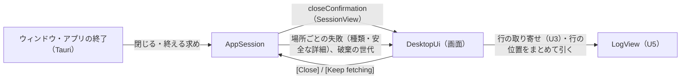
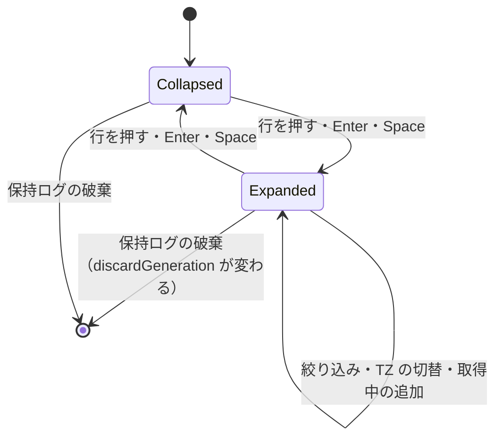
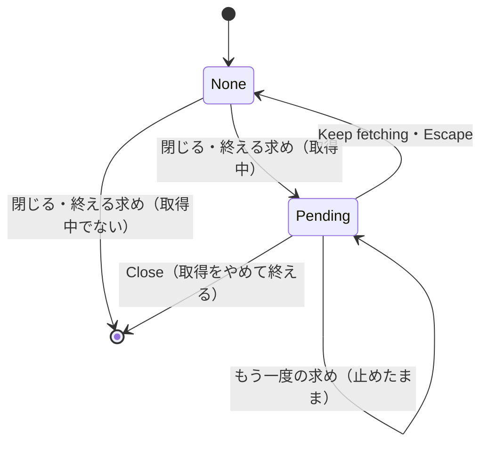

# Functional Spec — U7 画面の仕上げ（u7-ui-polish）

上流の成果物：`inception/units-generation/unit-of-work.md`（U7 の範囲）、`inception/domain-design/components.md`（DesktopUi・AppSession）、`inception/requirements-analysis/requirements.md`（FR1.5、FR4.9、FR5.1〜FR5.4、FR8.1〜FR8.3、NFR2、NFR5、NFR10〜NFR13、NFR16）、`ideation/rough-mockups/wireframes.md`（画面 3・5・7）。質問票の回答は `functional-design-questions.md` の Q1〜Q4。画面の部品の分け方は `frontend-components.md` が正。U1〜U6 のルールは、ここで置き換えると書いたもの以外はそのまま有効。前の単位のルールは `U3:BR6.5` のように作業単位名を前に付け、前に何も付けない `BRx.y` はこの文書（U7）のルールを指す。

U7 の種類は ui のため、entities.md と rules.md は作らず、ルールはこの文書の §6 に置く。ライブラリ側で足すのは、行の位置をまとめて引く読み取りのコマンド、保持ログの破棄の世代、終了の確認の状態だけ（§5）。

## 1. U7 で動くもの

- 一覧の行を押すと、その行のすぐ下にメッセージの全文を展開する。もう一度押すと閉じる。複数の行を同時に展開でき、全文は選択してコピーできる。JSON は整形しない。全文は折り返し、20 行ぶんを超える分は展開部分の中でスクロールする（Q1）。絞り込みを変えても展開は開いたまま（Q2）。一覧の中では ↑↓ で行を選び、Enter か Space で展開・閉じる（Q3）。
- エラーを、種類ごとの「何が起きたか」と「次の行動」の文で示し、それまでの「失敗：種類名」の暫定の表示（U1:BR4.4）を置き換える。安全な詳細があれば、どのエラーにも短く添える（Q4）。色やアイコンだけで示さない。
- 取得中（キャッシュへの書き込み中を含む）にウィンドウを閉じる・アプリを終えようとしたときだけ確認する（[Keep fetching] / [Close]）。
- 最小ウィンドウは 1024×640。ダークモードは OS の設定に合わせる。英日の文言とキーボード操作を通しで確かめる。アプリの診断ログは標準エラー出力だけに出す。

部品のつながり（U7 で足す・変える部分）：



<!-- Text fallback: ウィンドウを閉じる・アプリを終える求めは AppSession に渡る。取得中なら AppSession は closeConfirmation を確認中にし、SessionView で画面に伝える。画面は [Close] か [Keep fetching] の答えを返す。画面は U3 のとおり行を取り寄せ、展開している行・選んでいる行・見えている先頭の行の位置を LogView からまとめて引く。AppSession は場所ごとの失敗（種類と安全な詳細）と、保持ログを捨てた世代を SessionView で渡す。 -->

## 2. ワークフロー

### UC1：行を展開する・閉じる

1. 利用者が一覧の行を押す（または ↑↓ で行を選び、Enter か Space を押す。BR1.5）。
2. その行がまだ展開されていなければ、行のすぐ下にメッセージの全文を出す。全文は文字として折り返し、高さは 20 行ぶん（372 px）まで。超える分は展開部分の中でスクロールする（BR1.1、BR1.2）。
3. 展開されていれば閉じる（BR1.1）。
4. 展開部分の中の文字は選択してコピーできる。展開部分の中を押しても行は閉じない（BR1.3）。
5. ほかの行を展開しても、前に展開した行は開いたまま（BR1.1）。
6. 画面は、展開している行と見えている先頭の行の、いまの一覧での位置をライブラリからまとめて引き（BR1.7）、行の位置を計算し直す。見えている先頭の行が画面の上でずれないように、スクロールの位置を合わせる（BR1.4、BR1.8）。

### UC2：絞り込み・タイムゾーン・取得中の追加・取り直しと展開

1. 絞り込みの文字列を変えても、展開は開いたまま。絞り込みで隠れた行は位置がなくなり（高さに数えない）、絞り込みを解けば展開したまま出る（BR1.6、Q2）。
2. タイムゾーンを切り替えても、展開は開いたまま（時刻の文字だけが変わる。BR1.6）。
3. 取得中にログが届いても（timelineVersion が増えても）、展開は開いたまま。展開している行の位置は、届いたぶん変わりうるため引き直す（BR1.6、BR1.7）。
4. 保持ログが捨てられたら（新しい取得の開始・接続の変更・中断で discardGeneration が変わったら）、展開をすべて閉じ、選んでいる行を一番上に戻す（BR1.6、BR1.5）。

### UC3：エラーを読む

1. 取得全体・ロググループの一覧・ストリームごとの取得で失敗すると、AppSession は U1〜U6 のとおり、場所ごとの失敗（取得のジョブの失敗、一覧の失敗、ストリームごとの失敗）に種類（FailureKind）と安全な詳細を入れて SessionView で渡す。ライブラリは変えない（BR2.1）。
2. 画面は、表示する場所から場面（Fetch・Listing・Stream）を決め、種類と場面から「何が起きたか」と「次の行動」の文を組み立てる（BR2.2）。文言は §6 の BR2.2 の表が正本。
3. 安全な詳細があれば、3 行目に「詳細：…」として添える（BR2.3、Q4）。
4. 取得全体の失敗はログ一覧の上のエラー欄に、ロググループの一覧の失敗は左ペインに、ストリームごとの失敗は失敗の一覧（U3）に出す。ステータス行には「何が起きたか」の文だけを短く出し、詳細の行は出さない（BR2.4）。
5. 文字で示し、色やアイコンだけにしない（BR2.5）。

### UC4：取得中にウィンドウを閉じる・アプリを終える（画面 7）

1. 利用者がウィンドウを閉じる、または Cmd+Q・Dock のメニューでアプリを終えようとする（BR3.1 の表）。
2. 取得中でなければ、確認なしで閉じる・終える（BR3.1）。
3. 取得中（キャッシュへの書き込み中を含む）なら、閉じる・終えるのを止め、closeConfirmation を Pending にする。画面は SessionView を見て確認ダイアログを出し、入力位置を [Keep fetching] に置く（BR3.1、BR3.3）。
4. [Keep fetching] か Escape なら、closeConfirmation を None に戻し、取得を続ける（BR3.2）。
5. [Close] なら、取得をやめ（U3:BR5.5 の中断。U6:BR3.2 によりキャッシュには書かない）、取得途中の結果を捨ててアプリを終える。終えるときにもう一度確認しない（BR3.2）。
6. ダイアログを出しているあいだに取得が終わっても、ダイアログはそのまま。[Close] ならそのまま終え、[Keep fetching] ならダイアログを閉じるだけ（BR3.4）。

## 3. 状態遷移

### 展開の状態（行ごと）



<!-- Text fallback: 行は閉じた状態から始まる。行を押すか Enter・Space で展開し、もう一度で閉じる。絞り込み・タイムゾーンの切替・取得中のログの追加では状態は変わらない（位置だけ引き直す）。保持ログが捨てられると（discardGeneration が変わると）、展開の状態はすべて消える。 -->

### 終了の確認（closeConfirmation）



<!-- Text fallback: 取得中でなければ、閉じる・終える求めでそのまま終わる。取得中なら Pending に移り、閉じる・終えるのを止める。Pending のあいだにもう一度求めが来ても止めたまま。Keep fetching か Escape で None に戻って取得を続け、Close で取得をやめて終える。Pending のあいだに取得が終わっても Pending のまま。 -->

## 4. 画面（U7 で足す・変えるもの）

画面の部品の分け方と状態は `frontend-components.md` が正。見た目は標準部品だけにする（NFR10、project.md Corrections）。

| 部分 | 内容 |
|------|------|
| ログ一覧 | 行の展開（全文・折り返し・20 行ぶんまで・中でスクロール・選択とコピー）、↑↓・PageUp・PageDown・Home・End での行の選択と Enter・Space での開閉、行の高さが変わる仮想スクロール、グリッドの役割（BR1.1〜BR1.9） |
| エラー欄 | 取得全体の失敗の「何が起きたか」「次の行動」「詳細」（BR2.2〜BR2.4） |
| 左ペイン・失敗の一覧・ステータス行 | 暫定の「種類名」を、BR2.2 の文に置き換える。ステータス行は「何が起きたか」だけ（BR2.4） |
| 終了の確認ダイアログ（画面 7） | [Keep fetching]・[Close]、入力位置は [Keep fetching]、Escape は [Keep fetching]（BR3.1〜BR3.4） |
| ウィンドウ | 最小 1024×640、ダークモードは OS に合わせる（BR4.1、BR4.2） |

## 5. 画面とライブラリの状態

| 状態 | 持ち主 | 内容 |
|------|--------|------|
| 展開している行 | 画面（ログ一覧） | 行のキー (logStreamName, sequence) の集合と、それぞれの、いまの一覧での位置（BR1.7 で引く）と高さ（測った値または見積もり）。discardGeneration が変わったら空にする。components.md は SessionState の expandedRows としていたが、表示だけの状態で、行の高さの測り方と一緒に扱う必要があるため画面の中に置く（ライブラリには渡さない） |
| 選んでいる行 | 画面（ログ一覧） | 行のキーと、いまの一覧での位置。位置はキーから引き直す（BR1.5、BR1.7） |
| 見えている先頭の行（アンカー） | 画面（ログ一覧） | 行のキーと、その行の中でのずれ（px）。U3:BR6.5 のアンカーを、展開部分を含む位置の計算に広げたもの（BR1.8） |
| 行の位置をまとめて引くコマンド | ライブラリ（LogView）＋ Tauri | `row_positions(keys)`：渡したキーの並びに対し、いまの一覧（絞り込み中は結果の中、U5）での位置（ないときは無し）を返す。あわせて timelineVersion・resultVersion・discardGeneration を返す（BR1.7） |
| 保持ログの破棄の世代 | ライブラリ（AppSession）→ SessionView | discardGeneration。保持ログを捨てるたびに 1 増える（取得の開始、接続の変更、中断）。取得中の追加では増えない（BR1.6） |
| 終了の確認 | ライブラリ（AppSession）→ SessionView | closeConfirmation（None / Pending）。画面はこの値を正とし、`session-changed` は変わった合図にだけ使う。画面を読み込み直しても get_session で同じ値を得る（BR3.1） |
| エラーの組み立て | 画面 | 場所ごとの失敗（種類・安全な詳細）と表示の場所から、BR2.2 の文を引く。ライブラリは文も場面も作らない |

## 6. ルール（機械可読）

```yaml
rules:
  - id: BR1.1
    statement: 行を押すとその行のすぐ下に全文を展開し、もう一度押すと閉じる。複数の行を同時に展開できる
    category: policy
    applies_to: DesktopUi
    trigger: 一覧の行を押したとき
    logic: 行のキー (logStreamName, sequence) が展開の集合になければ足し、あれば除く。展開した行の直下にメッセージの全文を出す。ほかの行の展開は変えない。押した行を選んでいる行にもする
    violation: なし
    source: FR5.2
  - id: BR1.2
    statement: 全文は文字として折り返して出し、20 行ぶんを超える分は展開部分の中でスクロールする
    category: policy
    applies_to: DesktopUi
    trigger: 行を展開したとき
    logic: "メッセージを API が返したまま（改行を含む、JSON を整形しない）、画面の文字（テキストノード）としてだけ出す。HTML として解釈しない、リンクにしない。等幅の文字（一覧のメッセージと同じ ui-monospace、12 px）で、行の高さ 18 px、上下の余白 6 px ずつ。折り返しは white-space: pre-wrap と overflow-wrap: anywhere（長い 1 語も横にあふれない）。展開部分の高さは min(内容の高さ, 18 × 20 + 12 = 372 px)。超える分は展開部分の中だけでスクロールする（overflow-y: auto）。長さの上限は設けない（CloudWatch Logs の 1 件のイベントは 256 KB までのため、全文をそのまま出す）"
    violation: なし
    source: FR5.4、Q1、NFR2
  - id: BR1.3
    statement: 展開した全文は選択してコピーでき、展開部分の中を押しても閉じない
    category: policy
    applies_to: DesktopUi
    trigger: 展開部分を操作したとき
    logic: 展開部分の文字は選択できる形で出し、OS の標準のコピー（Cmd+C）で写せる。展開部分の中の押下・選択は行の開閉にしない。開閉するのは行そのもの（時刻・ストリーム名・1 行のメッセージの部分）を押したときだけ
    violation: なし
    source: FR5.3
  - id: BR1.4
    statement: 行の位置は「位置の番号 × 22 px ＋ それより前にある展開部分の高さの合計」で求め、U3 の比例の縮小と組み合わせる
    category: calculation
    applies_to: DesktopUi
    trigger: 描く・スクロールする・展開と高さと位置が変わったとき
    logic: "展開している行のうち位置がある（いまの一覧に出ている）ものを位置の昇順に並べ、高さの累積 C[k] を持つ。行 i の仮想の上端 offset(i) = i × 22 ＋（位置が i より小さい展開の高さの合計。二分探索で求める）。行 i の高さは 22、展開していれば 22 ＋ 展開部分の高さ。仮想の全体の高さ H = 行数 × 22 ＋ 展開部分の高さの合計。U3 の比例の縮小は、この H に対して行う：H > 1,000 万 px なら s = 1,000 万 / H、そうでなければ s = 1。実際のスクロール位置 = 仮想の位置 × s。逆向き（実際のスクロール位置 → 先頭の行とその中のずれ）は、仮想の位置 y = 実際の位置 / s から、展開の累積を二分探索して、y を超えない最後の展開の位置までの高さを引き、残りを 22 で割って行を求める（展開部分の中に入った y はその展開した行に属する）。取り寄せる行の範囲は、見えている範囲の先頭の行から、画面の高さを埋めるまでの行。純粋な計算として rowLayout.ts に置き、入出力は frontend-components.md の §2 に書く"
    violation: なし
    source: FR5.2、U3 の仮想スクロール、NFR2
  - id: BR1.5
    statement: 一覧の中では ↑↓・PageUp・PageDown・Home・End で行を選び、Enter か Space で展開・閉じる（U3 のスクロールのキーを置き換える）
    category: policy
    applies_to: DesktopUi
    trigger: 一覧に入力位置があるときにキーを押したとき
    logic: "U3 の一覧のキー操作（↑↓・PageUp・PageDown・Home・End でスクロールする）を置き換える。↑↓ は選んでいる行を 1 行、PageUp・PageDown は見えている行の数ぶん、Home・End は先頭・末尾へ動かし、選んだ行が見えるようにスクロールする（展開部分は選ぶ単位にしない。↓ で展開した行の次の行に移る）。選んでいる行はキーと位置の両方で持つ。位置は BR1.7 でキーから引き直す。キーが一覧から消えたら（絞り込みで隠れたら）、同じ位置の行（行数を超えたら最後の行）を選ぶ。保持ログが捨てられたら一番上の行を選ぶ。Enter か Space で、選んでいる行を BR1.1 と同じく開閉する。選んでいる行がまだ届いていない（取り寄せる前）ときは何もしない"
    violation: なし
    source: Q3、NFR13、U3 の一覧のキー操作
  - id: BR1.6
    statement: 絞り込み・タイムゾーン・取得中の追加では展開を保ち、保持ログが捨てられたら閉じる
    category: policy
    applies_to: DesktopUi
    trigger: 絞り込み・タイムゾーン・timelineVersion・discardGeneration が変わったとき
    logic: 絞り込みの文字列・タイムゾーン・timelineVersion（取得中の追加）が変わっても、展開の集合はそのまま（位置は BR1.7 で引き直す。隠れた行は位置がなくなり、また出たときに展開したまま）。discardGeneration が変わったら（保持ログが捨てられたら。(logStreamName, sequence) は次の取得で別の行を指すため。U3:BR4.4）、展開の集合を空にする。AppSession は保持ログを捨てるたびに discardGeneration を 1 増やし、SessionView に入れる。取得中の追加では増やさない
    violation: なし
    source: Q2、U3:BR4.4、レビュー R-03
  - id: BR1.7
    statement: 展開している行・選んでいる行・見えている先頭の行の位置は、ライブラリからまとめて引く
    category: policy
    applies_to: LogView
    trigger: 展開の集合・timelineVersion・resultVersion・filterId が変わったとき
    logic: "画面は、展開している行・選んでいる行・見えている先頭の行のキーを並べて row_positions を 1 回呼ぶ。LogView は 1 回のロックの中で、それぞれのいまの一覧での位置（絞り込み中は U5 の結果の中での位置、隠れている・保持ログにないときは無し）を U3:BR4.4・U5 の位置の問い合わせと同じ方法で求め、timelineVersion・resultVersion・discardGeneration と一緒に返す。画面は、返ってきた版が手元の版より古ければ捨てる。取得中に版が続けて変わるときは、呼び出し中の答えが返るまで次を呼ばず、返ってきたら最新の版でもう一度呼ぶ（呼び出しは同時に 1 つ）"
    violation: なし
    source: レビュー R-01、U3:BR4.4、U5 の位置の問い合わせ
  - id: BR1.8
    statement: 展開・高さ・位置が変わっても、見えている先頭の行は画面の上で動かさない
    category: policy
    applies_to: DesktopUi
    trigger: 展開・閉じる・展開部分の高さ・位置が変わったとき
    logic: 見えている先頭の行のキーとその行の中でのずれ（px）をアンカーとして持つ。展開・閉じる・高さの変化・位置の引き直しのあと、アンカーの行の新しい位置から offset を求め、スクロールの位置を「offset ＋ ずれ」（BR1.4 の縮小をかけたもの）に合わせる。アンカーの行が一覧から消えたら、同じ位置の行をアンカーにする。U3:BR6.5 を、展開部分を含む位置の計算に広げたもの
    violation: なし
    source: U3:BR6.5、レビュー R-01
  - id: BR1.9
    statement: 展開部分の高さは、測る前は見積もり、測ったら実際の値を使い、幅が変わったら測り直す
    category: calculation
    applies_to: DesktopUi
    trigger: 展開したとき、展開部分が画面に出たとき、一覧の幅が変わったとき
    logic: "見積もり＝メッセージを改行で分けた各行について ceil(文字数 × 文字の幅 ÷ 展開部分の文字の幅) を足した行数（文字の幅は起動時に等幅の文字 1 つを測る）を L として、min(L, 20) × 18 + 12 px。画面に出ている展開部分は実際の高さを測り（ResizeObserver）、その値を使う。測った高さは一覧の幅と一緒に持ち、幅が変わったらすべての測った値を捨てて見積もりに戻し、画面に出ているものを測り直す。画面の外の展開行は、最後に測った値（幅が同じとき）か見積もりを使う。高さが変わったら BR1.8 でアンカーを保つ"
    violation: なし
    source: レビュー R-06
  - id: BR1.10
    statement: 一覧はグリッドの役割を持ち、選んでいる行と展開を読み上げで分かるようにする
    category: constraint
    applies_to: DesktopUi
    trigger: 一覧を描くとき
    logic: "一覧は role=grid とし、aria-rowcount に行数＋見出しの 1 を入れる。見出しの行は aria-rowindex=1、各行は role=row と aria-rowindex=位置＋2、各列は role=gridcell。一覧そのものが入力位置を受け（tabIndex=0）、選んでいる行を aria-activedescendant で示す（その行が描かれていないときは付けない）。展開した行には aria-expanded=true を付け、展開部分はその行の中の全幅のセル（aria-colspan=3）に置く。展開部分が 20 行ぶんを超えてスクロールするときは、展開部分に入力位置を受けさせる（tabIndex=0）。一覧で選んでいる行の展開部分がスクロールするときは Tab でその中に入り、Escape か Shift+Tab で一覧に戻る。キーの処理は event.target で分け、展開部分の中にあるときは一覧の ↑↓・PageUp・PageDown・Home・End・Enter・Space を処理しない（文字の選択とスクロールに使わせる）"
    violation: なし
    source: レビュー R-05、wireframes 画面 3 のアクセシビリティ、NFR13

  - id: BR2.1
    statement: エラーは場所ごとの失敗（種類と安全な詳細）として渡し、場面は画面が表示の場所から決める
    category: constraint
    applies_to: AppSession
    trigger: 取得・一覧・ストリームの取得で失敗したとき
    logic: AppSession は U1〜U6 のとおり、取得のジョブの失敗・一覧の失敗・ストリームごとの失敗に、FailureKind（AuthRequired・AccessDenied・Throttled・Network・NotFound・InvalidInput・RegionMissing・Other）と安全な詳細（U1:BR4.3 のとおり許可した項目だけで作った文、なければ空）を入れて渡す。ライブラリは変えない。画面は、取得のジョブの失敗を Fetch、一覧の失敗を Listing、ストリームごとの失敗を Stream の場面として扱う。秘密の認証情報とアクセスキー ID は渡さない
    violation: なし
    source: FR8.1、FR8.3、レビュー R-07
  - id: BR2.2
    statement: 種類と場面ごとに「何が起きたか」と「次の行動」の文で示す（文言の正本）
    category: policy
    applies_to: DesktopUi
    trigger: エラーを出すとき
    logic: "文言の正本はこの表だけとする。次の行動の {retry} には、場面が Fetch・Stream なら ja「[Fetch] でもう一度取得してください」／en「Press [Fetch] to fetch again」、Listing なら ja「[再読み込み] でもう一度読み込んでください」／en「Press [Reload] to load the list again」を差し込む（ボタン名は画面の表示どおり）。AuthRequired＝ja「認証情報を使えませんでした（SSO のログイン切れなど）。」「SSO を使っているときは aws sso login を実行してから、{retry}。それ以外はプロファイルの設定を確認するか、別のプロファイルを選んでください。」／en「Credentials could not be used (for example, the SSO session expired).」「If you use SSO, run aws sso login, then {retry}. Otherwise, check the profile settings or choose another profile.」。AccessDenied＝ja「権限がないため拒否されました。」「IAM の権限を確認するか、別のプロファイルを選んでください。」／en「Access was denied.」「Check the IAM permissions or choose another profile.」。Throttled＝ja「AWS の呼び出しが多すぎるため、制限されました。」「しばらく待ってから、{retry}。」／en「AWS throttled the requests.」「Wait a while, then {retry}.」。Network＝ja「AWS に接続できませんでした。」「接続を確認してから、{retry}。」／en「Could not connect to AWS.」「Check your connection, then {retry}.」。NotFound（Fetch・Stream）＝ja「ロググループかストリームが見つかりませんでした。」「[再読み込み] でロググループの一覧を読み込み直して、選び直してください。」／en「The log group or stream was not found.」「Press [Reload] to load the log group list again and choose again.」。InvalidInput（Fetch・Stream）＝ja「AWS が条件を受け付けませんでした。」「時間範囲を見直してから、{retry}。」／en「AWS rejected the request.」「Check the time range, then {retry}.」。RegionMissing＝ja「このプロファイルには既定のリージョンがありません。」「上部バーでリージョンを選んでください。」／en「This profile has no default region.」「Choose a region in the top bar.」。Other＝ja「AWS の呼び出しで問題が起きました。」「{retry}。続くときは詳細を確かめてください。」／en「Something went wrong while calling AWS.」「{retry}. If it keeps happening, check the details.」。その場面では起きない組み合わせ（Listing の NotFound・InvalidInput、Stream の RegionMissing）は、Other の文を使う"
    violation: なし
    source: FR1.5、FR8.1、wireframes 画面 5、レビュー R-08
  - id: BR2.3
    statement: 安全な詳細があれば、どのエラーにも短く添える
    category: policy
    applies_to: DesktopUi
    trigger: エラーを出すとき
    logic: "安全な詳細が空でなければ、3 行目に ja「詳細：{detail}」／en「Details: {detail}」として添える（U1 の status.detail の文言を使う）。空なら何も添えない。ステータス行には添えない（BR2.4）"
    violation: なし
    source: Q4、FR8.1、FR8.3
  - id: BR2.4
    statement: エラーは場面ごとの場所に出し、暫定の「種類名だけ」の表示を置き換える
    category: policy
    applies_to: DesktopUi
    trigger: エラーを出すとき
    logic: 取得全体の失敗（U3 の Failed）はログ一覧の上のエラー欄に BR2.2・BR2.3 の 3 行を出し、取得できた行があれば下に残す。ステータス行には「何が起きたか」の文だけを出し、今の詳細の行（status-line-detail）は外す。ロググループの一覧の失敗・途中までの一覧は左ペインに、ストリームごとの失敗は失敗の一覧に、同じ 3 行で出す。U1:BR4.4 の暫定の表示（U1〜U6 の「失敗：種類名」「一覧は途中までです：種類名」）を置き換える（途中までであることの文は残し、理由を BR2.2 の文にする）
    violation: なし
    source: FR8.1、wireframes 画面 5、unit-of-work.md の「エラー表示の暫定扱い」、レビュー R-07
  - id: BR2.5
    statement: エラーを色やアイコンだけで示さない
    category: constraint
    applies_to: DesktopUi
    trigger: エラーを出すとき
    logic: エラー欄・左ペイン・失敗の一覧・ステータス行のエラーは、必ず BR2.2 の文を含める。色や記号を足すときも、文を省かない
    violation: なし
    source: FR8.2

  - id: BR3.1
    statement: 取得中にウィンドウを閉じる・アプリを終えるときだけ確認し、取得中でなければそのまま閉じる
    category: policy
    applies_to: AppSession
    trigger: ウィンドウを閉じる・アプリを終える求めが来たとき
    logic: "経路ごとの扱い：(1) ウィンドウの閉じるボタン（Tauri の CloseRequested）と (2) Cmd+Q・Dock のメニューの終了（Tauri の ExitRequested）は、IF フェーズが取得中（U6 のキャッシュへの書き込み中を含む）THEN 閉じる・終えるのを止め（prevent_close / prevent_exit）、closeConfirmation を Pending にして session-changed を送る。ELSE そのまま通す（設定ダイアログ・接続変更の確認が開いていても通す）。Pending のときに来た (1)(2) は、止めたまま何もしない。(3) ウィンドウの破棄（Destroyed）は、通したあとに来るものとして取得の中断だけを行う（念のため）。CloseRequested で取得を中断する今の動きはやめ、中断は [Close] のとき（BR3.2）と (3) だけにする"
    violation: なし
    source: FR4.9、wireframes 画面 7、レビュー R-02
  - id: BR3.2
    statement: "[Keep fetching] で取得を続け、[Close] で取得をやめてアプリを終える"
    category: policy
    applies_to: AppSession
    trigger: 確認ダイアログの答え
    logic: "[Keep fetching] か Escape ならコマンド cancel_close で closeConfirmation を None に戻し、取得を続ける。[Close] ならコマンド confirm_close で、取得を中断し（U3:BR5.5。U6:BR3.2 によりキャッシュには書かない）、取得途中の結果を捨て、終えてよい印を立ててからアプリを終える（app.exit）。印が立っていれば、終えるときの ExitRequested と CloseRequested をもう一度止めない。書き込みの途中で終えたときは一時ファイルが残りうるが、U6:BR3.4 によりキャッシュは前のままで、一時ファイルは次の書き込みか全削除で消える"
    violation: なし
    source: FR4.9、レビュー R-02
  - id: BR3.3
    statement: 確認ダイアログは文で何が失われるかを示し、入力位置は [Keep fetching] に置く
    category: policy
    applies_to: DesktopUi
    trigger: 確認ダイアログを出したとき
    logic: "画面は SessionView の closeConfirmation が Pending のあいだダイアログを出す。文言は ja「取得中です。」「ウィンドウを閉じると、ここまで取得したログは失われます。」ボタン「取得を続ける」「閉じる」／en「Fetching is in progress.」「If you close the window, the logs fetched so far will be lost.」ボタン「Keep fetching」「Close」。開いたら入力位置を [Keep fetching] に置く（誤って Enter を押しても失わないように）。Escape は [Keep fetching]。閉じたら入力位置を元に戻す"
    violation: なし
    source: wireframes 画面 7、NFR13
  - id: BR3.4
    statement: 確認中に取得が終わっても、確認ダイアログはそのまま
    category: policy
    applies_to: AppSession
    trigger: 確認中に取得が終わったとき
    logic: 取得が終わっても closeConfirmation は Pending のまま。[Close] なら（もう取得していないので中断せずに）そのまま終え、[Keep fetching] ならダイアログを閉じるだけ
    violation: なし
    source: FR4.9

  - id: BR4.1
    statement: ウィンドウの最小の大きさは 1024×640
    category: constraint
    applies_to: DesktopUi
    trigger: 起動時、ウィンドウの大きさを変えるとき
    logic: src-tauri/tauri.conf.json のウィンドウの minWidth を 800 から 1024 に、minHeight を 500 から 640 に変える。起動時の大きさ（width・height）もそれ以上にする。1024×640 で、左ペイン・条件エリア・一覧・ステータス行が重ならず、横のスクロールが出ないこと
    violation: なし
    source: NFR11、レビュー R-09
  - id: BR4.2
    statement: ダークモードは OS の設定に合わせる
    category: policy
    applies_to: DesktopUi
    trigger: 起動時、OS の設定が変わったとき
    logic: 画面の色は OS の明暗に合わせて変わる標準の色（color-scheme: light dark とシステムカラー）だけを使い、決め打ちの色を使わない。OS の設定を変えたら、アプリを開き直さずに追従する。独自のテーマは作らない
    violation: なし
    source: NFR11、NFR10
  - id: BR4.3
    statement: 画面のすべての文言を英日でそろえ、OS の言語に合わせる
    category: constraint
    applies_to: DesktopUi
    trigger: 画面に文字を出すとき
    logic: 画面に出す文字はすべて文言のキーから引く（決め打ちの文字を置かない）。すべてのキーに英語と日本語がある。OS の言語の最初が日本語なら日本語、それ以外は英語（U1 の言語の判定のまま）
    violation: なし
    source: NFR12
  - id: BR4.4
    statement: 主な流れをキーボードだけで操作でき、ダイアログは Escape で閉じられる
    category: constraint
    applies_to: DesktopUi
    trigger: キーボードで操作するとき
    logic: "Tab の順は、プロファイル → リージョン → タイムゾーン → [*] → ロググループの検索 → ロググループの一覧 → 開始日時 → 終了日時 → [Fetch] → 絞り込み → ログ一覧（→ 選んでいる行のスクロールする展開部分）。どの部品にも入力位置が見える。接続変更の確認・設定・失敗の一覧・終了の確認のダイアログは、どれも Escape で閉じられる（終了の確認は [Keep fetching]）"
    violation: なし
    source: NFR13
  - id: BR4.5
    statement: アプリの診断ログは標準エラー出力だけに出し、ファイルに書かない
    category: constraint
    applies_to: DesktopUi
    trigger: 診断ログを出すとき
    logic: 診断ログは標準エラー出力だけに出す。ログ用のファイルを作る仕組み（ログのライブラリのファイル出力を含む）を入れない。中身は U1 の安全な詳細だけで、秘密の認証情報とアクセスキー ID を含めない
    violation: なし
    source: NFR16、NFR5
```

## 7. ルールの要約

| 分類 | ルール |
|------|--------|
| 行の展開 | BR1.1 押して開閉・複数可／BR1.2 文字として折り返し・372 px まで／BR1.3 選択とコピー／BR1.4 位置の計算と縮小／BR1.5 選択のキー（U3 のキーを置き換え）／BR1.6 絞り込み・TZ・追加で保ち、破棄で閉じる／BR1.7 位置をまとめて引く／BR1.8 見えている行を動かさない／BR1.9 高さの見積もりと測り直し／BR1.10 グリッドの役割 |
| エラー | BR2.1 場所ごとの失敗、場面は画面が決める／BR2.2 文言の正本／BR2.3 詳細はすべてに／BR2.4 場面ごとの場所、暫定の表示を置き換え／BR2.5 色やアイコンだけにしない |
| 終了の確認 | BR3.1 経路ごとの扱い、取得中だけ確認／BR3.2 続ける・閉じる／BR3.3 文言と入力位置／BR3.4 確認中に取得が終わっても |
| 画面全体 | BR4.1 1024×640／BR4.2 ダークモード／BR4.3 英日／BR4.4 キーボード／BR4.5 診断ログは標準エラー出力だけ |

## 8. 前提と割り切り

- 展開している行は画面の中だけで持ち、ライブラリには渡さない（§5）。components.md の SessionState.expandedRows からの意図した変更。位置だけを BR1.7 でまとめて引く。
- 展開部分の高さは、画面の外にある間は見積もりか前に測った値を使うため、スクロールしてきて測ったときに高さが少し変わることがある。そのときも BR1.8 で見えている先頭の行は動かさない。
- 取得中に版が続けて変わると、位置の引き直しは前の答えが返るまで待つため、展開した行の位置がしばらく古いままのことがある（呼び出しは同時に 1 つ）。
- ストリームごとの失敗の「次の行動」は、取得全体をやり直す [Fetch] を指す（ストリームだけを取り直す操作は MVP にない）。
- 診断ログをファイルに残さないため、あとから調べるには、開発者本人がターミナルから起動して標準エラー出力を見る。
- Cmd+Q のときも取得中なら確認する（BR3.1 の (2)）。OS の再起動・ログアウトなどで強制的に終わる場合は確認できない。

## 9. テストの方針（team.md の Testing Posture に沿って）

U7 は主に画面の層のため、多くを実装してからテストを書く。

- テストを先に書く純粋なロジック：
  - rowLayout.ts（BR1.4、BR1.8、BR1.9）：展開の累積、offset と逆向き、縮小との組み合わせ、操作した行より上は動かない、アンカーからのスクロールの位置、高さの見積もり。
  - 展開の集合と選んでいる行の更新（BR1.1、BR1.5、BR1.6）：開閉、破棄の世代で空になる、絞り込み・追加では保つ、キーが消えたときの選択。
  - エラーの文の組み立て（BR2.2、BR2.3）：種類 × 場面 × 詳細の有無、{retry} の差し込み、起きない組み合わせの代わり。
  - ライブラリの row_positions（BR1.7）：絞り込みの有無、隠れた行・ない行は無し、版を返す。
  - discardGeneration（BR1.6）：破棄で増え、追加では増えない。
  - AppSession の終了の確認（BR3.1、BR3.2、BR3.4）：取得中・書き込み中・取得中でない、Pending 中のもう一度の求め、確認中の取得の終わり、[Close] で中断と終えてよい印。
- 実装してからテストを書くもの：
  - ログ一覧：展開の表示（全文・テキストノードだけ・折り返し・372 px・中でスクロール・中を押しても閉じない）、キー操作（↑↓・PageUp・PageDown・Home・End・Enter・Space、展開部分の中では処理しない、Tab と Escape で出入り）、グリッドの役割と属性。
  - エラーの表示：エラー欄・左ペイン・失敗の一覧・ステータス行の文と詳細（ステータス行に詳細が出ない）。
  - 終了の確認ダイアログ：SessionView の値で出る、入力位置、Escape、答えのコマンド。
  - 文言とキーボード：すべてのキーの英日のそろいと決め打ちの文字がないこと、Tab の順。
- Tauri の閉じる・終えるのつなぎには自動テストを置かず、開発者本人の手元で確かめる。手元で確かめる項目：
  - ウィンドウの閉じるボタン・Cmd+Q・Dock の終了を、取得中・書き込み中・取得中でないときのそれぞれで試す。
  - 書き込み中に [Close] したあと、次の起動でキャッシュが前のままで、一時ファイルが次の書き込みか全削除で消えること。
  - ダークモードの切替。
  - 1024×640 で画面が崩れないこと。
  - 100 万件で、展開とスクロールの体感が保たれること。
- 自動テストと CI は実際の AWS に接続しない。
