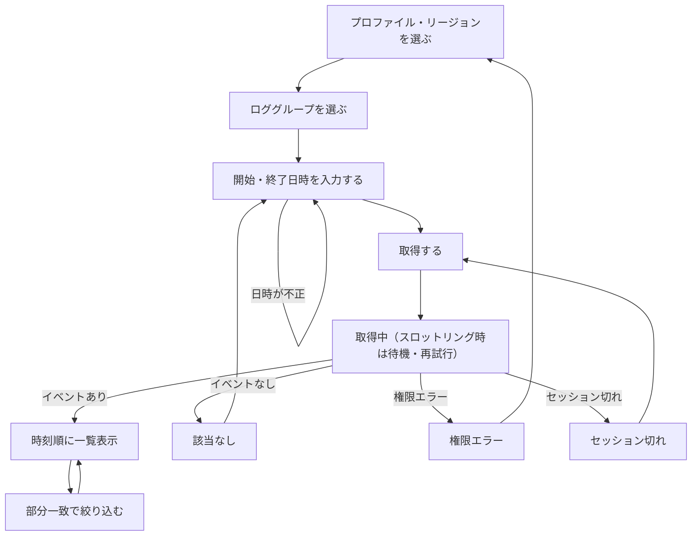

# User Flow — CloudWatch Logs ローカルビューア

上流の成果物：`intent-statement`、`scope-document`、`intent-backlog`（いずれも `aidlc/spaces/default/intents/261002-cwlogs-viewer/ideation/` 配下）。画面番号は `wireframes.md` を指す。

## 主要フロー：古いロググループの過去ログを閲覧する

```
Flow: 古いロググループの過去ログを閲覧する
Persona: 開発者本人（OSS 利用者も同じ）
Trigger: マネジメントコンソールで過去ログが見えなかった
Steps:
  1. 画面 1 -> プロファイルとリージョンを選ぶ -> ロググループ一覧が更新される
  2. 画面 1 -> ロググループを 1 つ選ぶ（名前で絞り込み可） -> 選択状態になる
  3. 画面 1 -> 開始日時と終了日時を入力する（絶対日時。画面上は日付を省略した表記で示している） -> [取得] が押せるようになる
  4. 画面 1 -> [取得] を押す -> 画面 2（取得中）
  5. 画面 2 -> 待つ -> 画面 3（ストリームを跨いだ結果を時刻順に表示）
  6. 画面 3 -> フィルターに文字列を入力する -> 画面 4（該当行だけ表示）
Success outcome: マネコンで見えなかった過去ログが、時刻順に一覧表示される
Error paths:
  - 時間範囲内にイベントがない -> 画面 5（該当なし） -> 時間範囲を広げて手順 3 へ
  - 権限がない -> 画面 5（権限エラー） -> 別のプロファイルを選んで手順 1 へ
  - SSO セッション切れ -> 画面 5（セッション切れ） -> 再ログインして手順 4 へ
  - スロットリング -> 画面 2 のまま待機・再試行（利用者の操作は不要）
  - 開始日時が終了日時より後 -> 入力欄の下に文字で指摘し、[取得] を押せないようにする
```



<!-- Text fallback: プロファイル・リージョン選択 → ロググループ選択 → 日時入力（不正なら再入力）→ 取得 → 取得中（スロットリング時は待機・再試行）→ イベントがあれば時刻順に一覧表示し、部分一致で絞り込める。イベントなしは日時入力へ、権限エラーはプロファイル選択へ、セッション切れは再ログイン後に取得へ戻る。 -->

## 補助フロー 1：別のロググループや時間範囲で見直す

```
Steps:
  1. 画面 3 -> 左ペインで別のロググループを選ぶ、または日時を変える -> [取得] が押せる
  2. [取得] を押す -> 画面 2 -> 画面 3（新しい結果に置き換わる）
```

- フィルターの入力内容は、新しい結果にもそのまま適用する（扱いは要件分析で確認する）。

## 補助フロー 2：タイムゾーンを切り替える

```
Steps:
  1. 画面 3 -> 上部バーで TZ を Local から UTC に切り替える
  2. ログ一覧の時刻表示と、日時入力欄の解釈が UTC に変わる。ステータス行の表示も変わる
```

- 再取得は不要（表示の変換だけ）。既定はローカル時刻（rough-mockups-questions の Q5）。

## 補助フロー 3：ディスクキャッシュを有効にする

```
Steps:
  1. 画面 1〜4 -> [*] を押す -> 画面 6（設定）
  2. キャッシュを有効にする -> 保存場所と機密情報の注意を確認する -> [Save]
  3. 以後の取得結果がディスクに保存され、同じ条件の再取得で再利用される
```

- 既定は無効（scope-document の範囲 6）。キャッシュの削除は画面 6 から行う。
- 同じ条件の判定方法（ロググループ・時間範囲・プロファイル・リージョンの組み合わせなど）は要件分析で決める。

## 操作ステップ数（成功指標「CLI より少ない操作」の参考）

主要フローは、選択 2 回（プロファイル・リージョン）、選択 1 回（ロググループ）、日時入力 2 回、[取得] 1 回の計 6 操作で結果が見られる。CLI との比較基準そのものは要件分析で決める（intent-statement、intent-backlog の未解決事項）。
