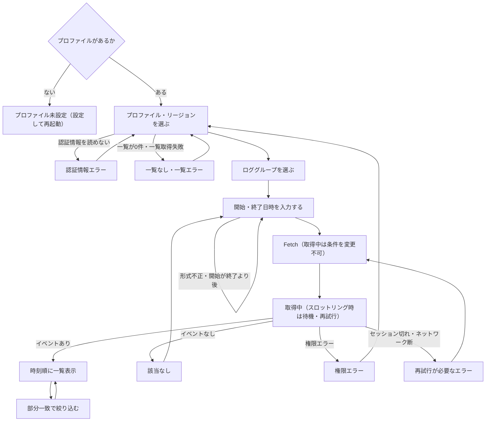

# User Flow — CloudWatch Logs ローカルビューア

上流の成果物：`intent-statement`、`scope-document`、`intent-backlog`（いずれも `aidlc/spaces/default/intents/261002-cwlogs-viewer/ideation/` 配下）。画面番号は `wireframes.md` を指す。質問票の回答は `rough-mockups-questions.md` の Q1〜Q13 を指す。

## 主要フロー：古いロググループの過去ログを閲覧する

```
Flow: 古いロググループの過去ログを閲覧する
Persona: 開発者本人（OSS 利用者も同じ）
Trigger: マネジメントコンソールで過去ログが見えなかった
Steps:
  1. 画面 1 -> プロファイルとリージョンを選ぶ -> ロググループ一覧が更新される
  2. 画面 1 -> ロググループを 1 つ選ぶ（名前で絞り込み可） -> 選択状態になる
  3. 画面 1 -> 開始日時と終了日時を年月日・時分秒で入力する -> 条件を満たすと [Fetch] が押せるようになる
  4. 画面 1 -> [Fetch] を押す -> 画面 2（取得中。条件は変更できない）
  5. 画面 2 -> 待つ -> 画面 3（ストリームを跨いだ結果を時刻順に表示）
  6. 画面 3 -> フィルターに文字列を入力する -> 画面 4（該当行だけ表示）
Success outcome: マネコンで見えなかった過去ログが、時刻順に一覧表示される
Error paths:
  - AWS のプロファイルが 1 つもない -> 画面 5 -> AWS CLI で設定して再起動し、手順 1 へ
  - 認証情報を読めない -> 画面 5 -> プロファイルを確認する、または別のプロファイルを選んで手順 1 へ
  - ロググループが 0 件、または一覧取得で権限エラー -> 画面 5（左ペイン） -> 別のリージョン・プロファイルを選んで手順 1 へ
  - 日時の形式が不正、または開始が終了より後 -> 画面 5（入力欄の下） -> 直すまで [Fetch] は押せない。手順 3 へ
  - 時間範囲内にイベントがない -> 画面 5 -> 時間範囲を広げて手順 3 へ
  - ログ取得で権限エラー -> 画面 5 -> 別のプロファイルを選んで手順 1 へ
  - SSO セッション切れ -> 画面 5 -> aws sso login を実行して手順 4 へ
  - ネットワーク断・その他の API エラー -> 画面 5 -> 接続を確認して手順 4 へ
  - スロットリング -> 画面 2 のまま待機・再試行（利用者の操作は不要）
```



<!-- Text fallback: 起動時にプロファイルがなければ設定を案内する。プロファイル・リージョンを選び（認証情報エラーや一覧0件・一覧エラーなら選び直し）、ロググループを選び、日時を入力する（形式不正や開始が終了より後なら直す）。Fetch すると取得中は条件を変更できない。スロットリング時は待機・再試行する。イベントがあれば時刻順に表示し、部分一致で絞り込める。イベントなしは日時入力へ、権限エラーはプロファイル選択へ、セッション切れ・ネットワーク断は再取得へ戻る。 -->

## 補助フロー 1：別のロググループや時間範囲で見直す

```
Steps:
  1. 画面 3 -> 左ペインで別のロググループを選ぶ、または日時を変える -> 条件を満たすと [Fetch] が押せる
  2. [Fetch] を押す -> 画面 2 -> 画面 3（新しい結果に置き換わる）
```

- 取得中は条件を変更できないので、見直しは取得が終わってから行う（Q11）。
- フィルターの入力内容を新しい結果にもそのまま適用するかは、要件分析で確認する。

## 補助フロー 2：タイムゾーンを切り替える

```
Steps:
  1. 画面 1 または画面 3 -> 上部バーで TZ を Local から UTC に切り替える
  2. 入力済みの日時は同じ瞬間を保ったまま UTC 表記に変わる。ログ一覧の時刻とステータス行の表示も変わる
```

- 例：ローカル（UTC+9）で `2024-03-01 10:00:00` と入力した後に UTC に切り替えると、表示は `2024-03-01 01:00:00` になる。取得範囲は変わらない（Q9）。
- 再取得は不要（表示の変換だけ）。既定はローカル時刻（Q5）。

## 補助フロー 3：ディスクキャッシュを有効にする・削除する

```
Steps:
  1. 画面 1〜4 -> [*] を押す -> 画面 6（設定）
  2. キャッシュを有効にする -> 保存場所と機密情報の注意を確認する -> [Save]
  3. 以後の取得結果がディスクに保存され、同じ条件の再取得で再利用される
  4. 不要になったら画面 6 の [Clear cache] で削除する
```

- 既定は無効（scope-document の範囲 6）。
- 同じ条件の判定方法（ロググループ・時間範囲・プロファイル・リージョンの組み合わせなど）は要件分析で決める。

## 補助フロー 4：取得中にウィンドウを閉じる

```
Steps:
  1. 画面 2 -> ウィンドウを閉じる -> 画面 7（終了確認）
  2a. [Keep fetching] -> 画面 2 に戻り、取得を続ける
  2b. [Close] -> 取得途中の結果を捨てて終了する
```

- 取得中でなければ、確認なしで閉じる（Q12）。

## 操作ステップ数（成功指標「CLI より少ない操作」の参考）

主要フローは、選択 2 回（プロファイル・リージョン）、選択 1 回（ロググループ）、日時入力 2 回、[Fetch] 1 回の計 6 操作で結果が見られる。CLI との比較基準そのものは要件分析で決める（intent-statement、intent-backlog の未解決事項）。
