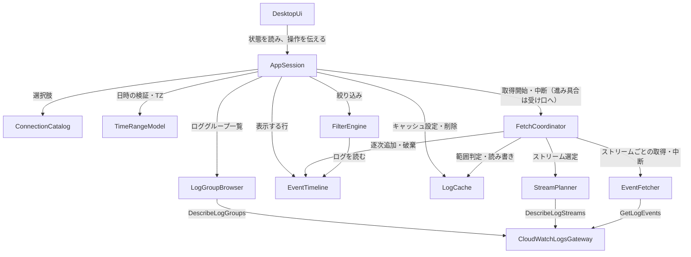

# Components — CloudWatch Logs ローカルビューア

上流の成果物：`inception/requirements-analysis/requirements.md`（FR1〜FR8、NFR1〜NFR16）、`inception/practices-discovery/team-practices.md`。質問票の回答は `domain-design-questions.md` の Q1〜Q5、F1 を指す。設計判断の記録は `decisions.md`（ADR-001〜ADR-008）。アーキテクチャレビューの指摘（R-01〜R-07）を受けた人間の判断を反映済み。

ここで決めるのは「書くコードの部品」とその責任・依存・データの持ち主だけである。どのフレームワークを使うか、部品をどうまとめて配置するかは、後のステージ（Units Generation 以降）で決める。CloudWatch Logs API、AWS の認証の仕組み、ファイルシステム、GUI フレームワークは部品ではなく、部品が使う外部依存として扱う。

**全部品に共通のルール（診断ログ）**：アプリ自身の診断ログは標準エラー出力だけに出し、ファイルには書かない（NFR16）。どの部品も、診断ログには安全な詳細（ApiFailure の safeDetail と同じ基準：秘密の認証情報とアクセスキー ID を含まない）だけを出す（FR8.3、NFR5、レビュー R-03）。

## 部品カタログ（機械可読）

```yaml
components:
  - name: ConnectionCatalog
    summary: AWS CLI と同じ設定からプロファイルとリージョンの選択肢を用意する
    behaviour: >
      ~/.aws/config と ~/.aws/credentials に定義されたプロファイル名の一覧を返す（FR1.1）。
      リージョンの選択肢は AWS SDK が持つ公開リージョンの一覧とし、プロファイルに既定のリージョンがあればそれを初期値として返す（FR1.3）。
      認証情報そのもの（シークレットアクセスキー・セッショントークン・SSO トークン・アクセスキー ID）は読み出さず、保持もしない。認証は AWS SDK の仕組みに任せる（NFR5）。
    responsibilities:
      - プロファイル名の一覧
      - リージョンの選択肢と既定リージョン
    depends_on: []
    dependents:
      - component: AppSession
        interaction: 上部バーに出すプロファイルとリージョンの選択肢を得る
    external_dependencies:
      - name: AWS 共有設定ファイル（~/.aws/config、~/.aws/credentials）
        kind: other
        purpose: プロファイル名と既定リージョンの読み取り
      - name: AWS SDK のリージョン一覧
        kind: other
        purpose: リージョンの選択肢
    entities:
      - name: ConnectionProfile
        identifier: profileName
        attributes: [profileName, defaultRegion]
      - name: RegionOption
        identifier: regionCode
        attributes: [regionCode]

  - name: CloudWatchLogsGateway
    summary: CloudWatch Logs の読み取り 3 API を呼ぶ境界（trait）と、その AWS SDK による実装
    behaviour: >
      呼べる操作は DescribeLogGroups・DescribeLogStreams・GetLogEvents の 3 つだけで、それ以外の API を呼ぶ手段を持たない（NFR6）。
      選ばれたプロファイルとリージョンで接続し、SSO・アクセスキー・AssumeRole・環境変数の認証は AWS SDK の仕組みで解決する（FR1.2）。
      AWS からのエラーを、認証切れ・権限不足・スロットリング・通信断・その他の種類に分類し、秘密の認証情報とアクセスキー ID を含まない安全な詳細だけを添えて返す（FR8.3、NFR5）。
      テストでは、この境界の偽物（スタブ）に差し替え、実際の AWS には接続しない（NFR14）。
    responsibilities:
      - 読み取り 3 API の呼び出し
      - AWS のエラーの分類と、安全な詳細への変換
    depends_on: []
    dependents:
      - component: LogGroupBrowser
        interaction: DescribeLogGroups を呼ぶ
      - component: StreamPlanner
        interaction: DescribeLogStreams を呼ぶ
      - component: EventFetcher
        interaction: GetLogEvents を呼ぶ
    external_dependencies:
      - name: Amazon CloudWatch Logs API
        kind: third-party-api
        purpose: DescribeLogGroups・DescribeLogStreams・GetLogEvents
      - name: AWS SDK の認証の仕組み（SSO・AssumeRole・環境変数・アクセスキー）
        kind: other
        purpose: 認証情報の解決（アプリ自身は保存しない）
    entities:
      - name: ApiFailure
        identifier: kind
        attributes: [kind, safeDetail, retryable]
        references:
          - entity: ConnectionProfile
            owned_by: ConnectionCatalog
            relationship: 各接続は 1 つのプロファイルとリージョンで作られる

  - name: LogGroupBrowser
    summary: 選んだ接続で取得できるロググループを列挙し、名前で絞り込む
    behaviour: >
      DescribeLogGroups のページをすべてたどってロググループを列挙する（FR2.1）。
      名前の部分一致で一覧を絞り込む（FR2.2）。選べるのは一度に 1 つ（FR2.3）。
      権限不足などで列挙できないときは、エラーの種類を呼び出し元に返す（FR2 の受け入れ基準）。
    responsibilities:
      - ロググループの全件列挙
      - ロググループ名での絞り込み
    depends_on:
      - component: CloudWatchLogsGateway
        interaction: DescribeLogGroups のページを取得する
        style: sync
    dependents:
      - component: AppSession
        interaction: 左ペインのロググループ一覧を得る
    external_dependencies: []
    entities:
      - name: LogGroup
        identifier: logGroupName
        attributes: [logGroupName, arn, creationTime]

  - name: TimeRangeModel
    summary: 日時の入力を解釈し、タイムゾーンを切り替えても同じ瞬間を保つ
    behaviour: >
      yyyy-mm-dd hh:mm:ss の絶対日時を解釈する（FR3.1）。タイムゾーンはローカルと UTC の 2 つで、既定はローカル（FR3.2）。
      タイムゾーンを切り替えても、入力済みの開始・終了は同じ瞬間を指したまま表示だけを変える（FR3.3）。
      終了日時はその秒の終わり（ミリ秒を含む）までを範囲に含める（FR3.5）。
      ローカルの夏時間で存在しない日時は入力の誤り、2 回現れる日時は早い方の瞬間とする（FR3.6）。
      形式の誤り・開始が終了より後、を判定して理由を返す（FR3.4 の条件の一部）。
      ログ一覧の時刻表示も、選んだタイムゾーンで整形する（FR3.3）。
    responsibilities:
      - 日時の解釈と検証
      - タイムゾーン変換と表示用の整形
      - 取得に使う瞬間（ミリ秒）の範囲の算出
    depends_on: []
    dependents:
      - component: AppSession
        interaction: 日時入力の検証、タイムゾーン切替、取得範囲の算出、時刻表示の整形
    external_dependencies:
      - name: OS のタイムゾーン設定・タイムゾーンデータ
        kind: other
        purpose: ローカルタイムゾーンと夏時間の判定
    entities:
      - name: TimeRange
        identifier: startInstant + endInstant
        attributes: [startInstant, endInstant, inputTimeZone]
      - name: DisplayTimeZone
        identifier: zoneKind
        attributes: [zoneKind]

  - name: StreamPlanner
    summary: 時間範囲に関係するストリームだけを選ぶ
    behaviour: >
      選んだロググループのストリームを DescribeLogStreams でたどって列挙する（FR4.1）。
      最初・最後のイベント時刻が時間範囲と重ならないストリームを外す。最後のイベント時刻の遅れを考え、1 時間の余裕を持たせて判定する（FR4.2）。
      最初・最後のイベント時刻を持たないストリームは、取りこぼしを避けるため対象に含める（FR4.2）。
      スロットリング時は待ってから再試行する（FR4.5、NFR4）。キャッシュは知らない（F1）。
    responsibilities:
      - ストリームの列挙
      - 時間範囲によるストリームの選定（余裕 1 時間、時刻なしは含める）
    depends_on:
      - component: CloudWatchLogsGateway
        interaction: DescribeLogStreams のページを取得する
        style: sync
    dependents:
      - component: FetchCoordinator
        interaction: 取得対象のストリーム一覧を得る
    external_dependencies: []
    entities:
      - name: LogStream
        identifier: logStreamName
        attributes: [logStreamName, firstEventTimestamp, lastEventTimestamp]
        references:
          - entity: LogGroup
            owned_by: LogGroupBrowser
            relationship: 各ストリームは 1 つのロググループに属する
          - entity: TimeRange
            owned_by: TimeRangeModel
            relationship: 選定は 1 つの時間範囲に対して行う

  - name: EventFetcher
    summary: 1 つのストリームについて、時間範囲のログをページの終わりまで取得する
    behaviour: >
      GetLogEvents を開始時刻と終了時刻を必ず指定して呼ぶ（FR4.3）。
      渡したトークンと同じトークンが返ったときだけページの終わりとし、空・部分的なページでは終わらない（FR4.4）。
      スロットリング時は待ってから再試行し（FR4.5）、それでも続く場合や権限不足・通信断のときは、そのストリームを失敗として結果に記録する（FR4.10）。
      件数の上限は設けない（FR4.6）。取得したページは呼び出し元に逐次渡す。キャッシュは知らない（F1）。
      呼び出し元から中断を指示されたら、次の API 呼び出しをせずに取得を止める（FR4.9、レビュー R-01）。
      MVP 後の高速化（並列化、IB-07）では、この部品の取得のしかたを差し替える（Q1）。
    responsibilities:
      - ストリーム単位のページング取得
      - ページ終端の判定
      - 再試行と、ストリーム単位の失敗の記録
      - 中断の指示による取得の停止
    depends_on:
      - component: CloudWatchLogsGateway
        interaction: GetLogEvents を呼ぶ
        style: sync
    dependents:
      - component: FetchCoordinator
        interaction: 選定したストリームごとにログを取得させる
    external_dependencies: []
    entities:
      - name: StreamFetchOutcome
        identifier: logStreamName
        attributes: [logStreamName, eventCount, status, failureKind]
        references:
          - entity: LogStream
            owned_by: StreamPlanner
            relationship: 各結果は 1 つのストリームについてのもの
          - entity: ApiFailure
            owned_by: CloudWatchLogsGateway
            relationship: 失敗したときは 1 つの失敗の種類を持つ

  - name: EventTimeline
    summary: 取得したログをストリームを跨いだ時刻順で保持する
    behaviour: >
      取得したログを逐次受け取り、常にストリームを跨いだ時刻順に並べて保持する（FR4.7）。
      同じ時刻のイベントは、毎回同じ結果になる決まった順序で並べる（決め方は Functional Design、FR4.7）。
      100 万件を保持してもスクロールに 1 秒以内に応えられる形で持つ（NFR2）。
      キャッシュが無効のときはメモリ上だけで扱い、ディスクに書かない（NFR8）。
    responsibilities:
      - ログの時刻順の保持と逐次追加
      - 表示範囲の行の取り出し
      - 保持しているログの破棄（中断時・取得し直しの開始時、レビュー R-06）
    depends_on: []
    dependents:
      - component: FetchCoordinator
        interaction: 取得したログを逐次追加する。中断時・取得し直しの開始時に保持ログを破棄する
      - component: FilterEngine
        interaction: 保持しているログを読んで絞り込む
      - component: AppSession
        interaction: ログ一覧に出す行と件数を得る
    external_dependencies: []
    entities:
      - name: LogEvent
        identifier: eventKey
        attributes: [eventKey, timestamp, ingestionTime, message]
        references:
          - entity: LogStream
            owned_by: StreamPlanner
            relationship: 各イベントは 1 つのストリームに属する

  - name: FilterEngine
    summary: 保持しているログを、条件に合う行だけに絞り込む
    behaviour: >
      メッセージに指定した文字列を含む行だけを返す（FR6.1）。AWS の API は呼ばない（FR6.2）。
      10 万件を 10 秒以内（NFR1）、100 万件を 100 秒以内（NFR2）に絞り込む。
      大文字・小文字の区別は Functional Design で決める（FR6.5）。
      MVP 後に Logs Insights 互換のクエリ（IB-11）へ置き換えられるよう、保持（EventTimeline）とは別にする（Q2）。
    responsibilities:
      - 部分一致による絞り込み
      - 絞り込み結果（合う行の位置と件数）と、絞り込み後 / 全件の件数の保持（FR6.3）
    depends_on:
      - component: EventTimeline
        interaction: 保持しているログを読む
        style: sync
    dependents:
      - component: AppSession
        interaction: 絞り込み文字列を渡して結果を得る
    external_dependencies: []
    entities:
      - name: FilterCondition
        identifier: filterText
        attributes: [filterText]
      - name: FilterResult
        identifier: filterText
        attributes: [filterText, matchedPositions, matchedCount, totalCount]
        references:
          - entity: LogEvent
            owned_by: EventTimeline
            relationship: 絞り込み結果はログの中身を写さず、EventTimeline の行を指す（具体的な持ち方は Functional Design、レビュー R-05）

  - name: LogCache
    summary: 取得したログを、利用者が選んだときだけディスクに保存し、範囲が含まれれば再利用する
    behaviour: >
      既定は無効で、有効にしたときだけ書き込む（FR7.1、FR7.7）。保存場所は ~/Library/Caches/ 配下のアプリ専用フォルダ（FR7.3）。
      プロファイル・リージョン・ロググループが一致し、指定範囲がキャッシュ済みの範囲に含まれるときだけ、その範囲を取り出せる（FR7.4）。
      有効期限は持たない（FR7.5）。削除ですべて消す（FR7.6）。
      秘密の認証情報とアクセスキー ID は書かない（NFR5）。
    responsibilities:
      - キャッシュの有効・無効と保存場所の管理
      - キャッシュ済み範囲の判定、読み出し、書き込み
      - キャッシュの全削除
    depends_on: []
    dependents:
      - component: FetchCoordinator
        interaction: 範囲がキャッシュ済みか判定し、読み出す。全ストリーム成功時に書き込む
      - component: AppSession
        interaction: 設定ダイアログからの有効・無効の切り替え、保存場所の表示、全削除
    external_dependencies:
      - name: ローカルファイルシステム（~/Library/Caches/ 配下）
        kind: object-store
        purpose: キャッシュファイルの保存
    entities:
      - name: CacheEntry
        identifier: cacheKey
        attributes: [cacheKey, coveredRanges, storagePath]
        references:
          - entity: ConnectionProfile
            owned_by: ConnectionCatalog
            relationship: 各キャッシュは 1 つのプロファイルに対応する
          - entity: LogGroup
            owned_by: LogGroupBrowser
            relationship: 各キャッシュは 1 つのロググループに対応する
          - entity: LogEvent
            owned_by: EventTimeline
            relationship: キャッシュは複数のログを保存する
      - name: CacheSettings
        identifier: settingsKey
        attributes: [settingsKey, enabled, location]

  - name: FetchCoordinator
    summary: 1 回の取得の流れを束ね、キャッシュを使うかどうかを判断する
    behaviour: >
      取得の入口で、キャッシュが有効かつ範囲がキャッシュ済みならキャッシュから読み、AWS は呼ばない（FR7.4、Q4）。
      そうでなければ StreamPlanner で対象ストリームを選び、EventFetcher で各ストリームを取得し、取得したログを EventTimeline に逐次追加する（FR4.1、FR4.7）。
      失敗したストリームがあっても取得できた分は残し、失敗したストリーム数をまとめる（FR4.10）。件数をまとめて返す（FR4.11）。
      全ストリームが成功したときだけ、キャッシュに書き込む。失敗したストリームがある取得と、途中で終了した取得は書かない（FR7.9）。
      呼び出し元から中断を指示されたら、EventFetcher の取得を止め、その取得を中断済みとし、キャッシュには書かず、EventTimeline に保持ログを破棄させて取得途中の結果を捨てる（FR4.9、FR7.9、レビュー R-01）。利用者向けの「中断」操作は MVP の対象外（IB-08）で、終了時の内部処理だけに使う。
      取得の進み具合（取得中・追加された件数・完了・中断・失敗数）は、取得開始時に呼び出し元が渡した受け口へ届ける。FetchCoordinator は呼び出し元（AppSession）を知らず、依存は AppSession → FetchCoordinator の一方向（レビュー R-04）。
    responsibilities:
      - 1 回の取得の実行・中断と状態の管理
      - キャッシュを使うかどうかの判断と、成功時のキャッシュ書き込み
      - 部分失敗のまとめ
    depends_on:
      - component: LogCache
        interaction: 範囲の判定・読み出し・成功時の書き込み
        style: sync
      - component: StreamPlanner
        interaction: 取得対象のストリームを選ぶ
        style: sync
      - component: EventFetcher
        interaction: ストリームごとにログを取得する・中断を指示する
        style: async
      - component: EventTimeline
        interaction: 取得したログを逐次追加する。中断時・取得し直しの開始時に保持ログを破棄させる（レビュー R-06）
        style: sync
    dependents:
      - component: AppSession
        interaction: "[Fetch] で取得を始める・終了時に中断する。進み具合は開始時に渡した受け口で受け取る"
    external_dependencies: []
    entities:
      - name: FetchJob
        identifier: jobId
        attributes: [jobId, status, eventCount, failedStreamCount, servedFromCache]
        references:
          - entity: ConnectionProfile
            owned_by: ConnectionCatalog
            relationship: 各取得は 1 つのプロファイルとリージョンで行う
          - entity: LogGroup
            owned_by: LogGroupBrowser
            relationship: 各取得は 1 つのロググループに対して行う
          - entity: TimeRange
            owned_by: TimeRangeModel
            relationship: 各取得は 1 つの時間範囲に対して行う
          - entity: StreamFetchOutcome
            owned_by: EventFetcher
            relationship: 各取得はストリームごとの結果を複数持つ

  - name: AppSession
    summary: 画面の状態とルールを GUI から切り離して持つ
    behaviour: >
      選択中のプロファイル・リージョン・ロググループと、待機中／取得中／取得完了の状態を持つ。日時とタイムゾーンは TimeRangeModel のもの、絞り込み条件は FilterEngine のものを参照する（レビュー R-02、R-07、R-08）。
      プロファイルかリージョンを変えたらロググループ一覧を取り直す（FR1.4）。
      [Fetch] を押せるのは、接続・ロググループ・正しい日時・開始が終了より前・取得中でない、をすべて満たすときだけで、押せない理由を返す（FR3.4）。
      取得中は取得条件を変更させず、[Fetch] も押させない。取得中であることを状態として示す（FR4.8、NFR3）。
      取得中にウィンドウを閉じようとしたら確認が必要と判断し、続行か終了を受け付ける。終了を選んだら FetchCoordinator に中断を指示し、途中の結果を捨てる（FR4.9、レビュー R-01）。
      再取得しても絞り込み文字列を引き継ぎ、新しい結果に同じ絞り込みをかける（FR6.4）。絞り込み中は「絞り込み後 / 全件」を示す（FR6.3）。
      行の展開状態（複数可）を持つ（FR5.2）。
      エラーは種類と安全な詳細のまま画面に渡し、文は作らない（Q5、FR8）。
    responsibilities:
      - 画面の状態と操作ルール
      - 部品の呼び出しの取りまとめ（接続・ロググループ・時間範囲・取得・絞り込み・キャッシュ設定）
      - ステータス行に出す状態（取得中・件数・失敗数・0 件）の算出
    depends_on:
      - component: ConnectionCatalog
        interaction: プロファイルとリージョンの選択肢を得る
        style: sync
      - component: LogGroupBrowser
        interaction: ロググループ一覧を得る・名前で絞り込む
        style: sync
      - component: TimeRangeModel
        interaction: 日時入力の検証・タイムゾーン切替・取得範囲の算出・時刻の整形
        style: sync
      - component: FetchCoordinator
        interaction: 取得を始める・終了時に中断する。進み具合は開始時に渡した受け口で受け取る（依存は一方向）
        style: sync
      - component: FilterEngine
        interaction: 絞り込みを行う
        style: sync
      - component: EventTimeline
        interaction: 表示する行と件数を得る
        style: sync
      - component: LogCache
        interaction: キャッシュの有効・無効、保存場所の表示、全削除
        style: sync
    dependents:
      - component: DesktopUi
        interaction: 状態を読み、利用者の操作を伝える
    external_dependencies: []
    entities:
      - name: SessionState
        identifier: sessionId
        attributes: [sessionId, phase, selectedProfile, selectedRegion, selectedLogGroup, expandedRows, statusSummary]
        references:
          - entity: ConnectionProfile
            owned_by: ConnectionCatalog
            relationship: セッションは選択中のプロファイルを 1 つ持つ
          - entity: LogGroup
            owned_by: LogGroupBrowser
            relationship: セッションは選択中のロググループを 0 か 1 つ持つ
          - entity: TimeRange
            owned_by: TimeRangeModel
            relationship: セッションは入力中の時間範囲を 1 つ参照する（日時の値は TimeRangeModel が持つ）
          - entity: DisplayTimeZone
            owned_by: TimeRangeModel
            relationship: セッションは表示タイムゾーンを 1 つ参照する
          - entity: FilterCondition
            owned_by: FilterEngine
            relationship: セッションは絞り込み条件を 0 か 1 つ参照する（絞り込み文字列は FilterEngine が持つ、レビュー R-07）
          - entity: FilterResult
            owned_by: FilterEngine
            relationship: セッションは直近の絞り込み結果を 0 か 1 つ参照する
          - entity: FetchJob
            owned_by: FetchCoordinator
            relationship: セッションは直近の取得を 0 か 1 つ持つ

  - name: DesktopUi
    summary: 1 画面のデスクトップ GUI として、状態を表示し操作を受け付ける
    behaviour: >
      上部バー（プロファイル・リージョン・タイムゾーン・設定）、左ペイン（ロググループ一覧）、右ペイン（条件エリア・ログ一覧・ステータス行）、設定ダイアログ、終了確認ダイアログを、OS・GUI 部品の標準の見た目だけで表示する（NFR10、WF 画面 1〜7）。
      ログ一覧はメッセージを 1 行分だけ表示し、行を押すとその行のすぐ下に全文を展開する。複数展開でき、全文はコピーできる。JSON は整形しない（FR5）。
      取得中も操作に 1 秒以内に応える（NFR3）。最小ウィンドウは 1024×640、ダークモードは OS に合わせる（NFR11）。
      文言は英語と日本語を用意し、OS の言語設定に合わせる。日本語以外は英語（NFR12）。エラーの種類から「何が起きたか」と「次の行動」の文を作り、色やアイコンだけで示さない（FR8.1、FR8.2、Q5）。
      主な流れをキーボードだけで操作でき、ダイアログは Escape で閉じる（NFR13）。
      アプリ自身の診断ログは標準エラー出力だけに出す（NFR16）。
    responsibilities:
      - 画面の描画と操作の受け付け
      - 表示言語の切り替えとエラー文の組み立て
      - キーボード操作とダイアログ
    depends_on:
      - component: AppSession
        interaction: 状態を読み、操作を伝える
        style: sync
    dependents: []
    external_dependencies:
      - name: デスクトップ GUI フレームワーク（未選定）
        kind: other
        purpose: ウィンドウ・標準部品・描画
      - name: OS の言語・外観設定
        kind: other
        purpose: 表示言語とダークモードの判定
    entities: []
```

## 部品の関係図



<!-- Text fallback: DesktopUi → AppSession。AppSession → ConnectionCatalog、LogGroupBrowser、TimeRangeModel、FetchCoordinator、FilterEngine、EventTimeline、LogCache。FetchCoordinator → LogCache、StreamPlanner、EventFetcher、EventTimeline。FilterEngine → EventTimeline。LogGroupBrowser・StreamPlanner・EventFetcher → CloudWatchLogsGateway。循環はない。 -->

## 部品の一覧

| Component | Purpose | Depends On | Dependents | Entities Owned |
|-----------|---------|------------|------------|----------------|
| ConnectionCatalog | プロファイルとリージョンの選択肢 | — | AppSession | ConnectionProfile、RegionOption |
| CloudWatchLogsGateway | 読み取り 3 API の境界と実装、エラー分類 | — | LogGroupBrowser、StreamPlanner、EventFetcher | ApiFailure |
| LogGroupBrowser | ロググループの列挙と名前での絞り込み | CloudWatchLogsGateway | AppSession | LogGroup |
| TimeRangeModel | 日時の解釈・TZ 変換・夏時間・終了境界 | — | AppSession | TimeRange、DisplayTimeZone |
| StreamPlanner | 時間範囲に関係するストリームの選定 | CloudWatchLogsGateway | FetchCoordinator | LogStream |
| EventFetcher | ストリーム単位のページング取得・再試行・失敗記録 | CloudWatchLogsGateway | FetchCoordinator | StreamFetchOutcome |
| EventTimeline | 時刻順の保持・逐次追加・破棄 | — | FetchCoordinator、FilterEngine、AppSession | LogEvent |
| FilterEngine | 部分一致の絞り込みと結果の保持 | EventTimeline | AppSession | FilterCondition、FilterResult |
| LogCache | 任意のディスクキャッシュ | — | FetchCoordinator、AppSession | CacheEntry、CacheSettings |
| FetchCoordinator | 1 回の取得の流れ・中断とキャッシュ判断 | LogCache、StreamPlanner、EventFetcher、EventTimeline | AppSession | FetchJob |
| AppSession | 画面の状態とルール（GUI 非依存） | ConnectionCatalog、LogGroupBrowser、TimeRangeModel、FetchCoordinator、FilterEngine、EventTimeline、LogCache | DesktopUi | SessionState |
| DesktopUi | 画面の描画・操作・表示言語・エラー文 | AppSession | — | — |

## データの持ち主

| Entity | Owning Component | Identifier | Attributes | References |
|--------|------------------|------------|------------|------------|
| ConnectionProfile | ConnectionCatalog | profileName | profileName、defaultRegion | — |
| RegionOption | ConnectionCatalog | regionCode | regionCode | — |
| ApiFailure | CloudWatchLogsGateway | kind | kind、safeDetail、retryable | ConnectionProfile |
| LogGroup | LogGroupBrowser | logGroupName | logGroupName、arn、creationTime | — |
| TimeRange | TimeRangeModel | startInstant + endInstant | startInstant、endInstant、inputTimeZone | — |
| DisplayTimeZone | TimeRangeModel | zoneKind | zoneKind | — |
| LogStream | StreamPlanner | logStreamName | logStreamName、firstEventTimestamp、lastEventTimestamp | LogGroup、TimeRange |
| StreamFetchOutcome | EventFetcher | logStreamName | logStreamName、eventCount、status、failureKind | LogStream、ApiFailure |
| LogEvent | EventTimeline | eventKey | eventKey、timestamp、ingestionTime、message | LogStream |
| FilterCondition | FilterEngine | filterText | filterText | — |
| FilterResult | FilterEngine | filterText | filterText、matchedPositions、matchedCount、totalCount | LogEvent |
| CacheEntry | LogCache | cacheKey | cacheKey、coveredRanges、storagePath | ConnectionProfile、LogGroup、LogEvent |
| CacheSettings | LogCache | settingsKey | settingsKey、enabled、location | — |
| FetchJob | FetchCoordinator | jobId | jobId、status、eventCount、failedStreamCount、servedFromCache | ConnectionProfile、LogGroup、TimeRange、StreamFetchOutcome |
| SessionState | AppSession | sessionId | sessionId、phase、selectedProfile、selectedRegion、selectedLogGroup、expandedRows、statusSummary | ConnectionProfile、LogGroup、TimeRange、DisplayTimeZone、FilterCondition、FilterResult、FetchJob |

## 外部依存

| Component | Dependency | Kind | Purpose |
|-----------|------------|------|---------|
| ConnectionCatalog | AWS 共有設定ファイル | other | プロファイル名と既定リージョンの読み取り |
| ConnectionCatalog | AWS SDK のリージョン一覧 | other | リージョンの選択肢 |
| CloudWatchLogsGateway | Amazon CloudWatch Logs API | third-party-api | 読み取り 3 API |
| CloudWatchLogsGateway | AWS SDK の認証の仕組み | other | 認証情報の解決（アプリは保存しない） |
| TimeRangeModel | OS のタイムゾーン設定・データ | other | ローカルタイムゾーンと夏時間 |
| LogCache | ローカルファイルシステム | object-store | キャッシュファイルの保存 |
| DesktopUi | デスクトップ GUI フレームワーク（未選定） | other | ウィンドウ・標準部品・描画 |
| DesktopUi | OS の言語・外観設定 | other | 表示言語とダークモード |

## 分けた理由

| Component | 別の部品にした理由 |
|-----------|---------------------|
| ConnectionCatalog | AWS の設定ファイルという独立した入力を扱う。認証情報に触れない境界をはっきりさせる（NFR5） |
| CloudWatchLogsGateway | 外部 API との境界。trait の裏に置いてテストで差し替える（NFR14）。呼べる API を 3 つに限る場所を 1 か所にする（NFR6、ADR-002） |
| LogGroupBrowser | ロググループの列挙は取得とは別のタイミング（接続変更時）で動く |
| TimeRangeModel | 日時・タイムゾーン・夏時間のルールは純粋なロジックで、テストを先に書く対象（team-practices の Ordering） |
| StreamPlanner | ストリームの選定ルール（余裕 1 時間、時刻なしは含める）は取得方法と独立して変わる（Q1、ADR-003） |
| EventFetcher | 高速化（IB-07）で差し替える対象。ページ終端判定・再試行は純粋なロジックとしてテストする（Q1、ADR-003） |
| EventTimeline | 100 万件の保持と時刻順の逐次追加という、性能上の要の部分を 1 か所にする（NFR2、ADR-007） |
| FilterEngine | MVP 後にクエリへ置き換える。保持とは変わる理由が違う（Q2、ADR-005） |
| LogCache | 既定無効の任意機能で、期限が厳しいときは外せる（FR7.8）。機密情報の保存場所を 1 か所にする |
| FetchCoordinator | 選定・取得・保持・キャッシュを束ね、キャッシュの判断と「全成功時だけ書く」ルールを 1 か所に持つ（F1、ADR-004） |
| AppSession | 画面のルールを GUI から切り離してテストする（Q3、ADR-001） |
| DesktopUi | GUI フレームワークに依存する唯一の部品。見た目・言語・キーボード操作を担う（ADR-001、ADR-006） |

### 採らなかった分け方（Alternatives Rejected）

- 取得を 1 つの部品にまとめる案は、高速化の差し替え範囲が広がるため採らなかった（Q1、ADR-003）。
- 絞り込みを保持と同じ部品にする案は、クエリへの置き換えがしにくくなるため採らなかった（Q2、ADR-005）。
- 画面のルールを GUI の中に置く案は、ルールを自動テストできないため採らなかった（Q3、ADR-001）。
- キャッシュの判断を AppSession に置く案、StreamPlanner に持たせる案は、取得の流れとキャッシュのルールが散らばるため採らなかった（Q4、F1、ADR-004）。
- ライブラリが表示文まで作る案は、翻訳が GUI 非依存の層に入り込むため採らなかった（Q5、ADR-006）。
