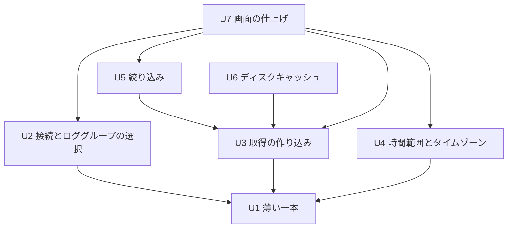

# Unit of Work Dependency — CloudWatch Logs ローカルビューア

上流の成果物：`unit-of-work.md`（作業単位 U1〜U7）、`inception/domain-design/components.md`。質問票の回答は `units-generation-questions.md`。アーキテクチャレビューの指摘（R-02、R-04、R-05）を受けた人間の判断を反映済み。

このファイルは依存の形（どれがどれに依存するか）だけを示す。作る順番の優先度や、どれが一番時間を左右するかは決めない。

## 依存関係（機械可読）

```yaml
units:
  - name: u1-walking-skeleton
    kind: service
    depends_on: []
  - name: u2-connection-selection
    kind: service
    depends_on: [u1-walking-skeleton]
  - name: u3-fetch-robustness
    kind: service
    depends_on: [u1-walking-skeleton]
  - name: u4-time-range
    kind: service
    depends_on: [u1-walking-skeleton]
  - name: u5-filter
    kind: service
    depends_on: [u3-fetch-robustness]
  - name: u6-disk-cache
    kind: service
    depends_on: [u3-fetch-robustness]
  - name: u7-ui-polish
    kind: ui
    depends_on: [u2-connection-selection, u3-fetch-robustness, u4-time-range, u5-filter]
```

## 依存関係の図



<!-- Text fallback: 矢印は「依存する」。U2・U3・U4 は U1 に依存する。U5・U6 は U3 に依存する。U7 は U2・U3・U4・U5 に依存する。U6 にはどの単位も依存しない。循環はない。 -->

## 依存の理由

| 依存 | 理由 |
|------|------|
| U2 → U1 | U1 のアプリ・AWS の窓口（CloudWatchLogsGateway）・画面の土台に、一覧からの選択を足す |
| U3 → U1 | U1 の 1 ストリーム取得（EventFetcher）を、複数ストリーム・時刻順・再試行・中断へ広げる |
| U4 → U1 | U1 の UTC の日時の解釈とミリ秒範囲の算出（TimeRangeModel）を、タイムゾーン切替・夏時間・入力検証へ広げる |
| U5 → U3 | 絞り込みは、U3 で作る時刻順の保持（EventTimeline）を読む |
| U6 → U3 | キャッシュの判断は、U3 で広げた取得の束ね役（FetchCoordinator）の入口に入る。範囲の判定は U1 で作ったミリ秒範囲の算出を使うため、U4 には依存しない |
| U7 → U2、U3、U4、U5 | 行の展開・エラー文・終了確認・ダークモードと、英日の文言・キーボード操作の通しの見直しを、それぞれの単位の画面とルールの上に仕上げる。U6 の設定ダイアログは U6 自身で仕上げるため、U7 は U6 に依存せず、U6 を外しても U7 は作れる |

## 単位どうしのつなぎ目

1 つのアプリの中の部品どうしのやり取りで、ネットワーク越しの API や共有データベースはない。

| つなぎ目 | 関わる単位 | 内容 |
|----------|------------|------|
| CloudWatchLogsGateway の trait | U1、U2、U3 | 読み取り 3 API の境界。U1 で GetLogEvents、U2 で DescribeLogGroups、U3 で DescribeLogStreams を足す（ADR-002） |
| FetchCoordinator の入口 | U1、U3、U6 | 取得の開始・中断と、進み具合の受け口。U1 で最小版の形を作り、U3 が中身を広げ、U6 はこの入口にキャッシュの分岐を入れる（ADR-004、ADR-007、ADR-008） |
| EventTimeline の読み出し | U3、U5 | 絞り込みは保持しているログを読み、ログの中身は写さない（ADR-005） |
| AppSession の状態 | U1〜U7 | 画面の状態とルール。各単位が自分の機能の状態とルールを足す（ADR-001） |
| 画面（Tauri の画面側）と Rust 側のやり取り | U1〜U7 | Tauri のコマンドとイベントで、画面側（TypeScript＋React）と AppSession をつなぐ。U1 で形を作り、各単位が足す |

## 並行して進められる組み合わせ

依存のない単位どうしは、どちらを先に作ってもよい（複数の正しい順番がある）。

- U1 のあと：U2、U3、U4 は互いに依存しない。
- U3 のあと：U5 と U6 は互いに依存しない。U2・U4 とも依存しない。
- U7 は U2〜U5 がそろってから。U6 とは依存しない。

## 薄い一本（Walking Skeleton）

- 依存の起点は U1 で、他のどの単位にも依存せずに動く。U1 だけで「GUI を起動し、手入力した条件で 1 つのストリームを GetLogEvents で取得して表示する」ところまで端から端まで動く（team.md の Walking Skeleton、Q2）。
- 確認は `cargo test`、実際の AWS に対する確認用プログラム、GUI の目視の 3 つで行い、人間が骨組みのチェックポイントを承認してから次の単位に進む（team.md）。
